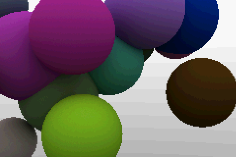
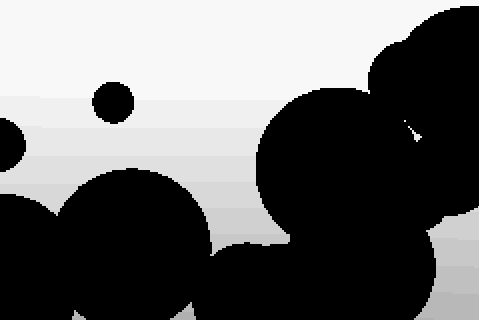
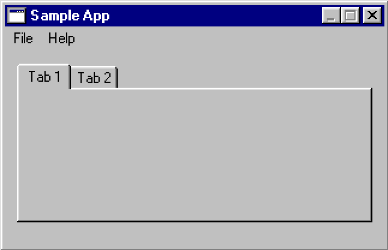
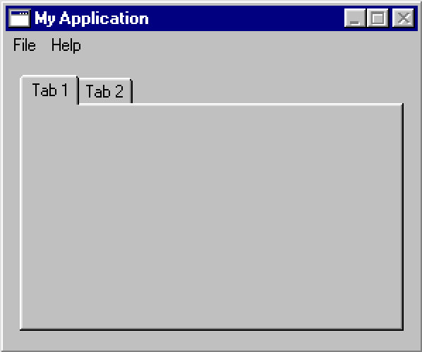
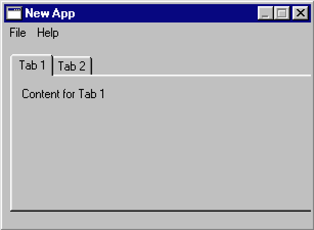

<post-date date="4 December 2024"/>

# Briefly evaluating QwQ Preview

Alibaba has somewhat stunned the AI community by their releasing a relatively capable o1 competitor as an open model, mere months after the unveiling of o1. The model is called QwQ Preview, or QwQ-32B-Preview if you will. You can learn more about it on google.

Let's briefly evaluate its coding chops, using the Q4_K_M variant running via Ollama. Note that I won't be comparing it to o1 directly since my OAI API credit is at 0 and I don't want to put more in there right now.

## Add comments to C++ code

<x-prompt>
    <p>
        Add helpful comments to this code. The code renders an image of a heightmap by tracing rays through each pixel on the image plane.
    </p>

> Code
```cpp
unsigned y = 0;

for (; y < dstPixelmap.height(); y++)
{
    numVoxels += stepsTaken;

    const double screenPlaneY = ((2.0 * ((y + 0.5) / dstPixelmap.height()) - 1.0) * tanFov);

    ray_s ray;

    {
        const vond::vector3<double> view = (vond::vector3<double>{screenPlaneX, screenPlaneY, camera.zoom} * viewMatrix);

        ray.pos = camera.position;
        ray.dir = (view.normalized() * RAY_STEP_SIZE);
    }

    {
        if (stepsTaken == 0)
        {
            rayDepth = 0;
        }

        ray.pos += (ray.dir * rayDepth);
        stepsTaken = 0;
    }

    {
        if ((ray.pos[1] > 255) && (ray.dir[1] >= 0))
        {
            break;
        }

        for (; rayDepth < (MAX_RAY_LENGTH / RAY_STEP_SIZE); stepsTaken++)
        {
            double voxelHeight = heightmapSampler(ray.pos, camera.position).channel_at(0);

            if (voxelHeight >= ray.pos[1])
            {
                const vond::color<uint8_t, 4> groundColor = textureSampler(ray.pos, camera.position);

                if (!groundColor.channel_at(3))
                {
                    goto draw_sky;
                }

                const double depth = ray.pos.distance_to(camera.position);

                for (unsigned i = 0; i < PIXEL_WIDTH_MULTIPLIER; i++)
                {
                    dstPixelmap.pixel_at((x + i), (dstPixelmap.height() - y - 1)) = groundColor;
                    dstDepthmap.pixel_at((x + i), (dstDepthmap.height() - y - 1)) = {depth};
                }

                break;
            }

            const unsigned extraSteps = (rayDepth * RAY_SKIP_MULTIPLIER);
            ray.pos += (ray.dir * (extraSteps + 1));
            rayDepth += (extraSteps + 1);

            if ((ray.pos[1] > 255) && (ray.dir[1] >= 0))
            {
                goto draw_sky;
            }
        }
    }
}
```
</x-prompt>

> QwQ Preview 32B
``` [{no-line-numbers}{inline-class:model-response}]
unsigned y = 0;

for (; y < dstPixelmap.height(); y++)
{
    numVoxels += stepsTaken;

    // Calculate the Y-coordinate on the screen plane for the current pixel row.
    // This maps the pixel row to a normalized coordinate between -1 and 1.
    const double screenPlaneY = ((2.0 * ((y + 0.5) / dstPixelmap.height()) - 1.0) * tanFov);

    ray_s ray;

    {
        // Calculate the view vector in world space by transforming the screen coordinates.
        // screenPlaneX should be defined elsewhere; assuming it's calculated similarly to screenPlaneY.
        const vond::vector3<double> view = (vond::vector3<double>{screenPlaneX, screenPlaneY, camera.zoom} * viewMatrix);

        // Set the ray's origin to the camera's position and direction to the normalized view vector scaled by RAY_STEP_SIZE.
        ray.pos = camera.position;
        ray.dir = (view.normalized() * RAY_STEP_SIZE);
    }

    {
        // If no steps have been taken, reset rayDepth to 0.
        if (stepsTaken == 0)
        {
            rayDepth = 0;
        }

        // Move the ray's position along its direction by the current rayDepth.
        ray.pos += (ray.dir * rayDepth);
        stepsTaken = 0;
    }

    {
        // Early exit if the ray is above the maximum height and moving upwards.
        if ((ray.pos[1] > 255) && (ray.dir[1] >= 0))
        {
            break;
        }

        // Trace the ray until it reaches the maximum allowed length.
        for (; rayDepth < (MAX_RAY_LENGTH / RAY_STEP_SIZE); stepsTaken++)
        {
            // Sample the heightmap at the current ray position to get the terrain height.
            double voxelHeight = heightmapSampler(ray.pos, camera.position).channel_at(0);

            // If the terrain height is above the ray's current Y-position, it's a hit.
            if (voxelHeight >= ray.pos[1])
            {
                // Sample the texture at the hit position.
                const vond::color<uint8_t, 4> groundColor = textureSampler(ray.pos, camera.position);

                // If the alpha channel is zero, it's transparent; draw sky instead.
                if (!groundColor.channel_at(3))
                {
                    goto draw_sky;
                }

                // Calculate the distance from the camera to the hit point.
                const double depth = ray.pos.distance_to(camera.position);

                // Set the pixel color and depth in the destination maps.
                // PIXEL_WIDTH_MULTIPLIER likely accounts for multiple samples per pixel (e.g., anti-aliasing).
                for (unsigned i = 0; i < PIXEL_WIDTH_MULTIPLIER; i++)
                {
                    dstPixelmap.pixel_at((x + i), (dstPixelmap.height() - y - 1)) = groundColor;
                    dstDepthmap.pixel_at((x + i), (dstDepthmap.height() - y - 1)) = {depth};
                }

                // Exit the loop since we've found the intersection.
                break;
            }

            // Take larger steps in empty space to optimize performance.
            const unsigned extraSteps = (rayDepth * RAY_SKIP_MULTIPLIER);
            ray.pos += (ray.dir * (extraSteps + 1));
            rayDepth += (extraSteps + 1);

            // Early exit if the ray is above the maximum height and moving upwards.
            if ((ray.pos[1] > 255) && (ray.dir[1] >= 0))
            {
                goto draw_sky;
            }
        }
    }
}
```

> Qwen 2.5 Coder 32B
``` [{no-line-numbers}{inline-class:model-response}]
unsigned y = 0;

// Iterate over each row of pixels in the destination pixel map
for (; y < dstPixelmap.height(); y++)
{
    // Accumulate the total number of steps taken by rays so far
    numVoxels += stepsTaken;

    // Calculate the y-coordinate on the screen plane, normalized to [-1, 1] and scaled by tanFov
    const double screenPlaneY = ((2.0 * ((y + 0.5) / dstPixelmap.height()) - 1.0) * tanFov);

    ray_s ray;

    // Initialize the ray for the current pixel
    {
        // Transform the view direction from camera space to world space using the view matrix
        const vond::vector3<double> view = (vond::vector3<double>{screenPlaneX, screenPlaneY, camera.zoom} * viewMatrix);

        // Set the starting position of the ray at the camera's position
        ray.pos = camera.position;
        // Set the direction of the ray and scale it by RAY_STEP_SIZE for each step
        ray.dir = (view.normalized() * RAY_STEP_SIZE);
    }

    // Adjust the ray position based on the current depth and reset steps taken
    {
        if (stepsTaken == 0)
        {
            // Initialize rayDepth to 0 at the start of a new row or when no steps were taken in the previous iteration
            rayDepth = 0;
        }

        // Move the ray forward by the accumulated depth from previous iterations
        ray.pos += (ray.dir * rayDepth);
        // Reset the step counter for the current pixel's ray tracing process
        stepsTaken = 0;
    }

    // Trace the ray through the heightmap and determine if it intersects with any voxels or reaches the sky
    {
        // If the ray is above the maximum height (255) and moving upwards, stop processing this row
        if ((ray.pos[1] > 255) && (ray.dir[1] >= 0))
        {
            break;
        }

        // Continue tracing the ray until it intersects with a voxel or reaches the maximum ray length
        for (; rayDepth < (MAX_RAY_LENGTH / RAY_STEP_SIZE); stepsTaken++)
        {
            // Sample the heightmap at the current ray position to get the height of the voxel
            double voxelHeight = heightmapSampler(ray.pos, camera.position).channel_at(0);

            // Check if the current voxel intersects with the ray
            if (voxelHeight >= ray.pos[1])
            {
                // Retrieve the ground color from a texture at the intersection point
                const vond::color<uint8_t, 4> groundColor = textureSampler(ray.pos, camera.position);

                // If the ground color is fully transparent (alpha channel == 0), draw the sky instead
                if (!groundColor.channel_at(3))
                {
                    goto draw_sky;
                }

                // Calculate the depth of the intersection point from the camera's position
                const double depth = ray.pos.distance_to(camera.position);

                // Set the pixel color and depth for each pixel in the current column (considering PIXEL_WIDTH_MULTIPLIER)
                for (unsigned i = 0; i < PIXEL_WIDTH_MULTIPLIER; i++)
                {
                    dstPixelmap.pixel_at((x + i), (dstPixelmap.height() - y - 1)) = groundColor;
                    dstDepthmap.pixel_at((x + i), (dstDepthmap.height() - y - 1)) = {depth};
                }

                // Stop tracing the current ray as it has already found an intersection
                break;
            }

            // Skip a number of steps based on RAY_SKIP_MULTIPLIER to optimize performance in open areas
            const unsigned extraSteps = (rayDepth * RAY_SKIP_MULTIPLIER);
            // Move the ray forward by the number of skipped steps plus one
            ray.pos += (ray.dir * (extraSteps + 1));
            // Increment the ray depth by the same amount
            rayDepth += (extraSteps + 1);

            // If the ray is above the maximum height after skipping, stop processing this row
            if ((ray.pos[1] > 255) && (ray.dir[1] >= 0))
            {
                goto draw_sky;
            }
        }
    }
}
```

The comments are similar in style and substance between these two models, but I'd say QwQ does a slightly better job. Neither ought to fully replace a decent human documenter yet.

## Convert C code into JavaScript

<x-prompt>
    <p>
        Convert this C code into JavaScript.
    </p>

> Code
```c
#include <stdlib.h>
#include <string.h>
#include <stdio.h>
#include <float.h>
#include <math.h>
#include <stdint.h>
#include <time.h> /* For rand().*/

typedef float real;

#define RANDOM_REAL (rand()/(real)RAND_MAX)
#define SCREEN_WIDTH 240
#define SCREEN_HEIGHT 160
#define EPSILON 0.01
#define PI 3.14

struct color_rgb
{
    real r, g, b;
};

struct vector3
{
    real x, y, z;
};

struct sphere
{
    struct vector3 position;

    struct color_rgb color;

    real radius;

    /* TODO: material */
};

real vector3_dot(const struct vector3 *const v1,
                 const struct vector3 *const v2)
{
    return ((v1->x * v2->x) + (v1->y * v2->y) + (v1->z * v2->z));
}

struct vector3 vector3_cross(const struct vector3 *const v1,
                             const struct vector3 *const v2)
{
    struct vector3 ret;

    ret.x = ((v1->y * v2->z) - (v1->z * v2->y));
    ret.y = ((v1->z * v2->x) - (v1->x * v2->z));
    ret.z = ((v1->x * v2->y) - (v1->y * v2->x));
    
    return ret;
}

real vector3_length(const struct vector3 *const v)
{
    return sqrt((v->x * v->x) + (v->y * v->y) + (v->z * v->z));
}

struct vector3 vector3_normalized(const struct vector3 *const v)
{
    struct vector3 ret;
    real inv = 0;
    real length = vector3_length(v);

    if (length == 0)
    {
        length = 1;
    }

    inv = (1.0 / length);
    ret.x = (v->x * inv);
    ret.y = (v->y * inv);
    ret.z = (v->z * inv);

    return ret;
}

int test_vector3(void)
{
    /* Dot.*/
    {
        struct vector3 v1 = {1.0, 2.0, 3.0};
        struct vector3 v2 = {4.0, 5.0, 6.0};

        if (vector3_dot(&v1, &v2) != 32)
        {
            fprintf(stderr, "Test failed: vector3_dot()\n");
            return 0;
        }
    }

    /* Length & normalize.*/
    {
        struct vector3 v1 = {1.0, 4.0, 8.0};
        const struct vector3 v1Norm = vector3_normalized(&v1);

        if (vector3_length(&v1) != 9)
        {
            fprintf(stderr, "Test failed: vector3_length()\n");
            return 0;
        }

        if (vector3_length(&v1Norm) != 1)
        {
            fprintf(stderr, "Test failed: vector3_normalized()\n");
            return 0;
        }
    }

    /* Cross.*/
    {
        struct vector3 v1 = {1.0, 2.0, 3.0};
        struct vector3 v2 = {4.0, 5.0, 6.0};
        const struct vector3 crossed = vector3_cross(&v1, &v2);

        if ((crossed.x != -3) ||
            (crossed.y !=  6) ||
            (crossed.z != -3))
        {
            fprintf(stderr, "Test failed: vector3_cross()\n");
            return 0;
        }
    }

    return 1;
}

/* Ray-sphere intersection. Returns 0 if the ray misses the sphere, 1 if the ray hits the
 * sphere, and -1 if the ray hits the sphere from inside the sphere. Adapted with superficial
 * changes from an implementation by Jacco Bikker:
 * https://web.archive.org/web/20080509075746/http://www.devmaster.net/articles/raytracing_series/part2.php.*/
int ray_intersects_sphere(const struct vector3 *const rayOrigin,
                          const struct vector3 *const rayDirection,
                          const struct sphere *const sphere,
                          real *const closestDistance)
{
    real b = 0;
    real det = 0;
    int doesHit = 0;
    struct vector3 v = {0, 0, 0};

    v.x = (rayOrigin->x - sphere->position.x);
    v.y = (rayOrigin->y - sphere->position.y);
    v.z = (rayOrigin->z - sphere->position.z);

    b = -vector3_dot(&v, rayDirection);
    det = ((b * b) - vector3_dot(&v, &v) + (sphere->radius * sphere->radius));
    if (det > 0)
    {
        real i1 = 0, i2 = 0;

        det = sqrt(det);
        i1 = (b - det);
        i2 = (b + det);

        if (i2 > 0)
        {
            if (i1 < 0) 
            {
                if (i2 < *closestDistance) 
                {
                    *closestDistance = i2;
                    doesHit = -1;
                }
            }
            else
            {
                if (i1 < *closestDistance)
                {
                    *closestDistance = i1;
                    doesHit = 1;
                }
            }
        }
    }

    return doesHit;
}

/* Returns a random direction about the given normal.*/
struct vector3 random_direction_about_hemisphere(const struct vector3 *normal)
{
    struct vector3 randomDir;

    randomDir.x = (-RANDOM_REAL + RANDOM_REAL);
    randomDir.y = (-RANDOM_REAL + RANDOM_REAL);
    randomDir.z = (-RANDOM_REAL + RANDOM_REAL);

    randomDir = vector3_normalized(&randomDir);

    if (vector3_dot(normal, &randomDir) < 0)
    {
        randomDir.x *= -1;
        randomDir.y *= -1;
        randomDir.z *= -1;
    }

    return randomDir;
}

struct color_rgb trace_ray(struct vector3 *const rayOrigin,
                           struct vector3 *const rayDirection,
                           const struct sphere *const spheres,
                           const int sphereCount,
                           const int depth)
{
    int i = 0;
    
    /* The closest sphere in the list of spheres that the ray hits. Will be
     * null if no sphere was hit.*/
    const struct sphere *intersectedSphere = NULL;

    struct vector3 hitNormal;

    struct color_rgb returnColor = {0, 0, 0};
    const struct color_rgb black = {0, 0, 0};

    if (depth > 10)
    {
        return black;
    }

    /* Intersect the ray to the scene.*/
    {
        /* The distance to the closest intersection point along the ray.*/
        real closestHitDistance = FLT_MAX;

        for (i = 0; i < sphereCount; i++)
        {
            const int hit = ray_intersects_sphere(rayOrigin, rayDirection, &spheres[i], &closestHitDistance);

            switch (hit)
            {
                case 1: intersectedSphere = &spheres[i]; break;
                case -1: return black;
                default: break;
            }
        }

        /* Hit the sky.*/
        if (!intersectedSphere)
        {
            /* An approximation of the color of an overcast sky in the given direction.
             * The equation is roughly that of "Moon & Spencer" (date/publication unknown;
             * as cited in Preetham 1999: A practical analytic model for daylight).*/
            const struct vector3 up = {0, 1, 0};
            const real theta = (1 - vector3_dot(&up, rayDirection));
            const real zenithLuminance = 1.3;
            const real luminance = (zenithLuminance * ((1 + 2 * cos(theta)) / 3));
            struct color_rgb skyColor = {0, 0, 0};

            skyColor.r = skyColor.g = skyColor.b = luminance;

            return skyColor;
        }

        /* Move the ray to the new intersection point.*/
        rayOrigin->x += (rayDirection->x * closestHitDistance);
        rayOrigin->y += (rayDirection->y * closestHitDistance);
        rayOrigin->z += (rayDirection->z * closestHitDistance);

        /* Diffusely scatter the ray in a random direction about the new hitpoint's hemisphere.*/
        {
            hitNormal.x = (rayOrigin->x - intersectedSphere->position.x);
            hitNormal.y = (rayOrigin->y - intersectedSphere->position.y);
            hitNormal.z = (rayOrigin->z - intersectedSphere->position.z);
            hitNormal = vector3_normalized(&hitNormal);

            rayOrigin->x += (hitNormal.x * EPSILON);
            rayOrigin->y += (hitNormal.y * EPSILON);
            rayOrigin->z += (hitNormal.z * EPSILON);

            *rayDirection = random_direction_about_hemisphere(&hitNormal);
        }
    }
    
    /* Recursively cast a new ray.*/
    {
        const real albedo = 0.7;
        const real pdf = 0.15915494309;
        const real bsdf = ((vector3_dot(&hitNormal, rayDirection) / pdf) * (albedo / PI));

        const struct color_rgb incident = trace_ray(rayOrigin, rayDirection, spheres, sphereCount, (depth + 1));

        returnColor.r = (intersectedSphere->color.r * bsdf * incident.r);
        returnColor.g = (intersectedSphere->color.g * bsdf * incident.g);
        returnColor.b = (intersectedSphere->color.b * bsdf * incident.b);
    }

    return returnColor;
}

/* Saves the given screen buffer into a PPM image file. The code is lifted, with modifications,
* from Kevin Beason's smallpt: http://www.kevinbeason.com/smallpt/. */
void save_screen_buffer_to_ppm(const uint16_t *const screenBuffer,
                                const unsigned width,
                                const unsigned height)
{
    int i = 0;
    FILE *const f = fopen("image.ppm", "w");

    fprintf(f, "P3\n%d %d\n%d\n", width, height, 255);

    for (i = (width * height - 1); i >= 0; i--)
    {
        fprintf(f,"%d %d %d ", ((screenBuffer[i] & 0x1f) * 8),
                                (((screenBuffer[i] >> 5) & 0x1f) * 8),
                                (((screenBuffer[i] >> 10) & 0x1f) * 8));
    }
    
    return;
}

int main(void)
{
    unsigned i = 0;
    const unsigned numSpheres = 20;
    const unsigned numSamplesPerPass = 200;
    struct sphere *spheres = calloc(numSpheres, sizeof(*spheres));
    uint16_t *videoMemory = NULL;

    srand(time(NULL));

    videoMemory = malloc(SCREEN_WIDTH * SCREEN_HEIGHT * sizeof(*videoMemory));
    memset(videoMemory, 0, (SCREEN_WIDTH * SCREEN_HEIGHT * sizeof(*videoMemory)));

    /* Create a bunch of random-looking spheres.*/
    for (i = 0; i < numSpheres; i++)
    {
        spheres[i].position.x = ((RANDOM_REAL * 70) - (RANDOM_REAL * 70));
        spheres[i].position.y = ((RANDOM_REAL * 35) - (RANDOM_REAL * 35));
        spheres[i].position.z = ((50 + RANDOM_REAL * 35) - (RANDOM_REAL * 35));

        spheres[i].radius = (RANDOM_REAL * 15);

        spheres[i].color.r = RANDOM_REAL;
        spheres[i].color.g = RANDOM_REAL;
        spheres[i].color.b = RANDOM_REAL;
    }

    /* Trace a ray through each pixel on the screen.*/
    {
        unsigned x = 0, y = 0, i = 0;
        const real cameraZoom = 2.5;
        const struct vector3 cameraPosition = {0.0, 0.0, 150.0};

        for (y = 0; y < SCREEN_HEIGHT; y++)
        {
            for (x = 0; x < SCREEN_WIDTH; x++)
            {
                struct color_rgb accumulatedColor = {0, 0, 0};

                for (i = 0; i < numSamplesPerPass; i++)
                {
                    struct color_rgb color = {0, 0, 0};
                    struct vector3 rayDirection = {0, 0, 0};
                    struct vector3 rayPosition = cameraPosition;
                    const real fov = 65;
                    const real aspectRatio = (SCREEN_WIDTH / (real)SCREEN_HEIGHT);
                    const real tanFov = tan((fov / 2.0) * (PI / 180.0));

                    rayDirection.x = ((2.0 * ((x + 0.5) / SCREEN_WIDTH) - 1.0) * tanFov * aspectRatio);
                    rayDirection.y = ((2.0 * ((y + 0.5) / SCREEN_HEIGHT) - 1.0) * tanFov);
                    rayDirection.z = -cameraZoom;
                    rayDirection = vector3_normalized(&rayDirection);

                    color = trace_ray(&rayPosition, &rayDirection, spheres, numSpheres, 0);

                    accumulatedColor.r += color.r;
                    accumulatedColor.g += color.g;
                    accumulatedColor.b += color.b;
                }

                accumulatedColor.r /= numSamplesPerPass;
                accumulatedColor.g /= numSamplesPerPass;
                accumulatedColor.b /= numSamplesPerPass;

                /* Convert the 0..1 color values into 0..31, and encode them into the screen
                 * buffer as a single 16-bit value.*/
                {
                    #define clamp(x) (unsigned)((x) < 0? 0 : (x) > 31? 31 : (x))

                    const unsigned r = clamp(accumulatedColor.r * 32);
                    const unsigned g = clamp(accumulatedColor.g * 32);
                    const unsigned b = clamp(accumulatedColor.b * 32);

                    #undef clamp
                    
                    videoMemory[x + y * SCREEN_WIDTH] = (r | (g << 5) | (b << 10));
                }
            }

            printf("\rRendering... %d%%", (int)((y / (real)SCREEN_HEIGHT) * 100));
            fflush(stdout);
        }

        printf("\rRendering... 100%%\n");
    }

    save_screen_buffer_to_ppm(videoMemory, SCREEN_WIDTH, SCREEN_HEIGHT);

    free(videoMemory);
    free(spheres);

    return 0;
}
```
</x-prompt>

> Original


> QwQ Preview 32B


> Qwen 2.5 32B


A small ray tracer. Qwen 2.5 Coder gets further than QwQ; neither gets it right.

## Spatial reasoning

<x-prompt>
<p>
    This code draws the likeness of a 1990s ray traced scene of two spheres. It doesn't quite look physically correct though.
</p>

> Code
```js
<!DOCTYPE html>
<html lang="en">
<head>
    <meta charset="UTF-8">
    <title>Simple Scene</title>
</head>
<body>
    <canvas id="sceneCanvas" width="400" height="300"></canvas>
    <script>
        const canvas = document.getElementById('sceneCanvas');
        const ctx = canvas.getContext('2d');

        // Draw red sphere in the middle
        ctx.fillStyle = 'red';
        ctx.beginPath();
        ctx.arc(200, 150, 50, 0, Math.PI * 2);
        ctx.fill();

        // Draw blue sphere to the left
        ctx.fillStyle = 'blue';
        ctx.beginPath();
        ctx.arc(100, 170, 48, 0, Math.PI * 2);
        ctx.fill();

        // Draw reflection of red sphere on blue sphere (simplified)
        ctx.globalAlpha = 0.5; // Semi-transparent for the reflection effect
        ctx.beginPath();
        ctx.arc(138, 206, 19, 0, Math.PI * 2);
        ctx.fillStyle = 'red';
        ctx.fill();
    </script>
</body>
</html>
```
</x-prompt>

> Original


> QwQ Preview 32B


> Claude 3.5 Sonnet (October 2024)


> Mistral Large 123B


> Grok 2


> Qwen 2.5 72B


> Llama 3.2 Vision 90B


In the original image, the reflection of the red sphere on the blue sphere is incorrectly placed. QwQ was the only model that clearly understood this and fixed it. Grok 2 might also have had a sniff of this issue; the other models not so much.

## Use a GUI framework

<x-prompt>
<p>
    Here is a sample javascript web app created using a windows 95 lookalike ui framework. Use the framework to write a new app containing a menu bar ("File" and "Help", File is empty and Help -> About shows an about dialog) and a tab control with two empty tabs.
</p>

> Code
``` [{no-line-numbers}]
[Code omitted for clarity]
```
</x-prompt>

> QwQ Preview 32B


> Gemini 1.0


> ChatGPT 3.5


QwQ was able to operate this obscure Windows 95-like UI framework, but so was OG ChatGPT as well as the otherwise somewhat disappointing Gemini 1.0.

## Use a rendering library

<x-prompt>
<p>
    Below is the reference manual for a JavaScript software 3D renderer. Use the renderer to draw a rotating cube with different-colored sides.
</p>

> Reference manual
``` [{no-line-numbers}]
[Reference manual omitted for clarity]
```
</x-prompt>

> QwQ Preview 32B


> Claude 3.5 Sonnet (October 2024)


> Qwen 2.5 Coder 32B


QwQ was on the level of Claude 3.5 Sonnet on this one. A good showing, despite the backface culling issues.

## Finish an implementation of Minesweeper

<x-prompt>
<p>
    Below is an unfinished implementation of Minesweeper. Finish it.
</p>

> Code
``` [{no-line-numbers}]
[Code omitted for clarity]
```
</x-prompt>

> Original


> QwQ Preview 32B


> Qwen 2.5 Coder 32B


Both QwQ and Qwen 2.5 Coder added a game-over condition, though I'd say QwQ's is better. They both also implemented right-clicking to place flags, but since the UI framework only supports left-click, that can't be tested. Overall, I wouldn't call either version finished, but getting there.

## Conclusions

QwQ Preview does a decent job, often rising above Qwen 2.5 and sometimes even Claude 3.5 Sonnet; but on the flip side eating up quite a few more tokens. It appears to be a specialist model in that some tasks it does very well and others not too great. Interesting to see the full QwQ down the road.
