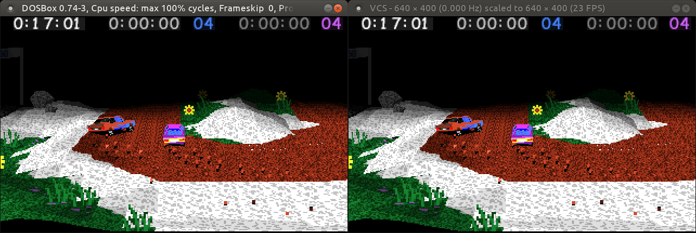

<post-date date="28 September 2022"/>

# Capturing DOSBox's frame buffer via shared memory

[VCS](/#vcs) is a free program I wrote for doing high-quality video capture with Datapath's VisionRGB capture devices. The program's aimed chiefly at capturing old analog sources, e.g. DOS-era PCs.

For debugging purposes, I needed a convenient source of period-correct images to capture, as it was a chore booting up a real retro PC every time. So I implemented DOSBox capturing, where instead of a capture device, VCS reads from a shared memory buffer where DOSBox streams its output.

This blog post describes that implementation in general outlines.

The post assumes that you have some familiarity with the concept of shared memory and are working in Linux &ndash; shared memory in Windows is a little bit different in the details. I don't claim to be an expert on this topic though, so feel free to <ths-inline-feedback-button>drop feedback</ths-inline-feedback-button> if something here seems out of line.

> Capturing DOS gameplay. DOSBox is on the left, and on the right VCS captures and displays DOSBox's output in real time.


## On the VCS side

VCS's responsibility in this system is to set up the shared memory and respond to frame buffer images being shared by DOSBox. This implementation's full original code can be found [here](https://github.com/leikareipa/vcs/blob/master/src/capture/dosbox_mmap/capture_dosbox_mmap.cpp); the code snippets below have been simplified for clarity by e.g. removing error checking.

First, we'll use *[shm_open()](https://linux.die.net/man/3/shm_open)* to create a shared memory object, which will be represented as a file in **/dev/shm**. Then, *[ftruncate()](https://linux.die.net/man/2/ftruncate)* to initialize the size of the corresponding shared memory allocation and *[mmap()](https://linux.die.net/man/2/mmap)* to get a local-space pointer to the allocation. Data written via the pointer will be visible to other processes that likewise access the memory object.

```cpp [{headerless}]
uint8_t *MMAP_STATUS_BUF = nullptr;
uint8_t *MMAP_SCREEN_BUF = nullptr;
const char MMAP_STATUS_BUF_FILENAME[] = "vcs_dosbox_mmap_status";
const char MMAP_SCREEN_BUF_FILENAME[] = "vcs_dosbox_mmap_screen";

// Create the shared status buffer.
int fd = shm_open(MMAP_STATUS_BUF_FILENAME, (O_RDWR | O_CREAT), 0666);
ftruncate(fd, MMAP_STATUS_BUF_SIZE);
MMAP_STATUS_BUF = (uint8_t*)mmap(nullptr, MMAP_STATUS_BUF_SIZE, 0666, MAP_SHARED, fd, 0);

// Create the shared screen buffer.
fd = shm_open(MMAP_SCREEN_BUF_FILENAME, (O_RDWR | O_CREAT), 0666);
ftruncate(fd, MMAP_SCREEN_BUF_SIZE);
MMAP_SCREEN_BUF = (uint8_t*)mmap(nullptr, MMAP_SCREEN_BUF_SIZE, 0666, MAP_SHARED, fd, 0);
```

The snippet above creates two shared memory buffers: a status buffer, and a screen buffer. The screen buffer is for sharing frame data from DOSBox to VCS, and the status buffer for control flow signaling between DOSBox and VCS &ndash; e.g. to control which program is allowed to access the shared memory at a given time.

We'll spawn a new thread in VCS to monitor the status buffer for a signal indicating that new frame buffer data is available in the screen buffer:

```cpp [{headerless}]
while (RUN_CAPTURE_THREAD)
{
    if (get_status_buffer_value(status_buffer_value_e::is_new_frame_available))
    {
        const char *framePixels = get_screen_buffer_value(screen_buffer_value_e::pixels_ptr);
        const uint16_t frameWidth = get_screen_buffer_value(screen_buffer_value_e::width);
        const uint16_t frameHeight = get_screen_buffer_value(screen_buffer_value_e::height);

        memcpy(localPixelBuffer, framePixels, (frameWidth * frameHeight * 4));

        set_status_buffer_value(status_buffer_value_e::is_new_frame_available, false);
    }
}
```

When DOSBox has shared a new frame's data, the above code copies it into VCS's internal pixel buffer for further processing and displaying, and resets the shared status buffer flag to indicate to DOSBox that it's again free to share the next frame, as VCS has finished reading the existing data.

The code above uses helper functions like *get_screen_buffer_value()* and *set_status_buffer_value()* for extra readability. These functions simply map plain-language enumerators to specific regions of the shared memory buffers, like so:

```cpp [{headerless}]
intptr_t get_screen_buffer_value(const screen_buffer_value_e valueEnum)
{
    switch (valueEnum)
    {
        case screen_buffer_value_e::width: return *((uint16_t*)&MMAP_SCREEN_BUF[0]);
        case screen_buffer_value_e::height: return *((uint16_t*)&MMAP_SCREEN_BUF[2]);
        case screen_buffer_value_e::pixels_ptr: return (intptr_t)&MMAP_SCREEN_BUF[4];
        default: assert(!"Unrecognized enumerator for querying the screen buffer.");
    }
}
```

## On the DOSBox side

To get DOSBox to share its data with VCS, we'll need to patch its code a bit. This basically boils down to

1. having DOSBox acquire access to the shared memory buffers that were set up by VCS, and
2. copying DOSBox's frame buffer pixel data into the shared memory every time DOSBox updates its screen.

You'll find the full original patch [here](https://github.com/leikareipa/vcs/blob/master/src/capture/dosbox_mmap/dosbox-0.74.3-linux-for-vcs-mmap.patch); the snippets below have been simplified for clarity e.g. by removing error checks.

As with VCS, we'll use *shm_open()* and *mmap()* to access the shared memory objects and map them into DOSBox's address space.

```cpp [{headerless}]
unsigned char *THS_MMAP_STATUS_BUF;
unsigned char *THS_MMAP_SCREEN_BUF;

unsigned char* ths_acquire_shared_memory_buffer(const char *filename)
{
    const int fd = shm_open(filename, O_RDWR, 0666);
    unsigned char *sharedMemPtr = (unsigned char*)mmap(NULL, stat.st_size, 0666, MAP_SHARED, fd, 0);
    return sharedMemPtr;
}

void ths_init_shared_memory_interface(void)
{
    THS_MMAP_STATUS_BUF = ths_acquire_shared_memory_buffer("vcs_dosbox_mmap_status");
    THS_MMAP_SCREEN_BUF = ths_acquire_shared_memory_buffer("vcs_dosbox_mmap_screen");
}
```

The memory object names &ndash; "vcs_dosbox_mmap_status" and "vcs_dosbox_mmap_screen" &ndash; are the same as we set up with VCS and which should be found under **/dev/shm** once VCS has been started.

To share the frame buffer data, we'll first check a flag in the status buffer to determine whether VCS has processed the previous frame we shared. This is a simple memory barrier looking to ensure that we don't write into the shared memory while a VCS thread is reading it.

```cpp [{headerless}]
void ths_copy_frame_buffer(SDL_Block *sdl)
{
    // VCS will set this value to 0 once it's done accessing the shared pixel
    // buffer, meaning that DOSBox is free to modify the buffer again.
    if (THS_MMAP_STATUS_BUF[0] != 0)
    {
        return;
    }

    // Copy the contents of DOSBox's frame buffer into the shared memory buffer.
    if (sdl->opengl.framebuf)
    {
        const uint16_t frameWidth = sdl->draw.width;
        const uint16_t frameHeight = sdl->draw.height;
        
        *((uint16_t*)&THS_MMAP_SCREEN_BUF[0]) = frameWidth;
        *((uint16_t*)&THS_MMAP_SCREEN_BUF[2]) = frameHeight;

        memcpy(&THS_MMAP_SCREEN_BUF[4], sdl->opengl.framebuf, (frameHeight * sdl->opengl.pitch));
    }

    // Signal to VCS that the shared memory buffer contains a new frame.
    THS_MMAP_STATUS_BUF[0] = 1;
}
```

If we've been cleared to modify the shared memory, we'll *memcpy()* the pixel buffer data using the pointer we got from *mmap()*. Note that this code assumes DOSBox to have been configured to output using OpenGL.

At the end of that code, we raise the status buffer flag to indicate to VCS that a new frame's data has been shared. Until VCS finishes processing that frame and clears the status buffer flag, *ths_copy_frame_buffer()* will return without sharing any more data, effectively dropping frames until VCS catches up.

Finally, as we want DOSBox to call *ths_copy_frame_buffer()* whenever its frame buffer contains a new, finished frame to be displayed, we'll append the call to instances of *[SDL_GL_SwapBuffers()](https://wiki.libsdl.org/SDL_GL_SwapWindow)* in **src/gui/sdlmain.cpp**:

<x-diff>
      SDL_GL_SwapBuffers();\
    + ths_copy_frame_buffer(&sdl);
</x-diff>
