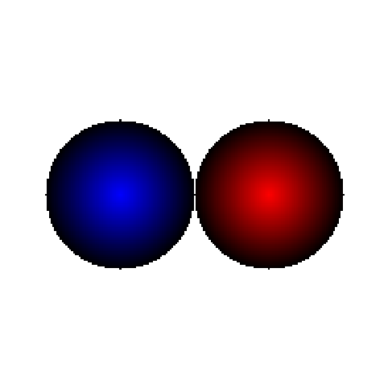

<post-date date="24 November 2023"/>

# Comparing ChatGPT models' drawing skills, part 2

OpenAI released the Turbo version of GPT-4 a short while back, so let's pit it against the original GPT-4 from Q1 2023 in some visual programming tasks.

For full context, see the original blog post, [comparing ChatGPT models' drawing skills](/blog/comparing-chatgpt-models-drawing-skills/).

> My subjective assessment of task fulfilment
<dokki-table headerless>
    <table>
        <tr>
            <th>Task</th>
            <th colspan="2">Score</th>
        </tr>
        <tr>
            <th></th>
            <th>GPT-4 (Q1 2023)</th>
            <th>GPT-4 Turbo</th>
        </tr>
        <tr>
            <th>Average</th>
            <th>90%</th>
            <th>70%</th>
        </tr>
        <tr>
            <td>DOOM melt</td>
            <td>80%</td>
            <td>75%</td>
        </tr>
        <tr>
            <td>Snowfall</td>
            <td>80%</td>
            <td>65%</td>
        </tr>
        <tr>
            <td>Ray tracing</td>
            <td>90%</td>
            <td>70%</td>
        </tr>
        <tr>
            <td>Mollweide</td>
            <td>100%</td>
            <td>90%</td>
        </tr>
        <tr>
            <td>Gource</td>
            <td>90%</td>
            <td>70%</td>
        </tr>
        <tr>
            <td>Starfield</td>
            <td>100%</td>
            <td>80%</td>
        </tr>
        <tr>
            <td>Fire</td>
            <td>95%</td>
            <td>60%</td>
        </tr>
        <tr>
            <td>Effect of choice</td>
            <td>90%</td>
            <td>30%</td>
        </tr>
    </table>
</dokki-table>

## DOOM-style screen melt

"Write JavaScript code that applies onto a pixel buffer an animated screen melt effect, as seen in the 1990s DOS game DOOM. The pixel buffer has four bytes per pixel: red, green, blue, alpha."

> GPT-4

> GPT-4 Turbo

Turbo was able to generate the effect in two iterations, much quicker than GPT-4. The first attempt resulted in a glitched upwards-moving animation. For the second iteration, I showed it a screenshot of DOOM with the effect and described it in words.

Neither model quite replicates the game's distribution of melt speeds (it's less random across neighboring columns).

## Snowfall

"Write JavaScript code that draws animated snowfall that accumulates on the ground. The pixel buffer has four bytes per pixel: red, green, blue, alpha."

> GPT-4

> GPT-4 Turbo

## Ray-tracing likeness

"Imagine you're a rudimentary ray tracer from the 1990s and you're asked to render a scene containing two spheres, one &ndash; red &ndash; in the middle of your view and another &ndash; blue &ndash; to the left of it. A reflection of the red sphere is visible on the blue sphere. Write JavaScript code that draws into a pixel buffer what your output might be. You don't need to show me the ray tracing code, just a representation of the output image. The pixel buffer has four bytes per pixel: red, green, blue, alpha."

"Feel free to make changes to the code to more realistically represent the image that you as the ray tracer would produce."

> GPT-4

> GPT-4 Turbo

Turbo implemented a simple ray tracer in Python and used its code interpreter abilities to run it to generate the image. It failed to include the reflection though, despite multiple attempts.

## Checkerboard with Mollweide projection

"Write JavaScript code that draws into a pixel buffer a chessboard pattern and then applies Mollweide projection to it. The pixel buffer has four bytes per pixel: red, green, blue, alpha."

> GPT-4

> GPT-4 Turbo

## Visualizing the internet in the style of Gource

"Write JavaScript code that draws into a pixel buffer a representation of the early Internet in the style of Gource. The pixel buffer has four bytes per pixel: red, green, blue, alpha."

"Could you use this graph to plot a representation of www.geocities.com from the late 1990s as best as you can?"

> GPT-4

> GPT-4 Turbo

## Starfield

"Write JavaScript code that draws an animated starfield effect (a field of stars moving in 3D space) into a pixel buffer. The pixel buffer has four bytes per pixel: red, green, blue, alpha."

> GPT-4

> GPT-4 Turbo

## Fire

"Write JavaScript code that plots an animated fire effect into a pixel buffer. The pixel buffer has four bytes per pixel: red, green, blue, alpha."

> GPT-4

> GPT-4 Turbo

## An effect of your choice

"I'm a very experienced graphics developer specializing in 2D image processing. I have an image in a pixel buffer (RGBA). Write JavaScript code that applies an interesting visual effect to the pixel buffer. The effect should be something that someone like me likely doesn't often see &ndash; something interesting."

> GPT-4

> GPT-4 Turbo

Turbo's implementation is clearly glitched, but it couldn't fix it despite multiple prompts.
