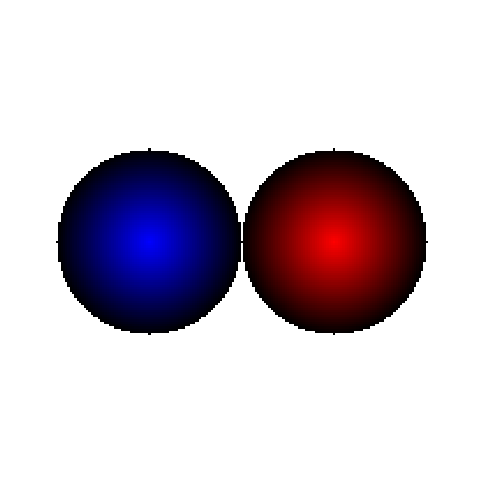

<post-date date="8 February 2024"/>

# Comparing Gemini Advanced and GPT-4 in graphics programming

Google's Gemini Advanced chatbot is fresh out of the oven. Let's see how it does against GPT-4 in some visual effects programming.

For full context, see the original blog posts:
- [Comparing ChatGPT models' drawing skills](/blog/comparing-chatgpt-models-drawing-skills/)
- [Comparing ChatGPT models' drawing skills, part 2](/blog/comparing-chatgpt-models-drawing-skills-part-2/)

## DOOM-style screen melt

"Write JavaScript code that applies onto a pixel buffer an animated screen melt effect, as seen in the 1990s DOS game DOOM. The pixel buffer has four bytes per pixel: red, green, blue, alpha."

> Gemini Advanced

> GPT-4 Turbo

> GPT-4

## Snowfall

"Write JavaScript code that draws animated snowfall that accumulates on the ground. The pixel buffer has four bytes per pixel: red, green, blue, alpha."

> Gemini Advanced

> GPT-4 Turbo

> GPT-4

Gemini would at first create tiny snowflakes that were colored red, which on my monitor made them invisible as they moved. Snow accumulation was also not working, which the AI couldn't fix after a few rounds of prompting.

## Ray-tracing likeness

"Imagine you're a rudimentary ray tracer from the 1990s and you're asked to render a scene containing two spheres, one &ndash; red &ndash; in the middle of your view and another &ndash; blue &ndash; to the left of it. A reflection of the red sphere is visible on the blue sphere. Write JavaScript code that draws into a pixel buffer what your output might be. You don't need to show me the ray tracing code, just a representation of the output image. The pixel buffer has four bytes per pixel: red, green, blue, alpha."

"Feel free to make changes to the code to more realistically represent the image that you as the ray tracer would produce."

> Gemini Advanced

> GPT-4 Turbo

> GPT-4

Gemini insisted there's a reflection of the red sphere on the blue sphere, and made no visible changes on the second prompt.

## Checkerboard with Mollweide projection

"Write JavaScript code that draws into a pixel buffer a chessboard pattern and then applies Mollweide projection to it. The pixel buffer has four bytes per pixel: red, green, blue, alpha."

> Gemini Advanced

> GPT-4 Turbo

> GPT-4

Gemini's first attempt was nowhere close, and the second attempt (shown here) is only slightly better. I didn't bother prompting it any further.

## Starfield

"Write JavaScript code that draws an animated starfield effect (a field of stars moving in 3D space) into a pixel buffer. The pixel buffer has four bytes per pixel: red, green, blue, alpha."

> Gemini Advanced

> GPT-4 Turbo

> GPT-4

## Fire

"Write JavaScript code that plots an animated fire effect into a pixel buffer. The pixel buffer has four bytes per pixel: red, green, blue, alpha."

> Gemini Advanced

> GPT-4 Turbo

> GPT-4

Gemini couldn't get the fire to span the entire canvas, similar to [the struggles of GPT-3.5](/blog/comparing-chatgpt-models-drawing-skills/#comparing-chatgpt-models-drawing-skills-fire).

## An effect of your choice

"I'm a very experienced graphics developer specializing in 2D image processing. I have an image in a pixel buffer (RGBA). Write JavaScript code that applies an interesting visual effect to the pixel buffer. The effect should be something that someone like me likely doesn't often see &ndash; something interesting."

> Gemini Advanced

> GPT-4 Turbo

> GPT-4

In its words, Gemini attempted to showcase "Reaction-Diffusion Based Organic Pattern Generation". Its output was more expert-sounding than the GPT-4 models', but the effect isn't very relevant as it just replaces the parrot image and doesn't animate (despite an attempt).

## Finishing notes

I've only just stated trialing Gemini Advanced (the first two months are free by the way), but what I see here leaves a mixed impression. The quality of its output in these tests was more inconsistent than that of GPT-4, and you might even say it looks a generation behind.

> My subjective assessment of task fulfilment
<dokki-table headerless>
    <table>
        <tr>
            <th>Task</th>
            <th colspan="3">Score</th>
        </tr>
        <tr>
            <th></th>
            <th>Gemini Advanced (Q1 2024)</th>
            <th>GPT-4 Turbo (Q4 2023)</th>
            <th>GPT-4 (Q1 2023)</th>
        </tr>
        <tr>
            <th>Average</th>
            <th>40%</th>
            <th>70%</th>
            <th>90%</th>
        </tr>
        <tr>
            <td>DOOM melt</td>
            <td>20%</td>
            <td>75%</td>
            <td>80%</td>
        </tr>
        <tr>
            <td>Snowfall</td>
            <td>70%</td>
            <td>65%</td>
            <td>80%</td>
        </tr>
        <tr>
            <td>Ray tracing</td>
            <td>50%</td>
            <td>70%</td>
            <td>90%</td>
        </tr>
        <tr>
            <td>Mollweide</td>
            <td>0%</td>
            <td>90%</td>
            <td>100%</td>
        </tr>
        <tr>
            <td>Starfield</td>
            <td>90%</td>
            <td>80%</td>
            <td>100%</td>
        </tr>
        <tr>
            <td>Fire</td>
            <td>10%</td>
            <td>60%</td>
            <td>95%</td>
        </tr>
        <tr>
            <td>Effect of choice</td>
            <td>50%</td>
            <td>30%</td>
            <td>90%</td>
        </tr>
    </table>
</dokki-table>

Compared to GPT-4, Gemini's style feels more like pair programming. Its output is more prose-y and it tries to engage you in a conversation about the problem. This is both good and bad &ndash; if you just want the code then Gemini will work you for it, but on the other hand you might enjoy its conversational, exploratory approach (or is that just Google farming for more training data?). Though the code it produced had no shortage of "fill in the functionality here" moments, it would also happily fill everything in if asked.

Overall, with an asking price matching that of GPT-4, Gemini Advanced is a hard sell. Given the inconsistent quality seen from it here, it may end up better than GPT-4 at certain tasks but much worse at some others. I get the impression there might be a more solid base on Gemini than on GPT-4, but until Google can get more out of it, I'd say GPT-4 is the winner.
