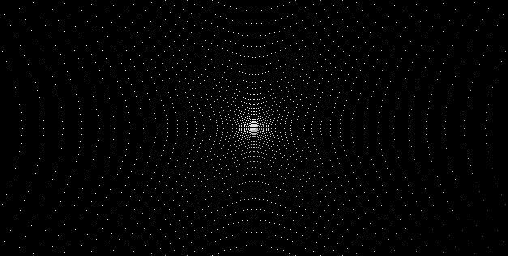
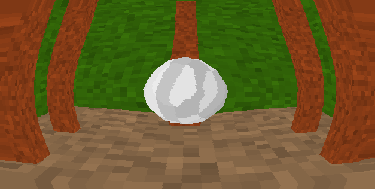
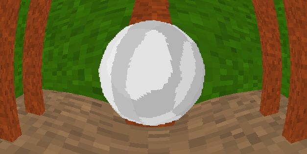
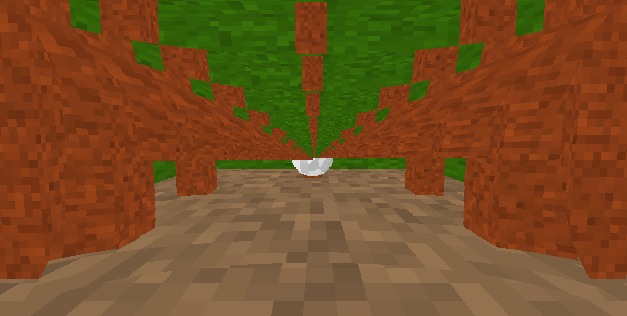
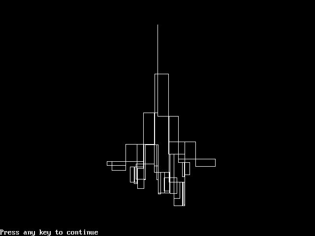

<post-date date="17 December 2024"/>

# Comparing quants of QwQ Preview in Ollama

My [coding tests](/blog/testing-open-and-closed-llms-some-more/) show a bell curve for the quants of QwQ Preview in Ollama, where Q4_K_M is more capable than the lower and higher quants:

<table>
    <thead>
        <tr>
            <th>Q2_K</th>
            <th>Q3_K_M</th>
            <th>Q4_K_M</th>
            <th>Q5_K_M</th>
            <th>Q8_0</th>
            <th>FP16</th>
        </tr>
    </thead>
    <tbody>
        <tr>
            <td>10%</td>
            <td>40%</td>
            <td>70%</td>
            <td>60%</td>
            <td>50%</td>
            <td>50%</td>
        </tr>
    </tbody>
</table>

Let's do some more testing to see if the curve holds up.

<x-prompt>
    <dokki-code word-wrap no-line-numbers>
        <template #caption>
            Reference manual
        </template>
        <template #code>
            <pre>
                [Reference manual omitted for clarity. See https://github.com/leikareipa/retro-ngon/blob/7e7bf5902b626483fb946eea8895ecb5983505fd/docs/api-reference.md]
            </pre>
        </template>
    </dokki-code>
    <p>
        Above is the reference manual for a JavaScript software 3D renderer. Write a pixel shader function that applies a fisheye lens effect.
    </p>
</x-prompt>

> Q2_K


> Q3_K_M


> Q4_K_M


> Q8_0


Q3_K_M and Q4_K_M managed to produce the requested fisheye effect; Q2_K failed completely and so did Q8_0. I think Q4_K_M's version is the best one.

<x-prompt>
    <p>
        Write a program using QBasic that draws a natural-looking lightning bolt.
    </p>
</x-prompt>

> Q2_K
``` [{no-line-numbers}{inline-class:model-response}]
[Syntax errors]
```

> Q3_K_M
``` [{no-line-numbers}{inline-class:model-response}]
[Syntax errors]
```

> Q4_K_M


> Q5_K_M
``` [{no-line-numbers}{inline-class:model-response}]
[Syntax errors]
```

> Q8_0
``` [{no-line-numbers}{inline-class:model-response}]
[Syntax errors]
```

Q4_K_M was the only quant that managed to produce syntactically valid, runnable code; all other quants' code had various syntax errors.

<x-prompt>
    <dokki-code syntax="js"><template #caption>Code</template>
        <template #code>
            <pre>
                // Pixel shader: Applies a vignette effect to the pixel buffer.
                function ps_vignette(renderContext)
                {
                    const {width, height, data:pixels} = renderContext.pixelBuffer;
                    const centerX = (width / 2);
                    const centerY = (height / 2);
                    const radius = Math.max(centerX, centerY);
                    const intensity = 1.0;
                    for (let y = 0; y < height; y++)
                    {
                        for (let x = 0; x < width; x++)
                        {
                            const dx = x - centerX;
                            const dy = y - centerY;
                            const distanceSquared = (dx * dx) + (dy * dy);
                            const vignette = Math.max(0, 1 - (distanceSquared / (radius * radius)));
                            const i = (x + y * width) * 4;
                            pixels[i + 0] *= (1 - intensity + (vignette * intensity));
                            pixels[i + 1] *= (1 - intensity + (vignette * intensity));
                            pixels[i + 2] *= (1 - intensity + (vignette * intensity));
                        }
                    }
                }
            </pre>
        </template>
    </dokki-code>
    <p>
        Above is a sample pixel shader for a JavaScript 3D software renderer. Write a pixel shader that applies a fisheye effect.
    </p>
</x-prompt>

<table>
    <thead>
        <tr>
            <th>Q2_K</th>
            <th>Q3_K_M</th>
            <th>Q4_K_M</th>
            <th>Q5_K_M</th>
            <th>Q8_0</th>
            <th>HF Playground (F16)</th>
        </tr>
    </thead>
    <tbody>
        <tr>
            <td>16%</td>
            <td>41%</td>
            <td>31%</td>
            <td>34%</td>
            <td>9%</td>
            <td>31%</td>
        </tr>
        <tr>
            <td><i>n</i> = 8</td>
            <td><i>n</i> = 8</td>
            <td><i>n</i> = 8</td>
            <td><i>n</i> = 8</td>
            <td><i>n</i> = 8</td>
            <td><i>n</i> = 8</td>
        </tr>
    </tbody>
</table>

Taking the average of eight runs of this prompt, and accounting for spread in the results, the sweet spot appears to be Q3_K_M through K5_K_M, while Q8_0 performs worse than Q2_K.

For reference, the table includes the unquantized version of QwQ as hosted on Hugging Face Playground.

# Conclusions

These tests roughly confirm the previously-found bell curve, where Q4_K_M is the apex quant and categorically better than Q8_0. More broadly, the sweet spot appears to be between Q3_K_M and Q5_K_M, inclusive.

Q8_0 was in fact so bad that it indicates a potential problem with Ollama. Outside of these tests, I've also seen preliminary indications that Ollama's FP16 struggles in a similar way. I opened an issue for this, but it was closed without resolution, so it's not something the Ollama authors are concerned about.

All of that said, my time with QwQ has also shown a fair bit of variance in output quality within any given quant. You'd ideally do very many runs of a test to find a realistic average.
