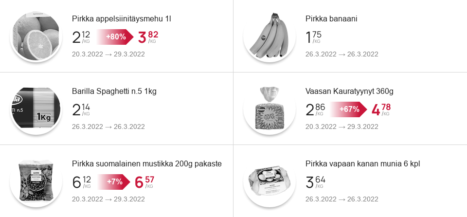

<post-date date="14 September 2022"/>

# Gawking at food prices

It's well known that consumer prices are going up in Europe. Not much you can do about it but watch on.

Earlier this year, I wrote [a handy app for keeping track of prices at Finnish K-Market stores](https://github.com/leikareipa/hs). Here's a sample screenshot:

> A sample screenshot of the price app's web view displaying trends in logged mock data. The data shown here are simply for demonstrational purposes and are not related to the dataset discussed in this blog post.

I've had the app logging data for the past six months, tracking prices at a particular K-Market. Let's see what those data look like.

## The overall picture

Out of the 26 products tracked, which primarily include various food items, 80% are now more expensive than they were six months ago, while 10% are cheaper.

On average, across all of the products tracked, from mid-March to mid-September, prices have increased by roughly 15%.

## Change by category

The table below shows a breakdown of the data by select product categories:

<dokki-table headerless>
    <table>
        <tr>
            <th>Category</th>
            <th>Average price change, mid-March to mid-September 2022</th>
        </tr>
        <tr>
            <td>Cheese</td>
            <td class="price up">30%</td>
        </tr>
        <tr>
            <td>Meat</td>
            <td class="price up">30%</td>
        </tr>
        <tr>
            <td>Butter</td>
            <td class="price up">20%</td>
        </tr>
        <tr>
            <td>Milk</td>
            <td class="price up">15%</td>
        </tr>
        <tr>
            <td>Non-food</td>
            <td class="price up">15%</td>
        </tr>
        <tr>
            <td>Bread</td>
            <td class="price up">10%</td>
        </tr>
        <tr>
            <td>Sweets</td>
            <td class="price up">10%</td>
        </tr>
    </table>
</dokki-table>

Meat and cheese look to be the biggest risers in this dataset. I think vegan cheese-like products, which used to be notably more expensive than the real stuff, aren't tangibly more expensive now. The vegan meat substitutes are getting pretty close as well to their counterparts &ndash; though I'm not tracking any vegan products, so this is just my gut feeling.

Bread doesn't seem to have gone up too much, relatively speaking. If like me you don't mind eating plain crispbread with butter then you get off the cheapest I guess.

## Change by month

The table below shows a breakdown of the data by month (only full months have been included):

<dokki-table headerless>
    <table>
        <tr>
            <th>Month in 2022</th>
            <th>Average price change during month</th>
        </tr>
        <tr>
            <td>April</td>
            <td class="price up">5%</td>
        </tr>
        <tr>
            <td>May</td>
            <td class="price up">5%</td>
        </tr>
        <tr>
            <td>June</td>
            <td class="price up">&lt; 5%</td>
        </tr>
        <tr>
            <td>July</td>
            <td class="price down">&lt; 5%</td>
        </tr>
        <tr>
            <td>August</td>
            <td class="price up">&lt; 5%</td>
        </tr>
        <tr>
            <td>*<i>September</i></td>
            <td class="price up">&lt; 5%</td>
        </tr>
        <tr>
            <td>*<i>October</i></td>
            <td class="price up">&lt; 5%</td>
        </tr>
        <tr>
            <td>*<i>November</i></td>
            <td class="price up">&lt; 5%</td>
        </tr>
        <tr>
            <td>*<i>December</i></td>
            <td class="price up">&lt; 5%</td>
        </tr>
    </table>
</dokki-table>

<i>***Update:** Added data for September through December.</i>

I haven't been following industry trends long enough to know whether prices tend to fall during the summer months, but in any case we're seeing inflation slowing down toward July, and even a transient decrease in July.

Still, the trend in these data appears to be that prices are hiked every month. It'll be interesting to see whether this continues for the rest of the year or whether we'll see a stabilization and maybe even a slight downward trend.

## Conclusion

Well, prices are going up, no surprise there. On average, you might expect your bill to have increased by 10&ndash;20% since March 2022, depending on what and where you're buying.

The particular K-Market I'm tracking was fairly expensive to begin with, and now it's rather expensive. Given that their main competitor chain appears to be offering staggeringly lower prices on many of these (or similar) products, I wonder how many customers this particular store is losing and what their longer-term strategy is.
