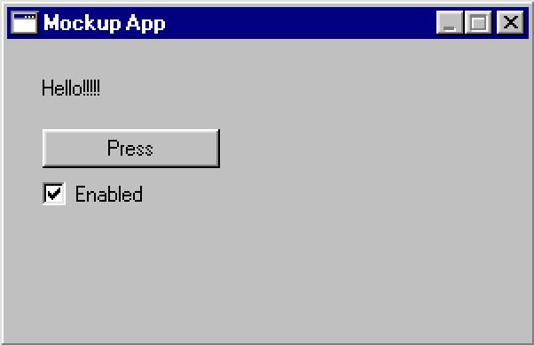

<post-date date="22 February 2024" edited="25 February 2024"/>

# Gemini Advanced vs. GPT-3.5 in operating a GUI framework

When it comes to coding, Gemini Advanced struggles to compete with GPT-4. Let's instead put it up against GPT-3.5 in [a test I had GPT-4 do a year ago](/blog/gpt-4-implementing-minesweeper-using-a-gui-framework-it-hadnt-seen-before/); namely, operating a foreign JavaScript GUI framework.

The framework is one I built myself. It wasn't included in GPT-4's training data and probably remains fairly obscure to the current-gen models.

The gist of the test is like so:

1. Give the AI sample code demonstrating usage of the framework.
2. Have the AI use the framework to build a GUI.

Let's go! Or [be distracted](https://www.midjourney.com/showcase).

## Simple window

<x-prompt>
    <p>
        Below is a sample javascript web app created using a windows 95 lookalike ui framework.
    </p>
    <p>
        Use the framework to create a new app with a menu bar ("File" and "Help", File is empty and Help -> About shows an about dialog) and a tab control with two empty tabs.
    </p>

> Code
```javascript
export default {
    Meta: {
        name: "Test app for w95",
        version: "0.1",
        author: "Tarpeeksi Hyvae Soft",
        description: `
            This app includes all (or most) widgets available in w95, so the user
            can test and debug them.
        `,
    },
    App() {
        const width = w95.state(400);
        const height = w95.state(Math.max(422, ~~(w95.shell.display.height * 0.8)));

        const x = w95.state(
            ~~((w95.shell.display.width - width.now) / 2),
            w95.reRenderOnly
        );
        const y = w95.state(
            ~~(0.5 * (w95.shell.display.visibleHeight - height.now)),
            w95.reRenderOnly
        );

        const domEl = w95.state(document.createElement("div"))
    
        const isNameQueryDialogOpen = w95.state(false);
        const isCustomWarningDialogOpen = w95.state(false);
        const isQuestionDialogOpen = w95.state(false);
        const isWarningDialogOpen = w95.state(false);
        const isErrorDialogOpen = w95.state(false);
    
        const sliderValue = w95.state(5);
        const lineEditText = w95.state("Left empty");
        const textEditText = w95.state("Text editing, with some bugs remaining.\n\nMultiline.");
        const numEditText = w95.state("123");
        const userName = w95.state("");
        const widgetDisable = w95.state(false);
        const tabIndex = w95.state(1);
        const tab2Index = w95.state(0);
        const dropdownIndex = w95.state(2);
        const isCheckChecked = w95.state(false);
        const groupItemCheckIdx = w95.state(0);

        return {
            get x() { return x.now },
            get y() { return y.now },
            get width() { return width.now },
            get height() { return height.now },
            Opened() {
                domEl.now.innerHTML = `
                    <table>
                        <tr><td>Final Fantasy VII (1997)</td></tr>
                        <tr><td>Metal Gear Solid (1998)</td></tr>
                        <tr><td>The Legend of Zelda: Ocarina of Time (1998)</td></tr>
                        <tr><td>GoldenEye 007 (1997)</td></tr>
                        <tr><td>Destruction Derby (1995)</td></tr>
                    </table>
                    <br>
                    <div class="main">
                        
                        <a target="_blank" href="https://www.google.com">Under construction</a>
                        
                    </div>
                `;
            },
            Form() {
                return w95.widget.window({
                    parent: this,
                    title: `${userName.now.length? `${userName.now} - ` : ""}Developer's test app for w95`,
                    resize(deltaWidth, deltaHeight) {
                        height.set(Math.max(100, (height.now + deltaHeight)));
                    },
                    move(deltaX, deltaY) {
                        x.set(x.now + deltaX);
                        y.set(y.now + deltaY);
                    },
                    close() {
                        w95.windowManager.release_window(this)
                    },
                    children: [
                        w95.widget.groupBox({
                            title: `Sliders & progress (${(sliderValue.now * 10)}%)`,
                            x: 6,
                            y: 185,
                            width: 182,
                            height: 80,
                            isDisabled: widgetDisable.now,
                            children: [
                                w95.widget.progressBar({
                                    x: 10,
                                    y: 15,
                                    width: "pw / 2 - 15",
                                    progress: (sliderValue.now * 10),
                                    showLabel: true,
                                }),
                                w95.widget.progressBar({
                                    x: 94,
                                    y: 15,
                                    width: "pw / 2 - 13",
                                    progress: (sliderValue.now * 10),
                                    styleHints: [
                                        w95.styleHint.dashed,
                                    ],
                                }),
                                w95.widget.horizontalSlider({
                                    x: 10,
                                    y: 36,
                                    width: "pw - 20",
                                    minValue: 0,
                                    maxValue: 10,
                                    value: sliderValue.now,
                                    newValue(value) {
                                        sliderValue.set(value);
                                    },
                                }),
                            ]
                        }),
                        w95.widget.groupBox({
                            title: "Fields",
                            x: 6,
                            y: 22,
                            width: 182,
                            height: 85,
                            isDisabled: widgetDisable.now,
                            children: [
                                w95.widget.dropdownBox({
                                    x: 10,
                                    y: 15,
                                    width: "pw - 20",
                                    itemIndex: dropdownIndex.now,
                                    items: {
                                        "2 Color": {
                                            onSelect(widget) {
                                                set_color_count(widget, 2);
                                            },
                                        },
                                        "16 Color": {
                                            onSelect(widget) {
                                                set_color_count(widget, 16);
                                            },
                                        },
                                        "True Color (32 bit)": {
                                            onSelect(widget) {
                                                set_color_count(widget, 32e6);
                                            },
                                        },
                                    },
                                    newItemIndex(idx) {
                                        dropdownIndex.set(idx);
                                    },
                                }),
                                w95.widget.lineEdit({
                                    x: 10,
                                    y: 45,
                                    width: "pw - 76",
                                    text: lineEditText.now,
                                    newText(text) {
                                        lineEditText.set(text);
                                    },
                                }),
                                w95.widget.lineEdit({
                                    x: "pw - 58",
                                    y: 45,
                                    width: "pw - 134",
                                    validator: /[0-9]/,
                                    text: numEditText.now,
                                    newText(text) {
                                        numEditText.set(text);
                                    },
                                }),
                            ]
                        }),
                        w95.widget.groupBox({
                            title: "Toggleables",
                            x: 6,
                            y: 112,
                            width: 182,
                            height: 68,
                            children: [
                                w95.widget.checkbox({
                                    x: 10,
                                    y: 16,
                                    label: "Disable all widgets", 
                                    isChecked: widgetDisable.now,
                                    newCheckState(isChecked) {
                                        widgetDisable.set(isChecked);
                                    },
                                }),
                                w95.widget.radioGroup({
                                    x: 10,
                                    y: 38,
                                    itemIndex: (w95.registry.get("render-scale") - 1),
                                    newItemIndex(idx) {
                                        w95.registry.set("render-scale", (idx + 1));
                                    },
                                    items: {
                                        "1x": {
                                            isDisabled: widgetDisable.now,
                                        },
                                        "2x": {
                                            x: 40,
                                            y: 0,
                                            isDisabled: widgetDisable.now,
                                        },
                                        "3x": {
                                            x: 80,
                                            y: 0,
                                            isDisabled: true,
                                        },
                                        "4x": {
                                            x: 120,
                                            y: 0,
                                            isDisabled: widgetDisable.now,
                                        },
                                    },
                                }),
                            ]
                        }),
                        w95.widget.groupBox({
                            title: "Buttons",
                            x: 196,
                            y: 22,
                            width: 190,
                            height: 55,
                            isDisabled: widgetDisable.now,
                            children: [
                                spawnButton({
                                    x: 10,
                                    y: 15,
                                    width: "pw - 95",
                                }),
                                twoStateButton({
                                    x: 113,
                                    y: 15,
                                    width: "pw - 123",
                                }),
                            ],
                        }),
                        w95.widget.groupBox({
                            title: "Tab widget",
                            x: 196,
                            y: 82,
                            width: 190,
                            height: 183,
                            isDisabled: widgetDisable.now,
                            children: [
                                w95.widget.tabControl({
                                    x: 10,
                                    y: 15,
                                    width: "pw - 20",
                                    height: "ph - 27",
                                    tabIndex: tabIndex.now,
                                    newTabIndex(idx) {
                                        tabIndex.set(idx);
                                    },
                                    tabs: {
                                        "Status": {
                                            children: [
                                                statistics({
                                                    width: "pw",
                                                    height: 131,
                                                }),
                                            ],
                                        },
                                        "Notes": {
                                            children: [
                                                w95.widget.label({
                                                    x: 9,
                                                    y: 7,
                                                    text: "1.) Use the #no-debug URL\nhash to disable the DOM\ndebug layer.",
                                                }),
                                                w95.widget.label({
                                                    x: 9,
                                                    y: 55,
                                                    text: "2.) For more info, see the w95\ncode repository on GitHub.*",
                                                }),
                                                w95.widget.label({
                                                    x: 84,
                                                    y: 68,
                                                    text: "on GitHub",
                                                    color: (
                                                        widgetDisable.now
                                                            ? w95.palette.named.dimgray
                                                            : w95.palette.named.blue
                                                    ),
                                                    styleHints: [
                                                        (widgetDisable.now? 0 : w95.styleHint.underlined),
                                                    ],
                                                    onMouseDown() {
                                                        if (!widgetDisable.now) {
                                                            window.open("https://github.com/leikareipa/w95", "_blank");
                                                            return true;
                                                        }
                                                    },
                                                }),
                                                w95.widget.horizontalRule({
                                                    x: 7,
                                                    y: 90,
                                                    width: "pw - 14"
                                                }),
                                                w95.widget.label({
                                                    x: 7,
                                                    y: 95,
                                                    text: "* This software is not associated\nwith Microsoft.",
                                                }),
                                            ]
                                        },
                                        "HTML": {
                                            children: [
                                                w95.widget.frame({ 
                                                    width: "pw",
                                                    height: "ph",
                                                    shape: w95.frameShape.input,
                                                    children: [
                                                        w95.widget.domElement({
                                                            x: 2,
                                                            y: 2,
                                                            width: "pw - 4",
                                                            height: "ph - 4",
                                                            element: domEl.now,
                                                            className: "html-page",
                                                            isDisabled: widgetDisable.now,
                                                        }),
                                                    ],
                                                }),
                                            ]
                                        },
                                        "3D": {
                                            children: [
                                                rotatingCube({
                                                    width: "pw",
                                                    height: "ph",
                                                    isDisabled: widgetDisable.now,
                                                }),
                                            ]
                                        },
                                    },
                                }),
                            ]
                        }),
                        w95.widget.tabControl({
                            x: 6,
                            y: 271,
                            width: (width.now - 20),
                            height: Math.max(110, (height.now - 307)),
                            isDisabled: widgetDisable.now,
                            tabIndex: tab2Index.now,
                            newTabIndex(idx) {
                                tab2Index.set(idx);
                            },
                            tabs: {
                                "Scroll area": {
                                    children: [
                                        w95.widget.scrollArea({
                                            x: 3,
                                            y: 3,
                                            width: "pw - 6",
                                            height: "ph - 6",
                                            backgroundColor: w95.palette.named.white,
                                            children: [
                                                w95.widget.label({
                                                    x: 2,
                                                    y: 0,
                                                    isDisabled: widgetDisable.now,
                                                    text: "Stately, plump Buck Mulligan came from the stairhead, bearing a bowl of lather on which a mirror and a razor lay crossed. A yellow dressinggown, ungirdled, was sustained gently behind him by the mild morning air. He held the bowl aloft and intoned:",
                                                w95.widget.bitmap({
                                                    x: 109,
                                                    y: 24,
                                                    image: w95.icon.windowsLogo16x16,
                                                    isDisabled: widgetDisable.now,
                                                }),
                                            ],
                                        }),
                                    ],
                                },
                                "Text edit": {
                                    children: [
                                        w95.widget.textEdit({
                                            x: 3,
                                            y: 3,
                                            width: "pw - 6",
                                            height: "ph - 6",
                                            text: textEditText.now,
                                            autofocus: true,
                                            font: w95.font.fixedsys[9],
                                            newText(text) {
                                                textEditText.set(text);
                                            },
                                        }),
                                    ],
                                },
                                "Embedded <iframe>": {
                                    children: [
                                        w95.widget.frame({
                                            x: 3,
                                            y: 3,
                                            width: "pw - 6",
                                            height: "ph - 6",
                                            shape: w95.frameShape.input,
                                            children: [
                                                embeddedIframe({
                                                    x: 2,
                                                    y: 2,
                                                    width: "pw - 4",
                                                    height: "ph - 4",
                                                    isDisabled: widgetDisable.now,
                                                }),
                                            ]
                                        }),
                                    ],
                                },
                            },
                        }),
                        w95.widget.menuBar({
                            width: (width.now - 8),
                            children: [
                                w95.widget.menuItem({
                                    label: "File",
                                    isTopLevel: true,
                                    isDisabled: widgetDisable.now,
                                    menu: w95.widget.menu({
                                        children: [
                                            w95.widget.menuItem({
                                                label: "Cloud it",
                                                onClick() {
                                                    w95.shell.wallpaper = "./assets/clouds.gif";
                                                },
                                            }),
                                            w95.widget.menuSeparator(),
                                            w95.widget.menuItem({
                                                label: "Exit",
                                                onClick(widget) {
                                                    w95.windowManager.release_window(widget.$app.window);
                                                },
                                            }),
                                        ],
                                    }),
                                }),
                                w95.widget.menuItem({
                                    label: "Dialogs",
                                    isTopLevel: true,
                                    isDisabled: widgetDisable.now,
                                    menu: w95.widget.menu({
                                        children: [
                                            w95.widget.menuItem({
                                                label: "Error",
                                                onClick() {
                                                    isErrorDialogOpen.set(true);
                                                },
                                            }),
                                            w95.widget.menuItem({
                                                label: "Question",
                                                onClick() {
                                                    isQuestionDialogOpen.set(true);
                                                },
                                            }),
                                            w95.widget.menuItem({
                                                label: "Warning",
                                                onClick() {
                                                    isWarningDialogOpen.set(true);
                                                },
                                            }),
                                            w95.widget.menuSeparator(),
                                            w95.widget.menuItem({
                                                label: "Custom warning",
                                                onClick() {
                                                    isCustomWarningDialogOpen.set(true);
                                                },
                                            }),
                                            w95.widget.menuSeparator(),
                                            w95.widget.menuItem({
                                                label: "String query",
                                                onClick() {
                                                    isNameQueryDialogOpen.set(true);
                                                },
                                            }),
                                        ],
                                    }),
                                }),
                                w95.widget.menuItem({
                                    label: "Other",
                                    isTopLevel: true,
                                    isDisabled: widgetDisable.now,
                                    menu: w95.widget.menu({
                                        children: [
                                            w95.widget.menuItem({
                                                label: "Group item 3",
                                                group: "a",
                                                isCheckable: true,
                                                isChecked: (groupItemCheckIdx.now === 2),
                                                newCheckState(isChecked) {
                                                    if (isChecked) {
                                                        groupItemCheckIdx.set(2);
                                                    }
                                                },
                                            }),
                                            w95.widget.menuSeparator(),
                                            w95.widget.menuItem({
                                                label: "Show debug layer",
                                                isDisabled: !Boolean(w95.shell.display.debugLayer),
                                                isCheckable: true,
                                                isChecked: w95.registry.get("is-debug-enabled"),
                                                newCheckState(isChecked) {
                                                    if (w95.shell.display.debugLayer) {
                                                        w95.shell.display.debugLayer.style.visibility = (isChecked? "visible" : "hidden");
                                                    }
                                                    w95.registry.set("is-debug-enabled", isChecked);
                                                },
                                            }),
                                            w95.widget.menuSeparator(),
                                            w95.widget.menuItem({
                                                label: "Out of service",
                                                isDisabled: true,
                                            }),
                                            w95.widget.menuSeparator(),
                                            w95.widget.menuItem({
                                                label: "Operating system",
                                                icon: w95.icon.windowsLogo16x16,
                                            }),
                                            w95.widget.menuItem({
                                                label: "Program application",
                                                icon: w95.icon.applicationIcon16x16,
                                            }),
                                        ],
                                    }),
                                }),
                            ],
                        }),
                        w95.shell.popup({
                            parent: this,
                            icon: w95.icon.error,
                            title: "Error",
                            text: "The NTVDM CPU has encountered an illegal instruction.",
                            buttons: [
                                w95.widget.button({
                                    width: 75,
                                    text: "OK",
                                    onClick() {
                                        isErrorDialogOpen.set(false);
                                    },
                                }),
                            ],
                        }, {hideIf: !isErrorDialogOpen.now}),
                    ],
                });
            },
        };
    },
};
```
</x-prompt>

> Gemini Advanced
``` [{no-line-numbers}{inline-class:model-response}]
Something went wrong.
```

> GPT-3.5


I gave Gemini a day and some number of prompting attempts, but it wasn't able to process this task, although it could respond to other prompts. I can only assume the token count was too high.

GPT-3.5 did a reasonable job, with only minor issues: the File menu wasn't empty and neither were the tabs, and the tab widget was too wide for the window.

Assuming the above prompt was too long for Gemini, I cut out some of the sample app and tried again.

<x-prompt>
    <p>
        Below is a sample javascript web app created using a windows 95 lookalike ui framework.
    </p>
    <p>
        Use the framework to create a new app with a menu bar ("File" and "Help", File is empty and Help -> About shows an about dialog) and a tab control with two empty tabs.
    </p>

> Code
```javascript 
export default {
    Meta: {
        name: "Test app for w95",
        version: "0.1",
        author: "Tarpeeksi Hyvae Soft",
    },
    App() {
        const width = w95.state(400);
        const height = w95.state(Math.max(422, ~~(w95.shell.display.height * 0.8)));

        const x = w95.state(
            ~~((w95.shell.display.width - width.now) / 2),
            w95.reRenderOnly
        );
        const y = w95.state(
            ~~(0.5 * (w95.shell.display.visibleHeight - height.now)),
            w95.reRenderOnly
        );

        const isErrorDialogOpen = w95.state(false);
        const lineEditText = w95.state("Left empty");
        const numEditText = w95.state("123");
        const userName = w95.state("");
        const widgetDisable = w95.state(false);
        const tabIndex = w95.state(1);
        const dropdownIndex = w95.state(2);

        return {
            get x() { return x.now },
            get y() { return y.now },
            get width() { return width.now },
            get height() { return height.now },
            Form() {
                return w95.widget.window({
                    parent: this,
                    title: `${userName.now.length? `${userName.now} - ` : ""}Developer's test app for w95`,
                    resize(deltaWidth, deltaHeight) {
                        height.set(Math.max(100, (height.now + deltaHeight)));
                    },
                    move(deltaX, deltaY) {
                        x.set(x.now + deltaX);
                        y.set(y.now + deltaY);
                    },
                    close() {
                        w95.windowManager.release_window(this)
                    },
                    children: [
                        w95.widget.groupBox({
                            title: "Fields",image.png
                            x: 6,
                            y: 22,
                            width: 182,
                            height: 85,
                            isDisabled: widgetDisable.now,
                            children: [
                                w95.widget.dropdownBox({
                                    x: 10,
                                    y: 15,
                                    width: "pw - 20",
                                    itemIndex: dropdownIndex.now,
                                    items: {
                                        "2 Color": {
                                            onSelect(widget) {
                                                set_color_count(widget, 2);
                                            },
                                        },
                                        "16 Color": {
                                            onSelect(widget) {
                                                set_color_count(widget, 16);
                                            },
                                        },
                                        "True Color (32 bit)": {
                                            onSelect(widget) {
                                                set_color_count(widget, 32e6);
                                            },
                                        },
                                    },
                                    newItemIndex(idx) {
                                        dropdownIndex.set(idx);
                                    },
                                }),
                                w95.widget.lineEdit({
                                    x: 10,
                                    y: 45,
                                    width: "pw - 76",
                                    text: lineEditText.now,
                                    newText(text) {
                                        lineEditText.set(text);
                                    },
                                }),
                                w95.widget.lineEdit({
                                    x: "pw - 58",
                                    y: 45,
                                    width: "pw - 134",
                                    validator: /[0-9]/,
                                    text: numEditText.now,
                                    newText(text) {
                                        numEditText.set(text);
                                    },
                                }),
                            ]
                        }),
                        w95.widget.groupBox({
                            title: "Tab widget",
                            x: 196,
                            y: 82,
                            width: 190,
                            height: 183,
                            isDisabled: widgetDisable.now,
                            children: [
                                w95.widget.tabControl({
                                    x: 10,
                                    y: 15,
                                    width: "pw - 20",
                                    height: "ph - 27",
                                    tabIndex: tabIndex.now,
                                    newTabIndex(idx) {
                                        tabIndex.set(idx);
                                    },
                                    tabs: {
                                        "Notes": {
                                            children: [
                                                w95.widget.label({
                                                    x: 9,
                                                    y: 7,
                                                    text: "1.) Use the #no-debug URL\nhash to disable the DOM\ndebug layer.",
                                                }),
                                            ]
                                        },
                                    },
                                }),
                            ]
                        }),
                        w95.widget.menuBar({
                            width: (width.now - 8),
                            children: [
                                w95.widget.menuItem({
                                    label: "File",
                                    isTopLevel: true,
                                    isDisabled: widgetDisable.now,
                                    menu: w95.widget.menu({
                                        children: [
                                            w95.widget.menuItem({
                                                label: "Cloud it",
                                                onClick() {
                                                    w95.shell.wallpaper = "./assets/clouds.gif";
                                                },
                                            }),
                                            w95.widget.menuSeparator(),
                                            w95.widget.menuItem({
                                                label: "Exit",
                                                onClick(widget) {
                                                    w95.windowManager.release_window(widget.$app.window);
                                                },
                                            }),
                                        ],
                                    }),
                                }),
                            ],
                        }),
                        w95.shell.popup({
                            parent: this,
                            icon: w95.icon.error,
                            title: "Error",
                            text: "The NTVDM CPU has encountered an illegal instruction.",
                            buttons: [
                                w95.widget.button({
                                    width: 75,
                                    text: "OK",
                                    onClick() {
                                        isErrorDialogOpen.set(false);
                                    },
                                }),
                            ],
                        }, {hideIf: !isErrorDialogOpen.now}),
                    ],
                });
            },
        };
    },
};
```
</x-prompt>

> Gemini Advanced


This time it's a good effort from Gemini, just as requested.

## Sketch to window

Unlike GPT-3.5, Gemini has the ability to process images. So let's feed it a mock sketch of a UI and have it convert it into code.

...Although the process wasn't quite that smooth. I found Gemini would explicitly refuse to look at the image if given together with the sample code. I had to use separate prompts.

<x-prompt>
    <p>
        Examine the UI in this mockup sketch.
    </p>
    <dokki-image src="./1009acd1-0faf-4113-ad1a-60975f7a383d.png" width="556" height="394">
        <template #caption>
            Image
        </template>
    </dokki-image>
</x-prompt>

> Gemini Advanced
``` [{no-line-numbers}{inline-class:model-response}]
[Response omitted for clarity.]
```

<x-prompt>
    <p>
        Below is a sample javascript web app created using a windows 95 lookalike ui framework.
    </p>
    <p>
        Examine the sample app to learn all you can about this framework, then write code to implement the UI from the sketch using the framework.
    </p>

> Code
```javascript 
export default {
    Meta: {
        name: "Test app for w95",
        version: "0.1",
        author: "Tarpeeksi Hyvae Soft",
    },
    App() {
        const width = w95.state(400);
        const height = w95.state(Math.max(422, ~~(w95.shell.display.height * 0.8)));

        const x = w95.state(
            ~~((w95.shell.display.width - width.now) / 2),
            w95.reRenderOnly
        );
        const y = w95.state(
            ~~(0.5 * (w95.shell.display.visibleHeight - height.now)),
            w95.reRenderOnly
        );

        const isErrorDialogOpen = w95.state(false);
        const lineEditText = w95.state("Left empty");
        const numEditText = w95.state("123");
        const userName = w95.state("");
        const widgetDisable = w95.state(false);
        const tabIndex = w95.state(1);
        const dropdownIndex = w95.state(2);

        return {
            get x() { return x.now },
            get y() { return y.now },
            get width() { return width.now },
            get height() { return height.now },
            Form() {
                return w95.widget.window({
                    parent: this,
                    title: `${userName.now.length? `${userName.now} - ` : ""}Developer's test app for w95`,
                    resize(deltaWidth, deltaHeight) {
                        height.set(Math.max(100, (height.now + deltaHeight)));
                    },
                    move(deltaX, deltaY) {
                        x.set(x.now + deltaX);
                        y.set(y.now + deltaY);
                    },
                    close() {
                        w95.windowManager.release_window(this)
                    },
                    children: [
                        w95.widget.groupBox({
                            title: "Fields",image.png
                            x: 6,
                            y: 22,
                            width: 182,
                            height: 85,
                            isDisabled: widgetDisable.now,
                            children: [
                                w95.widget.dropdownBox({
                                    x: 10,
                                    y: 15,
                                    width: "pw - 20",
                                    itemIndex: dropdownIndex.now,
                                    items: {
                                        "2 Color": {
                                            onSelect(widget) {
                                                set_color_count(widget, 2);
                                            },
                                        },
                                        "16 Color": {
                                            onSelect(widget) {
                                                set_color_count(widget, 16);
                                            },
                                        },
                                        "True Color (32 bit)": {
                                            onSelect(widget) {
                                                set_color_count(widget, 32e6);
                                            },
                                        },
                                    },
                                    newItemIndex(idx) {
                                        dropdownIndex.set(idx);
                                    },
                                }),
                                w95.widget.lineEdit({
                                    x: 10,
                                    y: 45,
                                    width: "pw - 76",
                                    text: lineEditText.now,
                                    newText(text) {
                                        lineEditText.set(text);
                                    },
                                }),
                                w95.widget.lineEdit({
                                    x: "pw - 58",
                                    y: 45,
                                    width: "pw - 134",
                                    validator: /[0-9]/,
                                    text: numEditText.now,
                                    newText(text) {
                                        numEditText.set(text);
                                    },
                                }),
                            ]
                        }),
                        w95.widget.groupBox({
                            title: "Tab widget",
                            x: 196,
                            y: 82,
                            width: 190,
                            height: 183,
                            isDisabled: widgetDisable.now,
                            children: [
                                w95.widget.tabControl({
                                    x: 10,
                                    y: 15,
                                    width: "pw - 20",
                                    height: "ph - 27",
                                    tabIndex: tabIndex.now,
                                    newTabIndex(idx) {
                                        tabIndex.set(idx);
                                    },
                                    tabs: {
                                        "Notes": {
                                            children: [
                                                w95.widget.label({
                                                    x: 9,
                                                    y: 7,
                                                    text: "1.) Use the #no-debug URL\nhash to disable the DOM\ndebug layer.",
                                                }),
                                            ]
                                        },
                                    },
                                }),
                            ]
                        }),
                        w95.widget.menuBar({
                            width: (width.now - 8),
                            children: [
                                w95.widget.menuItem({
                                    label: "File",
                                    isTopLevel: true,
                                    isDisabled: widgetDisable.now,
                                    menu: w95.widget.menu({
                                        children: [
                                            w95.widget.menuItem({
                                                label: "Cloud it",
                                                onClick() {
                                                    w95.shell.wallpaper = "./assets/clouds.gif";
                                                },
                                            }),
                                            w95.widget.menuSeparator(),
                                            w95.widget.menuItem({
                                                label: "Exit",
                                                onClick(widget) {
                                                    w95.windowManager.release_window(widget.$app.window);
                                                },
                                            }),
                                        ],
                                    }),
                                }),
                            ],
                        }),
                        w95.shell.popup({
                            parent: this,
                            icon: w95.icon.error,
                            title: "Error",
                            text: "The NTVDM CPU has encountered an illegal instruction.",
                            buttons: [
                                w95.widget.button({
                                    width: 75,
                                    text: "OK",
                                    onClick() {
                                        isErrorDialogOpen.set(false);
                                    },
                                }),
                            ],
                        }, {hideIf: !isErrorDialogOpen.now}),
                    ],
                });
            },
        };
    },
};
```
</x-prompt>

> Gemini Advanced


Not perfect, but a start.

Gemini didn't understand which widget the "First option" scribble was supposed to represent (it's a combo box), nor did it acknowledge at all the scroll bar widget (which isn't demonstrated in the sample code), nor did it realize "Hello!!!!!" was supposed to be the window title.

The model appears to have understood only the most obvious widgets, ie. "Press" is a button and "Enabled" is a boolean toggle.

## Minesweeper

Harking back to [the test I gave GPT-4 where I had it create Minesweeper using the framework](/blog/gpt-4-implementing-minesweeper-using-a-gui-framework-it-hadnt-seen-before/), let's see how the other two models do using the first two prompts from that test.

> Gemini Advanced


> GPT-3.5


The efforts from Gemini and GPT-3.5 aren't worth discussing in the sense that they don't cut the mustard by comparison to GPT-4, which understood the layout of the game board down to the menu bar and was able to recreate it well.

But if we must, Gemini's idea of the overall layout of the board was better than GPT-3.5's, although still not very accurate. It hallucinated a status bar and made a bit of a mess otherwise. GPT-3.5 was hyper-focused on the core gameplay section.

## Final notes

As I spend more time with Gemini Advanced, I develop some concerns. The model is good at talking but its ability to reason can be superficial and it easily ends up hallucinating extrapolations from a weak basis. It has smells of a small model or one confused by excessive guardrails.

The next version of Gemini reportedly will ship with a very large context window but is otherwise expected to be comparable to the current model. Which is to say, the near-term usefulness of Gemini for coding looks uncertain &ndash; as per this test and others, Gemini as-is does tend to beat GPT-3.5, but that bar is too low in my opinion.
