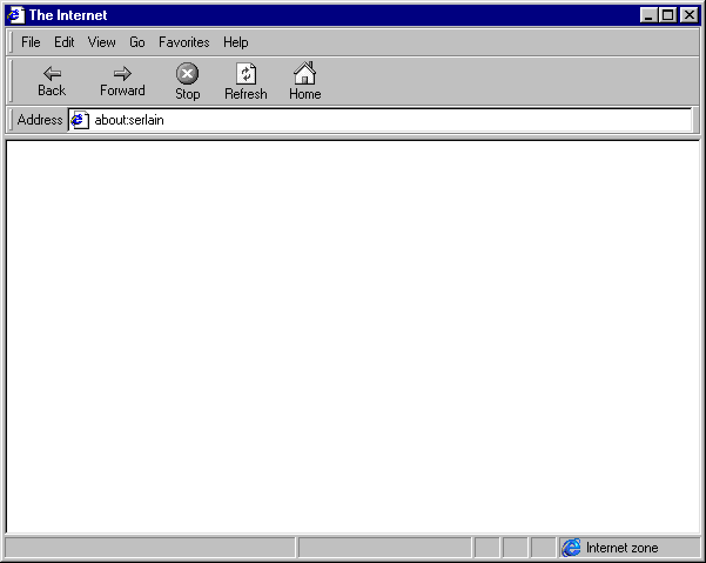
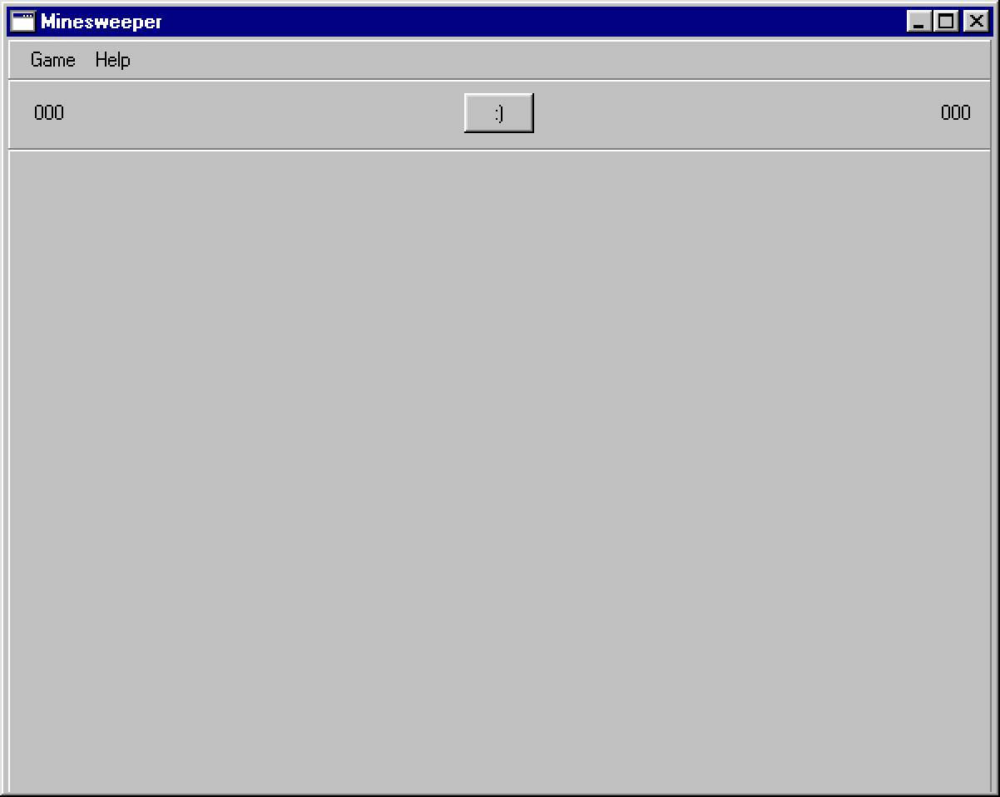
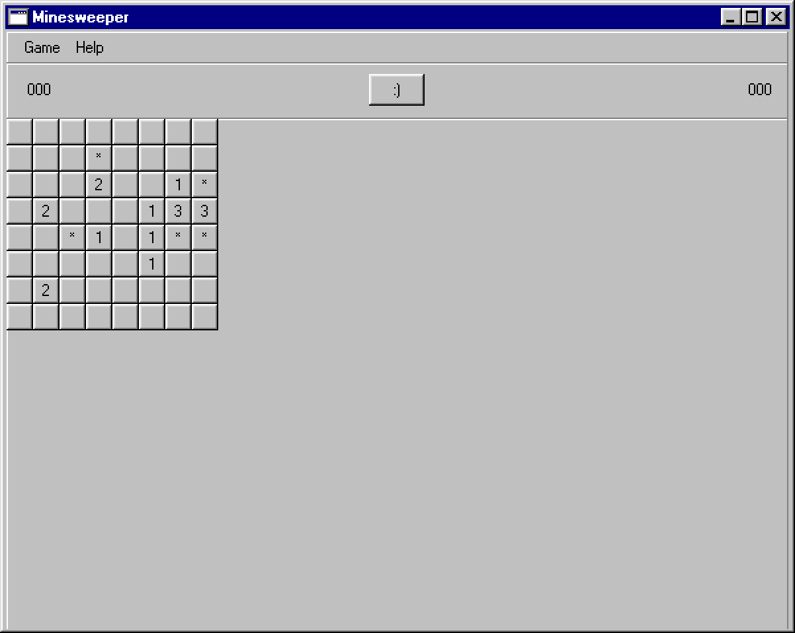
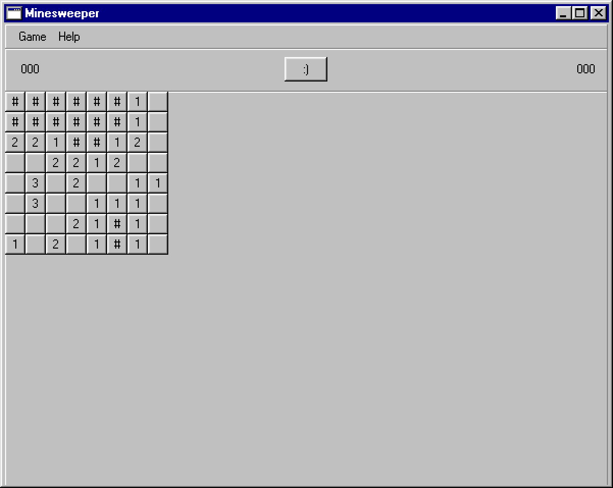
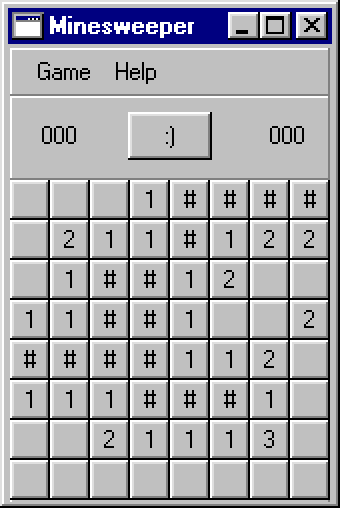
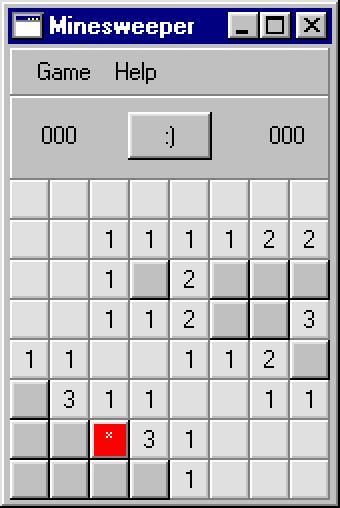

<post-date date="2 April 2023"/>

# GPT-4 implementing Minesweeper using a GUI framework it hadn't seen before

I've been casually working on a custom front-end framework &ndash; tentatively called <i>w95</i> &ndash; for building apps in the style of Windows 95. It does its own rendering into a \<canvas\>, etc. You can find out more about it [in these blog posts](/blog/#/w95).

The w95 framework isn't currently public nor would GPT-4 have prior knowledge about it. Still, I found that just by feeding the AI the GUI code of a single window built using the framework, it learns enough about the framework to compose new applications with it &ndash; with some help from the human along the way (chiefly adapting some of the AI's code to work with undisclosed implementation details of the framework).

This blog post outlines the steps the AI took in replicating a fair bit of the functionality of Windows Minesweeper as a w95 app. I didn't bother trying to get it to fully replicate the game, as I think what it did here is indication enough that it could've done most of the rest as well, if not all.

## Warming up

> <i>"Here's an example of a Windows 95-like GUI window built using a GUI framework called w95. Study this example and generate another window using the framework. The window should be like a typical Windows 95 application."</i>

> Input code
```javascript
w95.widget.window({
    x: x.now,
    y: y.now,
    width: width.now,
    height: height.now,
    title: "The Internet",
    icon: icons.blankPageSmall,
    move(newX, newY, {isRelative}) {
        x.set(newX + (isRelative? x.now : 0));
        y.set(newY + (isRelative? y.now : 0));
    },
    resize(newWidth, newHeight, {isRelative}) {
        width.set(newWidth + (isRelative? width.now : 0));
        height.set(newHeight + (isRelative? width.now : 0));
    },
    children: [
        // Controls.
        w95.widget.frame({
            x: 0,
            y: 0,
            width: (width.now - 8),
            height: 92,
            shape: w95.enum.frameShape.box,
            children: [
                // Menu bar.
                w95.widget.frame({
                    x: 4,
                    y: 4,
                    width: 3,
                    height: 18,
                    shape: w95.enum.frameShape.box,
                    styleHints: [
                        w95.enum.styleHint.raised,
                    ],
                }),
                w95.widget.frame({
                    x: 1,
                    y: 1,
                    width: (width.now - 10),
                    height: 24,
                    shape: w95.enum.frameShape.box,
                    styleHints: [
                        w95.enum.styleHint.raised,
                    ],
                    children: [
                        w95.widget.menuBar({
                            x: 8,
                            y: 3,
                            width: (width.now - 6),
                            children: [
                                w95.widget.menuItem({
                                    text: "File",
                                    isTopLevel: true,
                                }),
                                w95.widget.menuItem({
                                    text: "Edit",
                                    isTopLevel: true,
                                }),
                                w95.widget.menuItem({
                                    text: "View",
                                    isTopLevel: true,
                                }),
                                w95.widget.menuItem({
                                    text: "Go",
                                    isTopLevel: true,
                                }),
                                w95.widget.menuItem({
                                    text: "Favorites",
                                    isTopLevel: true,
                                }),
                                w95.widget.menuItem({
                                    text: "Help",
                                    isTopLevel: true,
                                }),
                            ],
                        }),
                    ],
                }),

                // Button bar.
                w95.widget.frame({
                    x: 4,
                    y: 28,
                    width: 3,
                    height: 36,
                    shape: w95.enum.frameShape.box,
                    styleHints: [
                        w95.enum.styleHint.raised,
                    ],
                }),
                w95.widget.frame({
                    x: 1,
                    y: 25,
                    width: (width.now - 10),
                    height: 42,
                    shape: w95.enum.frameShape.box,
                    styleHints: [
                        w95.enum.styleHint.raised,
                    ],
                    children: [
                        FlatButton({
                            x: 10,
                            y: 1,
                            width: 60,
                            height: 40,
                            text: "Back",
                            icon: icons.buttonLeft,
                            onClick() {
                                window.history.back();
                            },
                        }),
                        FlatButton({
                            x: 70,
                            y: 1,
                            width: 60,
                            height: 40,
                            text: "Forward",
                            icon: icons.buttonRight,
                            onClick() {
                                window.history.forward();
                            },
                        }),
                        FlatButton({
                            x: 130,
                            y: 1,
                            width: 50,
                            height: 40,
                            text: "Stop",
                            icon: icons.buttonStop,
                            onClick() {
                                window.stop();
                            }
                        }),
                        FlatButton({
                            x: 180,
                            y: 1,
                            width: 50,
                            height: 40,
                            text: "Refresh",
                            icon: icons.buttonReload,
                            onClick() {
                                viewportIframe.src += "";
                            }
                        }),
                        FlatButton({
                            x: 230,
                            y: 1,
                            width: 50,
                            height: 40,
                            text: "Home",
                            icon: icons.buttonHome,
                            onClick: ()=>{
                                 this.$form.addressBar.Message.replaceText("about:serlain");
                                 this.$form.addressBar.Message.submit();
                            },
                        }),
                    ]
                }),

                // Address bar.
                w95.widget.frame({
                    x: 4,
                    y: 70,
                    width: 3,
                    height: 18,
                    shape: w95.enum.frameShape.box,
                    styleHints: [
                        w95.enum.styleHint.raised,
                    ],
                }),
                w95.widget.frame({
                    x: 1,
                    y: 67,
                    width: (width.now - 10),
                    height: 24,
                    shape: w95.enum.frameShape.box,
                    styleHints: [
                        w95.enum.styleHint.raised,
                    ],
                    children: [
                        w95.widget.label({
                            x: 11,
                            y: 0,
                            height: 24,
                            text: "Address",
                            styleHints: [
                                w95.enum.styleHint.alignVCenter,
                            ],
                        }),
                        w95.widget.lineEdit({
                            $name: "addressBar",
                            x: 52,
                            y: 1,
                            width: (width.now - 43 - 25),
                            height: 22, 
                            padding: 19,
                            text: address.now,
                            onSubmit(text) {
                                let targetUrl = "";

                                switch (text) {
                                    case "about:serlain": {
                                        viewportIframe.removeAttribute("srcdoc");
                                        viewportIframe.src = "./assets/home.html";
                                        return;
                                    }
                                    default: targetUrl = text; break;
                                }

                                // Show a blank page while we load the next one.
                                viewportIframe.srcdoc = "";

                                targetUrl = targetUrl.replace(/[\s\:<>%&?\'\"]/g, "_");

                                (async()=>{
                                    const response = await fetch(`https://archive.org/wayback/available?timestamp=1998&url=${targetUrl}`);

                                    if (!response.ok) {
                                        console.error("Unhandled error");
                                        viewportIframe.src = "";
                                        viewportIframe.srcdoc = "Page not found";
                                    }
                                    
                                    try {
                                        const json = await response.json();
                                        const url = json.archived_snapshots.closest.url.replace(/^http:/, "https:");
                                        viewportIframe.removeAttribute("srcdoc");
                                        viewportIframe.src = url;
                                    }
                                    catch {
                                        console.error("Unhandled error");
                                        viewportIframe.src = "";
                                        viewportIframe.srcdoc = "Page not found";
                                    }
                                })();
                            },
                            onTextChange(newText) {
                                w95.debug?.assert(typeof newText === "string");
                                address.set(newText);
                            },
                        }),
                        w95.widget.bitmap({
                            x: 55,
                            y: 4,
                            image: icons.blankPageSmall,
                        }),
                    ],
                }),
            ],
        }),

        // Iframe.
        w95.widget.domElement({
            x: 2,
            y: 97,
            width: (width.now - 10),
            height: (height.now - 144),
            element: viewportIframe,
        }),
        w95.widget.frame({
            x: 0,
            y: 95,
            width: (width.now - 8),
            height: (height.now - 142),
            shape: w95.enum.frameShape.input,
        }),

        // Footer field #1.
        w95.widget.frame({
            x: 0,
            y: (height.now - 45),
            width: 248,
            height: 18,
            shape: w95.enum.frameShape.box,
        }),

        // Footer field #2.
        w95.widget.frame({
            x: 250,
            y: (height.now - 45),
            width: 148,
            height: 18,
            shape: w95.enum.frameShape.box,
            children: [
            ],
        }),

        // Footer field #3.
        w95.widget.frame({
            x: 400,
            y: (height.now - 45),
            width: 22,
            height: 18,
            shape: w95.enum.frameShape.box,
            children: [
            ],
        }),

        // Footer field #4.
        w95.widget.frame({
            x: 424,
            y: (height.now - 45),
            width: 22,
            height: 18,
            shape: w95.enum.frameShape.box,
            children: [
            ],
        }),

        // Footer field #5.
        w95.widget.frame({
            x: 448,
            y: (height.now - 45),
            width: 22,
            height: 18,
            shape: w95.enum.frameShape.box,
            children: [
            ],
        }),

        // Footer field #6.
        w95.widget.frame({
            x: 472,
            y: (height.now - 45),
            width: (width.now - 472 - 8),
            height: 18,
            shape: w95.enum.frameShape.box,
            children: [
                w95.widget.bitmap({
                    x: 2,
                    y: 1,
                    image: icons.ieLogoSmall,
                }),
                w95.widget.label({
                    x: 24,
                    y: 0,
                    height: 18,
                    text: "Internet zone",
                    styleHints: [
                        w95.enum.styleHint.alignVCenter,
                    ],
                }),
            ],
        }),
    ],
});
```

> The input code would produce a window like this if rendered with w95


For clarity, I've omitted a screenshot of the window GPT-4 chose to create.

## First go at Minesweeper

> <i>Generate the Windows 95 Minesweeper game using the API.</i>

> GPT-4
```javascript [{inline-class:gpt-response}]
w95.widget.window({
    x: x.now,
    y: y.now,
    width: width.now,
    height: height.now,
    title: "Minesweeper",
    icon: icons.minesweeper,
    move(newX, newY, {isRelative}) {
        x.set(newX + (isRelative ? x.now : 0));
        y.set(newY + (isRelative ? y.now : 0));
    },
    resize(newWidth, newHeight, {isRelative}) {
        width.set(newWidth + (isRelative ? width.now : 0));
        height.set(newHeight + (isRelative ? width.now : 0));
    },
    children: [
        // Menu bar.
        w95.widget.frame({
            x: 1,
            y: 1,
            width: (width.now - 10),
            height: 24,
            shape: w95.enum.frameShape.box,
            styleHints: [
                w95.enum.styleHint.raised,
            ],
            children: [
                w95.widget.menuBar({
                    x: 8,
                    y: 3,
                    width: (width.now - 6),
                    children: [
                        w95.widget.menuItem({
                            text: "Game",
                            isTopLevel: true,
                        }),
                        w95.widget.menuItem({
                            text: "Help",
                            isTopLevel: true,
                        }),
                    ],
                }),
            ],
        }),

        // Game header.
        w95.widget.frame({
            x: 1,
            y: 25,
            width: (width.now - 10),
            height: 42,
            shape: w95.enum.frameShape.box,
            styleHints: [
                w95.enum.styleHint.raised,
            ],
            children: [
                w95.widget.label({
                    x: 4,
                    y: 8,
                    width: 42,
                    height: 24,
                    text: "000",
                    styleHints: [
                        w95.enum.styleHint.alignVCenter,
                        w95.enum.styleHint.alignHCenter,
                    ],
                }),
                w95.widget.label({
                    x: (width.now - 52),
                    y: 8,
                    width: 42,
                    height: 24,
                    text: "000",
                    styleHints: [
                        w95.enum.styleHint.alignVCenter,
                        w95.enum.styleHint.alignHCenter,
                    ],
                }),
                w95.widget.button({
                    x: Math.floor((width.now - 10) / 2 - 21),
                    y: 8,
                    width: 42,
                    height: 24,
                    text: ":)",
                    onClick() {
                        // Reset the game board
                    },
                }),
            ],
        }),

        // Minesweeper game board.
        w95.widget.frame({
            x: 1,
            y: 67,
            width: (width.now - 10),
            height: (height.now - 92),
            shape: w95.enum.frameShape.box,
            styleHints: [
                w95.enum.styleHint.raised,
            ],
            children: [
                // ...Add Minesweeper game board elements here...
            ],
        }),
    ],
});

// Implement the Minesweeper game board elements and logic here.
```

Plugging GPT-4's code into w95 gave this output:



It's striking to me that the AI knew the layout of Minesweeper so well. I guess it's a massively well-known program, but still.

The menu bar entries are correct, the two score counters are where they should be, the smiley face button is reproduced and centered, and the window title has been set properly as well &ndash; all using an API the AI hadn't seen before. The vertical placement of the counters and smiley button is off by one pixel, and the background frame extends too far past the bottom of the window, but these are minor issues.

## Implementing game logic

> <i>"Could you show a full implementation of the game board frame widget?"</i>

> GPT-4
```javascript [{inline-class:gpt-response}]
// Generate the game board grid
function generateBoard(rows, cols, mines) {
    const board = Array.from({ length: rows }, () => Array(cols).fill(0));
    let minesPlaced = 0;

    while (minesPlaced < mines) {
        const row = Math.floor(Math.random() * rows);
        const col = Math.floor(Math.random() * cols);

        if (board[row][col] !== -1) {
            board[row][col] = -1;
            minesPlaced++;
        }
    }

    return board;
}

// Calculate the number of adjacent mines for each cell
function calculateAdjacentMines(board) {
    const rows = board.length;
    const cols = board[0].length;

    for (let row = 0; row < rows; row++) {
        for (let col = 0; col < cols; col++) {
            if (board[row][col] === -1) continue;

            let count = 0;
            const neighbors = [
                [-1, -1], [-1, 0], [-1, 1],
                [0, -1],           [0, 1],
                [1, -1], [1, 0], [1, 1]
            ];

            for (const [dx, dy] of neighbors) {
                const newRow = row + dx;
                const newCol = col + dy;

                if (
                    newRow >= 0 && newRow < rows &&
                    newCol >= 0 && newCol < cols &&
                    board[newRow][newCol] === -1
                ) {
                    count++;
                }
            }

            board[row][col] = count;
        }
    }

    return board;
}

const rows = 8;
const cols = 8;
const mines = 10;
const cellSize = 20;

const board = calculateAdjacentMines(generateBoard(rows, cols, mines));

// Create Minesweeper game board elements
const boardChildren = [];
for (let row = 0; row < rows; row++) {
    for (let col = 0; col < cols; col++) {
        const cell = w95.widget.button({
            x: col * cellSize,
            y: row * cellSize,
            width: cellSize,
            height: cellSize,
            text: "", // Initially, the cell content is hidden
            onClick() {
                // Reveal cell content (number of adjacent mines or mine)
                this.text = board[row][col] === -1 ? "*" : board[row][col] || "";
            },
        });

        boardChildren.push(cell);
    }
}

// Add the game board elements to the Minesweeper window
w95.widget.frame({
    x: 1,
    y: 67,
    width: (width.now - 10),
    height: (height.now - 92),
    shape: w95.enum.frameShape.box,
    styleHints: [
        w95.enum.styleHint.raised,
    ],
    children: boardChildren,
});
```



The AI added the game board buttons, correctly using the *onClick* callback function to interactively reveal the contents when the button is pressed (I've pressed some of the buttons in the above picture).

> <i>"Can you add logic for revealing the relevant surrounding empty cells when  an empty cell is clicked?"</i>

> GPT-4
```javascript [{inline-class:gpt-response}]
// ... (previous code to generate the board)

// DFS to reveal empty cells and adjacent numbered cells
function revealEmptyCells(board, row, col, visited) {
    if (
        row < 0 || row >= board.length ||
        col < 0 || col >= board[0].length ||
        visited[row][col]
    ) {
        return;
    }

    visited[row][col] = true;
    const cell = boardCells[row][col];
    cell.text = board[row][col] || '';

    if (board[row][col] === 0) {
        const neighbors = [
            [-1, -1], [-1, 0], [-1, 1],
            [0, -1],           [0, 1],
            [1, -1], [1, 0], [1, 1]
        ];

        for (const [dx, dy] of neighbors) {
            const newRow = row + dx;
            const newCol = col + dy;
            revealEmptyCells(board, newRow, newCol, visited);
        }
    }
}

const boardCells = Array.from({ length: rows }, () => Array(cols).fill(null));

// Create Minesweeper game board elements
const boardChildren = [];
for (let row = 0; row < rows; row++) {
    for (let col = 0; col < cols; col++) {
        const cell = w95.widget.button({
            x: col * cellSize,
            y: row * cellSize,
            width: cellSize,
            height: cellSize,
            text: "", // Initially, the cell content is hidden
            onClick() {
                if (board[row][col] === -1) {
                    this.text = "*";
                    // Add game over logic here
                } else {
                    revealEmptyCells(board, row, col, Array.from({ length: rows }, () => Array(cols).fill(false)));
                }
            },
        });

        boardCells[row][col] = cell;
        boardChildren.push(cell);
    }
}

// Add the game board elements to the Minesweeper window
w95.widget.frame({
    x: 1,
    y: 67,
    width: (width.now - 10),
    height: (height.now - 92),
    shape: w95.enum.frameShape.box,
    styleHints: [
        w95.enum.styleHint.raised,
    ],
    children: boardChildren,
});
```



The AI implemented depth-first search to reveal adjacent empty cells (marked here with "#"). I don't know whether this is a good approach, but it seems to work.

## Cleaning up

> <i>"Thanks, looks good. The initial values for width.now and height.now determine the size of the Minesweeper window. Could you give me their values so that the window is properly sized to contain the board and other GUI elements?"</i>

> GPT-4
```javascript [{inline-class:gpt-response}]
const cellSize = 24;
const rows = 9;
const cols = 9;

const menuBarHeight = 24;
const statusBarHeight = 24;
const paddingVertical = 10;
const paddingHorizontal = 8;

const widthNow = paddingHorizontal + (cellSize * cols);
const heightNow = paddingVertical + menuBarHeight + statusBarHeight + (cellSize * rows);
```



GPT-4 shows it has a working understading of what elements contribute to the dimensions of the window. Not all of the values it gave are precisely correct, but in the right ballpark. I adjusted the small inaccuracies by hand.

I made some tweaks on my own to the way the app looks:


