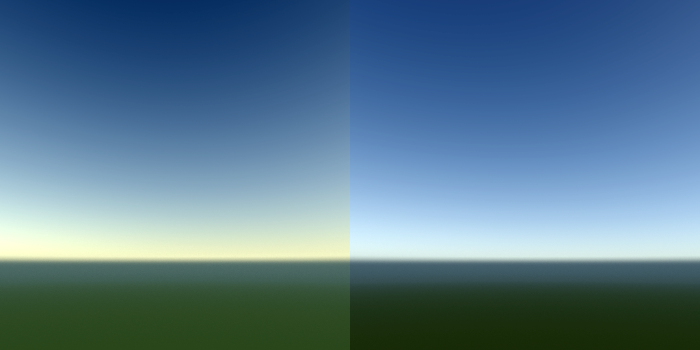
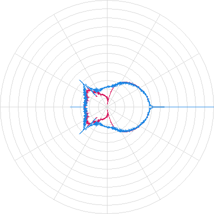
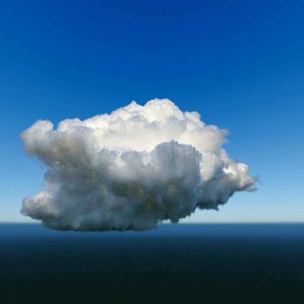

<post-date date="18 July 2022"/>

# How I wrote a cloud simulator/renderer

About a decade ago, I wrote a desktop app for simulating the atmospheric formation of water clouds and rendering them into fairly realistic images. It was an interesting project, crossing the fields of physics, chemistry, and optics, among others.

In this post, I'll describe a brief overview of the project's implementation &ndash; to the extent that I can remember. I'll start with how I simulated the atmosphere, then go over the rendering part.

## Simulation

Water clouds form when moisture in the air [condenses](https://en.wikipedia.org/wiki/Condensation) into droplets, which is preceded by the air's relative humidity increasing due to a decrease in its temperature, which results from the air expanding as it rises.

Simulating cloud formation is in other words concerned with realistically moving a body of air and modeling the resulting condensation.

### Kinetics

Air is a fluid, so a fluid simulator can be used to model its kinetic behavior &ndash; how it moves when a force is applied to it.

I'm not particularly mathematical, so I adopted the first fluid simulator that looked reasonable to me. That happened to be the fluid solver described in [Stam: Real-time fluid dynamics for games](http://graphics.cs.cmu.edu/nsp/course/15-464/Fall09/papers/StamFluidforGames.pdf).

You can see a sample 2D JavaScript implementation of Stam's solver below. Its source code is [available here](./widgets/fluid/fluid.js) (intended for demonstrational purposes, not of production quality).

> Sample JavaScript port of Stam's fluid solver

In my opinion, the solver produces a fairly convincing fluidic effect.

### Buoyancy

There are various forces that could move air, but a common one is [buoyancy](https://en.wikipedia.org/wiki/Buoyancy), in which a parcel of warm air experiences lift in a cooler environment.

I'm not sure what the exact formula for air buoyancy is, but the following works empirically:

<dokki-area inline-class="expression simple">
    B = Tparcel - Tenvironment
</dokki-area>

*B* is the air parcel's buoyancy (upward force) and *T* is temperature (in this case, °C).

As the air parcel rises, its temperature cools, and the buoyancy subsides.

### Relative humidity

The amount of water vapor air can hold is proportional to the temperature of the air (see [relative humidity](https://en.wikipedia.org/wiki/Humidity#Relative_humidity)).

As an air parcel cools, its relative humidity increases. Once the relative humidity exceeds 100%, the excess moisture begins to condense. Condensation slows the rate of cooling as the air rises further (see [moist adiabatic lapse rate](https://en.wikipedia.org/wiki/Lapse_rate#Moist_adiabatic_lapse_rate)).

The following may (or might not) be the correct way to compute an air parcel's relative humidity:

<dokki-area inline-class="expression">
    C =
    

        

            Mwater ⋅ PwaterVapor
        

        

            Mair ⋅ (Pair - PwaterVapor)
        

    

</dokki-area>

<dokki-area inline-class="expression">
    RH =
    100 ⋅
    

        

            V
        

        

            C
        

    

</dokki-area>

*RH* is the relative humidity (%), *C* is the air parcel's maximum capacity (kg) of water vapor, *V* is the amount (kg) of water vapor in the air parcel, *P* is pressure (hPa), and *M* is a mole mass constant (kg).

### Sample implementation

The sample simulation below applies buoyancy as a force to the Stam fluid solver and computes the resulting changes in the air's relative humidity &ndash; darker blue areas correspond to greater relative humidity. The sample's underlying source code is [available here](./widgets/fluid/atmosphere.js) (intended for demonstrational purposes, not of production quality).

> Sample atmospheric simulation (relative humidity)

The simulation runs in a 2D grid in which each grid cell represents an air parcel. Each parcel is associated with atmospheric variables like temperature and moisture, as well as corresponding velocity vectors from the fluid simulation.

Every tick, the grid cells' variables are moved along the velocity field, and changes resulting from the movement are computed (e.g. a reduction in temperature due to the air rising). Basic evaporation is also empirically modeled (see the source code for details).

### Output

The actual simulation runs on a 3D grid, producing as its output a 3D image of condensed moisture (= clouds).

> 3D simulation grid flattened on the Z axis showing the distribution of condensed moisture in a cloud

## Rendering

Clouds look the way they do due to refractive interaction of sunlight with the cloud droplets. Each time a ray intersects a droplet in a cloud, the direction of the ray may become altered:

<dokki-image headerless>
    <template #caption>
        A simplified view of a light ray changing direction as a result of intersecting water droplets inside a cloud
    </template>
    <template #content>
        <svg width="375" height="185" viewBox="0 0 300 150" style="background-color: white;">
            <marker id="arrow" viewBox="0 0 10 10" refX="5" refY="5"
                    markerWidth="13" markerHeight="13"
                    orient="auto-start-reverse">
                <path d="M 0 0 L 10 5 L 0 10 z" />
            </marker>
            <polyline points="-5,95 47.5,95 100,95 150,70 200,45 252.5,45 305,45" fill="none" stroke-width="1" stroke="black" stroke-linejoin="round" marker-mid="url(#arrow)"/>
            <circle cx="50" cy="50" r="10" stroke="black" stroke-width="1" fill="white"/>
            <circle cx="100" cy="95" r="10" stroke="black" stroke-width="1" fill="white"/>
            <circle cx="130" cy="20" r="10" stroke="black" stroke-width="1" fill="white"/>
            <circle cx="160" cy="130" r="10" stroke="black" stroke-width="1" fill="white"/>
            <circle cx="200" cy="45" r="10" stroke="black" stroke-width="1" fill="white"/>
            <circle cx="270" cy="100" r="10" stroke="black" stroke-width="1" fill="white"/>
        </svg>
    </template>
</dokki-image>

The job of the renderer, then, is to take the moisture (droplet) grid produced by the simulator and model the behavior or light inside it to produce images bearing the likeness of real clouds. The diagram below demonstrates the overall concept. A light ray originates from a viewer (black circle), enters a cloud (box), bounces around inside the cloud, then exits and scatters into the sky (blue arc).

<dokki-image headerless>
    <template #caption>
        A view ray (originating from the black circle) intersects a cloud (box), scatters inside the cloud (dashed line), and exits the cloud to hit the sky (blue arc)
    </template>
    <template #content>
        <svg width="375" height="280" viewBox="0 0 320 160" style="background-color: white;">
            <polyline points="35,140 90,140" fill="none" stroke-width="1" stroke="black" stroke-linejoin="round"/>
            <polyline points="90,140 110,100 120,120 140,140 150,160 160,120 180,100 220,80 250,40" fill="none" stroke-width="1" stroke="black" stroke-linejoin="round" stroke-dasharray="4"/>
            <polyline points="250,40 290,-13" fill="none" stroke-width="1" stroke="black" stroke-linejoin="round"/>
            <circle cx="35" cy="140" r="5.5" stroke="black" stroke-width="1"/>
            <rect x="90" y="40" width="200" height="150" fill="none" stroke-width="1.5" stroke="dimgray"/>
            <path d="M 0 0 A 220 100 0 0 1 320 0" stroke="#1e88e5" stroke-width="3" fill="transparent"/>
        </svg>
    </template>
</dokki-image>

For rendering these light paths, I wrote a volumetric [path tracer](https://en.wikipedia.org/wiki/Path_tracing).

### Rendering the sky dome

The sky gets its blue gradient appearance from sunlight being distributed across it by [Rayleigh scattering](https://en.wikipedia.org/wiki/Rayleigh_scattering).

[Hosek & Wilkie give a visually convincing model of Rayleigh scattering](https://cgg.mff.cuni.cz/projects/SkylightModelling/HosekWilkie_SkylightModel_SIGGRAPH2012_Preprint_lowres.pdf), as well as [an open-source reference implementation](https://cgg.mff.cuni.cz/projects/SkylightModelling/). (A [newer version of the model](https://cgg.mff.cuni.cz/publications/skymodel-2021/) is also available, but I'm not familiar with it.)

The two sample images below use the Hosek & Wilkie model to replicate the appearance of the sky at two different times of day (the color of the ground is not part of the model):

> Two sample sky renderings using the Hosek&ndash;Wilkie model showing the sun at a height of 15° (left) and 45° (right)

### Rendering clouds

As noted above, clouds are made of droplets, and light is scattered by those droplets in specific ways (see [Mie scattering](https://en.wikipedia.org/wiki/Mie_scattering) for details).

Referring back to me not being mathematically oriented, I didn't actually properly compute the droplet scattering parameters. Instead, I simply used the [MiePlot](http://www.philiplaven.com/mieplot.htm) software to get a visual idea of the distributions of scattering for various wavelengths of light, then implemented them in-code as fixed probabilities &ndash; a ray would have an *X*% chance of being scattered in a particular direction, and depending on the scattering angle, its color might be slightly modulated.

> A diagram produced originally by MiePlot showing the logarithmic polar distribution of light scattering from a spherical droplet (most scattering is forward)

Due to the nature of the scattering involved, the number of potential light paths inside a cloud is vast. It's very unlikely that a given ray originating from the viewer's eye finds its way straight into the sun though a cloud. Most scattering will be into the sky dome, with the occasional ray finding the sun. As a result, the rendering will take a very long time to converge.

To speed up the rendering, I added a separate [photon mapping](https://en.wikipedia.org/wiki/Photon_mapping) phase, which precedes the path tracing phase and in which rays are cast from the sun toward the clouds, depositing the sun's light into any droplets they intersect, producing a 3D cloud lightmap.

<dokki-image headerless>
    <template #caption>
        Two sun rays in the photon mapping phase depositing light inside droplets
    </template>
    <template #content>
        <svg width="375" height="375" viewBox="0 0 300 300" style="background-color: white;">
            <defs>
                <linearGradient id="two-color-droplet" x1="0%" y1="0%" x2="100%" y2="0%">
                <stop offset="0%" style="stop-color: #ffc107;"/>
                <stop offset="50%" style="stop-color: #ffc107;"/>
                <stop offset="50%" style="stop-color: #1e88e5;"/>
                <stop offset="100%" style="stop-color: #1e88e5;"/>
                </linearGradient>
            </defs>
            <polyline points="130,0 130,60 100,115 160,160 90,200 90,305" fill="none" stroke-width="2.5" stroke="#ffc107" stroke-linejoin="round"/>
            <polyline points="200,0 200,85 160,160 220,220 220,305" fill="none" stroke-width="2.5" stroke="#1e88e5" stroke-linejoin="round"/>
            <circle cx="50" cy="90" r="10" stroke="black" stroke-width="1" fill="none"/>
            <circle cx="100" cy="115" r="10" stroke="black" stroke-width="1" fill="#ffc107"/>
            <circle cx="130" cy="60" r="10" stroke="black" stroke-width="1" fill="#ffc107"/>
            <circle cx="160" cy="160" r="10.5" stroke="black" stroke-width="1" fill="black"/>
            <circle cx="160" cy="160" r="10" fill="url(#two-color-droplet)" />
            <circle cx="200" cy="85" r="10" stroke="black" stroke-width="1" fill="#1e88e5"/>
            <circle cx="270" cy="180" r="10" stroke="black" stroke-width="1" fill="none"/>
            <circle cx="220" cy="220" r="10" stroke="black" stroke-width="1" fill="#1e88e5"/>
            <circle cx="144" cy="250" r="10" stroke="black" stroke-width="1" fill="none"/>
            <circle cx="240" cy="35" r="10" stroke="black" stroke-width="1" fill="none"/>
            <circle cx="90" cy="200" r="10" stroke="black" stroke-width="1" fill="#ffc107"/>
        </svg>
    </template>
</dokki-image>

Then, during the path tracing phase, the lightmap is used to accumulate sunlight onto the view rays when they intersect droplets that were lit by the sun.

<dokki-image headerless>
    <template #caption>
        A view ray (traveling from left to right) accumulating deposited sunlight from droplets it intersects
    </template>
    <template #content>
        <svg width="375" height="188" viewBox="0 45 300 150" style="background-color: white;">
            <marker id="arrow3" viewBox="0 0 10 10" refX="5" refY="5"
                    markerWidth="12" markerHeight="12"
                    orient="auto-start-reverse">
                <path d="M 0 0 L 10 5 L 0 10 z" />
            </marker>
            <marker id="arrow2" viewBox="0 0 10 10" refX="5" refY="5"
                    markerWidth="4.8" markerHeight="4.8"
                    orient="auto-start-reverse">
                <path d="M 0 0 L 10 5 L 0 10 z" />
            </marker>
            <polyline points="-5,130 50,130 100,130" fill="none" stroke-width="1" stroke="black" stroke-linejoin="round" marker-mid="url(#arrow3)"/>
            <polyline points="100,130 150,107.5 200,85" fill="none" stroke-width="2.5" stroke="#ffc107" stroke-linejoin="round" marker-mid="url(#arrow2)"/>
            <polyline points="200,85 305,85" fill="none" stroke-width="2.5" stroke="#ffc107" stroke-linejoin="round"/>
            <polyline points="200,85 252.5,85 305,85" fill="none" stroke-width="2.5" stroke="#1e88e5" stroke-linejoin="round" stroke-dasharray="10" marker-mid="url(#arrow2)"/>
            <circle cx="50" cy="90" r="10" stroke="black" stroke-width="1" fill="none"/>
            <circle cx="100" cy="130" r="10" stroke="black" stroke-width="1" fill="#ffc107"/>
            <circle cx="130" cy="60" r="10" stroke="black" stroke-width="1" fill="#ffc107"/>
            <circle cx="160" cy="160" r="11" stroke="black" stroke-width="1" fill="#1e88e5"/>
            <circle cx="200" cy="85" r="10" stroke="black" stroke-width="1" fill="#1e88e5"/>
            <circle cx="270" cy="180" r="10" stroke="black" stroke-width="1" fill="none"/>
            <circle cx="220" cy="220" r="10" stroke="black" stroke-width="1" fill="#1e88e5"/>
            <circle cx="144" cy="250" r="10" stroke="black" stroke-width="1" fill="none"/>
        </svg>
    </template>
</dokki-image>

## Some results

Below are a couple of the renderings I made back then.

Due to hardware/performance limitations, none of the images are fully converged, and their resolution is fairly low.

The second image shows a mushroom cloud with unnaturally high heat and moisture parameters, causing the simulation grid to be partly visible.

## Conclusions

This post has outlined the process I used to create a cloud simulator/renderer. For brevity, I've left out some details (like non-convective lift, cloud evaporation, and droplet weight), but what's included is hopefully enough to get an interested person started. You're welcome to <ths-inline-feedback-button>send feedback</ths-inline-feedback-button> for improvements or comments.

A big problem I had when working on this app was its inhibitive computational cost. The number of potential light paths inside a cloud is massive, the atmospheric simulation wasn't fast to run either, and there were a large number of empirical parameters to adjust in both the simulator and the renderer (I wasn't an expert on the topic, so I did plenty of trial and error). It was hard to appreciate the effects of even smaller changes to the model when they required overnight runs to complete.

So the first thing I'd look to improve is probably the performance. One interesting paper I later came across was [one in which the authors used neural nets](https://arxiv.org/abs/1709.05418) for a considerable speedup to cloud rendering.
