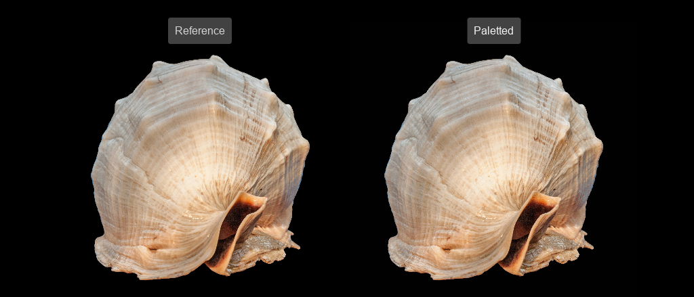

<post-date date="21 June 2022"/>

# Implementing a paletted API for \<canvas\>

[Palettes](https://en.wikipedia.org/wiki/Palette_(computing)) were used liberally in the earlier days of computing but aren't too common nowadays. But you'll come across them if you fancy retro computing.

I'd previously written a [retro-themed 3D renderer for \<canvas\>](https://github.com/leikareipa/retro-ngon) and now wanted to add support for paletted rendering. So I wrote a drop-in replacement interface for \<canvas\> that provides a paletted API/UX for direct pixel manipulation.

> A reference full-color image next to a 256-color paletted image, rendered on corresponding canvas elements


The rest of this post [describes the implementation in brief terms](#implementing-a-paletted-api-for-canvas-architecture-in-a-nutshell), [gives some simple samples of usage](#implementing-a-paletted-api-for-canvas-end-user-api), and [discusses a few performance matters](#implementing-a-paletted-api-for-canvas-performance-concerns).

## Architecture in a nutshell

The implementation of the paletted \<canvas\> consists of three new classes, which extend or replace existing canvas-related functionality. The sections below briefly describe those classes.

For reference, you can [access the full source code on GitHub](https://github.com/leikareipa/paletted-canvas).

### HTMLCanvasElement <i class="fas fa-fw fa-long-arrow-alt-right"></i> HTMLPalettedCanvasElement

The implementation extends [HTMLCanvasElement](https://developer.mozilla.org/en-US/docs/Web/API/HTMLCanvasElement) with the custom class *HTMLPalettedCanvasElement*, whose main purpose is to override *HTMLCanvasElement.getContext()* to return a paletted rendering context.

With this class registered as a customized built-in element using [CustomElementRegistry.define()](https://developer.mozilla.org/en-US/docs/Web/API/CustomElementRegistry/define), the user can transform any existing \<canvas\> into a paletted version by adding the *is* attribute:

```html [{headerless}]
<!-- Regular canvas (HTMLCanvasElement). -->
<canvas></canvas>

<!-- Paletted canvas (HTMLPalettedCanvasElement). -->
<canvas is="paletted-canvas"></canvas>
```

```javascript [{headerless}]
// In JavaScript:
const canvasEl = document.createElement("canvas", {is: "paletted-canvas"});

(canvasEl instanceof HTMLCanvasElement) === true
(canvasEl instanceof HTMLPalettedCanvasElement) === true
```

One downside of this approach is that [customized built-in elements aren't supported at all in Safari](https://caniuse.com/custom-elementsv1) without [a polyfill](https://github.com/ungap/custom-elements). Although supported across the board in other major browsers, it seems a little unclear whether this feature will stick around in the future.

### CanvasRenderingContext2D <i class="fas fa-fw fa-long-arrow-alt-right"></i> CanvasRenderingContextIndexed

The custom class *CanvasRenderingContextIndexed* is a translation layer on top of the standard [CanvasRenderingContext2D](https://developer.mozilla.org/en-US/docs/Web/API/CanvasRenderingContext2D), replicating relevant parts of the latter's interface to allow paletted rendering operations on the parent \<canvas\>.

Most notably, the class provides a version of [CanvasRenderingContext2D.putImageData()](https://developer.mozilla.org/en-US/docs/Web/API/CanvasRenderingContext2D/putImageData) that takes as its argument a paletted image. The function converts the image into 32-bit color using the currently active palette, then displays it on the canvas using the *putImageData()* of an underlying instance of *CanvasRenderingContext2D*.

### ImageData <i class="fas fa-fw fa-long-arrow-alt-right"></i> IndexedImageData

For storing and managing indexed image data, a custom *IndexedImageData* was implemented, giving the user an [ImageData](https://developer.mozilla.org/en-US/docs/Web/API/ImageData)-like interface.

Notably, *IndexedImageData* associates image data with a palette, and provides functionality with which the user can manipulate the palette's data.

## End-user API

### Creating a paletted \<canvas\>

As was noted above, a paletted \<canvas\> element can be created by specifying the *is* attribute:

```html [{headerless}]
<canvas is="paletted-canvas"></canvas>
```

Alternatively, the element can be created in JavaScript like so:

```javascript [{headerless}]
const canvasEl = document.createElement("canvas", {is: "paletted-canvas"});
```

### Manipulating the contents of a paletted \<canvas\>
As with a regular \<canvas\>, the *getContext()* function is used to retrieve the canvas's rendering context:

```javascript [{headerless}]
const context = canvasEl.getContext();
```

Drawing into it is likewise much as it is with a regular \<canvas\>, except a palette needs to be defined, and each pixel in the data buffer is a palette index rather than four RGBA values.

The following sample code fills the canvas with the color at index #0 in the palette (blue):

```javascript [{headerless}]
const image = context.createImageData();
image.palette = [[0, 100, 255]];
image.data.fill(0);
context.putImageData(image);
```

<div style="
    width: 307px;
    height: 190px;
    background-color: rgb(0, 100, 255);
"></div>

If we modify the palette color at index #0, then repaint the image, we get a version that uses the new color:

```javascript [{headerless}]
image.palette[0] = [255, 0, 200];
context.putImageData(image);
```

<div style="
    width: 307px;
    height: 190px;
    background-color: rgb(255, 0, 200);
"></div>

### More samples

Here's a few simple samples of manipulating a paletted \<canvas\> for one effect or another.

#### Horizontal spinner

<dokki-iframe height="35px" headerless src="./widgets/horizontal-spinner.html"></dokki-iframe>

```javascript [{headerless}]
<canvas is="paletted-canvas" width="32" height="1"></canvas>

// Create a palette with a gradient between blue and white (using the alpha channel
// to modulate lightness).
image.palette = (
    new Array(canvasEl.width)
    .fill()
    .map((e, idx)=>([0, 100, 255, (127 + (127 * Math.cos(idx / 5)))]))
);

image.data = Array.from(image.palette.keys());

// Each frame, shift the palette right by one step to animate the gradient.
(function render_loop() {
    image.palette = [image.palette.pop(), ...image.palette];
    context.putImageData(image);
    window.requestAnimationFrame(render_loop);
})();
```

#### Unintuitive clock

<dokki-iframe height="35px" headerless src="./widgets/clock.html"></dokki-iframe>

```javascript [{headerless}]
<canvas is="paletted-canvas" width="11" height="1"></canvas>

// Create a palette with 10 shades of blue, representing the values 0-9.
image.palette = (
    new Array(10)
    .fill()
    .map((el, idx)=>([0, 100, 255, (255 * (idx / 10))]))
);

// Each frame, get the current epoch time such that the nth digit corresponds to
// the nth horizontal pixel, then assign each pixel one of the 10 shades of color
// depending on the digit's value (0-9).
(function render_loop() {
    image.data = Date.now().toString().split("").slice(0, 11).reverse();
    context.putImageData(image);
    window.requestAnimationFrame(render_loop);
})();
```

## Performance concerns

A paletted \<canvas\> will generally have a higher raster throughput when compared to a regular \<canvas\>, since palette indices tend to be smaller (e.g. 8 bits) than full-color pixels (32 bits). The performance bottleneck will most likely be in converting the indexed image into a full-color image for display.

The simplest way to convert an indexed image into 32-bit color is of course to iterate over each pixel in the indexed image and copy the corresponding palette data into the destination image's pixel buffer:

```javascript [{headerless}]
// fullColorImage == ImageData
// indexedImage == IndexedImageData

for (let i = 0; i < indexedImage.data.length; i++) {
    fullColorImage.data[i * 4 + 0] = indexedImage.palette[indexedImage.data[i]][0];
    fullColorImage.data[i * 4 + 1] = indexedImage.palette[indexedImage.data[i]][1];
    fullColorImage.data[i * 4 + 2] = indexedImage.palette[indexedImage.data[i]][2];
    fullColorImage.data[i * 4 + 3] = indexedImage.palette[indexedImage.data[i]][3];
}
```

The above can be sped up a bit by copying 32 bits at a time (assumes a little-endian system):

```javascript [{headerless}]
const fullColor32bit = new Uint32Array(fullColor.data.buffer);

for (let i = 0; i < indexedImage.data.length; i++) {
    const paletteColor = indexedImage.palette[indexedImage.data[i]];
    fullColor32bit[i] = (
        (paletteColor[3] << 24) |
        (paletteColor[2] << 16) |
        (paletteColor[1] << 8) |
        paletteColor[0]
    );
}
```

A further optimization is to pre-compute the 32-bit value for each palette entry:

```javascript [{headerless}]
// When the user sets the palette.
palette.dword = new Uint32Array(palette.map(color=>(
    (color[3] << 24) |
    (color[2] << 16) |
    (color[1] << 8) |
    color[0]
)));

// ...

// When the user calls putImageData().
for (let i = 0; i < indexedImage.data.length; i++) {
    fullColor32bit[i] = indexedImage.palette.dword[indexedImage.data[i]];
}
```

With the above, I found the paletted \<canvas\> to perform more or less at the speed of a regular \<canvas\> (see [test/integration/reference-vs-paletted](https://github.com/leikareipa/paletted-canvas/tree/master/test/integration/reference-vs-paletted)).

A yet further optimization is to use the pre-computed 32-bit palette values directly: e.g. *image[5] = palette[0]* instead of *image[5] = 0*, where *image* is a 32-bit view directly to the underlying *CanvasRenderingContext2D* pixel buffer. This allows the implementation to skip entirely the step of converting the indexed image into full color in order to display it (since the act of writing into the indexed image has already transfered over the full color data) while still allowing the end-user API to resemble a paletted system. However, a downside is that changing the palette requires all pixel values in the indexed image to be updated in a separate step (so it's not really an indexed image), and overall the UX of this approach feels less genuine.
