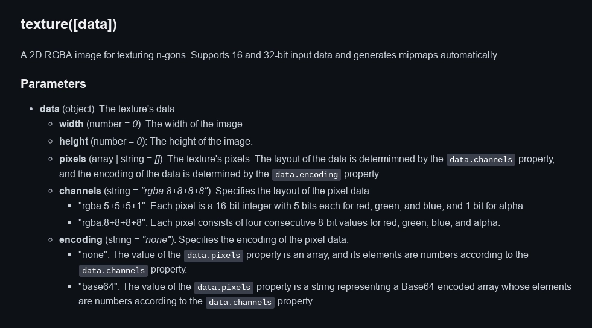

<post-date date="23 April 2023"/>

# In an AI future, what should end-user documentation look like?

Wearing the hat of technical writer for my software projects, the day usually starts with an attempt to predict the needs of the target audience, their backgrounds and expectations, etc., then aligning the documentation along those parameters.

Now that stronger AI is on the horizon, this approach is starting to feel old-fashioned. It produces static content that can't adapt to the reader's needs.

An obvious way forward is to use AI to project the documentation into the user's frame of mind, i.e. having the user issue queries to the AI about the software and the AI transforming the underlying documentation accordingly.

## AI-friendly documentation

Suppose we're a technical writer and want to create documentation the user can interface with via AI. Let's also say that this AI is ChatGPT powered by GPT-4. How should we structure our documentation to ensure a workable outcome?

Here are some idealistic key considerations:

- The documentation should fit in its entirety into ChatGPT's context space, so the AI can fully reason about it.
- The documentation should be easy for the user to incorporate into their ChatGPT prompts, ideally located all in one place.
- The documentation needs to be readable to both humans and ChatGPT.

Here's a format I've been trialing in [one of my projects](https://github.com/leikareipa/retro-ngon/), a JavaScript 3D software renderer:

```markdown [{headerless}{no-line-numbers}]
    # API reference

    The renderer's public API consists of the following functions:

    | Function | Brief description                     |
    | -------- | ------------------------------------- |
    | ...      | ...                                   |
    | texture  | A 2D RGBA image for texturing n-gons. |
    | ...      | ...                                   |

    All but *`render()`* and *`render_async()`* are factory functions, i.e. their purpose is to construct and return an object based on the input arguments.

    ## texture([data])

    A 2D RGBA image for texturing n-gons. Supports 16 and 32-bit input data and generates mipmaps automatically.

    ### Parameters

    - **data** (object): The texture's data:
        - **width** (number = *0*): The width of the image.
        - **height** (number = *0*): The height of the image.
        - **pixels** (array | string = *[]*): The texture's pixels. The layout of the data is determimned by the `data.channels` property, and the encoding of the data is determined by the `data.encoding` property.
        - **channels** (string = *"rgba:8+8+8+8"*): Specifies the layout of the pixel data:
            - "rgba:5+5+5+1": Each pixel is a 16-bit integer with 5 bits each for red, green, and blue; and 1 bit for alpha.
            - "rgba:8+8+8+8": Each pixel consists of four consecutive 8-bit values for red, green, blue, and alpha.
        - **encoding** (string = *"none"*): Specifies the encoding of the pixel data:
            - "none": The value of the `data.pixels` property is an array, and its elements are numbers according to the `data.channels` property.
            - "base64": The value of the `data.pixels` property is a string representing a Base64-encoded array whose elements are numbers according to the `data.channels` property.
```

The documentation has been reduced to a technical API reference &ndash; written in Markdown &ndash; that briefs the salient details. The text uses various formatting strategies to pattern and compress the information, and sparsely includes sample code to demonstrate usage (not shown here).

For end-user consumption, the raw Markdown can be rendered into HTML. For example, it looks like this when viewed on GitHub:



## Trying it out

Let's paste the API reference (or relevant parts of it, as it currently doesn't entirely fit the 4,000-token context limit) into ChatGPT and see whether the AI can have it accommodate some potential end-user needs.

### Quick-start guide

<p class="label-a">"Write a beginner-level quick-start guide on how to use the renderer."</p>

> GPT-4


This is a reasonable quick-start guide, with logical steps and code snippets that work. It's not the best writing ever, but enough to get the user's feet wet, and they could ask follow-up questions to keep the ball rolling.

### Isometric rendering

<p class="label-a">"Show me how to draw an isometric tilemap using the renderer."</p>

> GPT-4


Not a bad effort, as the output is more or less correct. The UV coordinates are off though.

<p class="label-a">"The textures look like they're not mapped correctly to the tile's orientation."</p>

> GPT-4
``` [{word-wrap}{no-line-numbers}{inline-class:gpt-response-text}]
I apologize for the confusion. You're right; the texture mapping is not properly aligned with the isometric tile orientation. To fix this, we need to adjust the texture coordinates (UV coordinates) of each vertex in the isometric tile.

Here's an updated version of the createIsometricTile function with corrected UV coordinates:

...
```

Here the conversation exceeded ChatGPT's 4,000-token context limit and the model started hallucinating functionality (the *createIsometricTile* function) that wasn't in its original response. Still, it was correct about needing to adjust the UV coordinates, which I've done here:

> GPT-4 + Human assistance


This highlights the problem of context length, as when the documentation takes up most of the available 4,000 tokens, there's not much room left for continued discussion, and the coherency goes south very quickly. But as the context length ceiling is expected to go up in future releases of ChatGPT, it's effectively a solved problem.

### Performance test

<p class="label-a">"Write a performance test that renders at three different resolutions and displays the FPS results in a HTML table."</p>

> GPT-4


If I wanted a quick pulse on the renderer's performance, I'd be pretty well covered, as ChatGPT is able to convert the API reference into this performance test scaffold.

### Idea generation

<p class="label-a">"List several possible render effects that can be accomplished by consecutive calls to render() with a custom surfaceWiper function."</p>

> GPT-4
``` [{word-wrap}{no-line-numbers}{inline-class:gpt-response-text}]
Here are several render effects that can be accomplished by consecutive calls to render() with a custom surfaceWiper function:

1. Motion blur effect: By accumulating pixel values over multiple frames and blending them together, a motion blur effect can be achieved. The custom surfaceWiper function should not clear the entire render surface but instead blend the new frame with the previous frames using a specific weight or decay factor.

2. Cross-fade or dissolve transition: To create a cross-fade transition between two different scenes or dissolve effect, the custom surfaceWiper function should store the pixel buffer of the previous frame and blend it with the current frame using a specific interpolation factor that changes over time.

3. Double exposure effect: This effect can be achieved by combining two different scenes with different opacities. The custom surfaceWiper function should render the first scene and then render the second scene on top of it with a certain opacity level without clearing the render surface in between.

4.Image overlay or watermark: A custom surfaceWiper function can be used to overlay an image or watermark on top of the rendered scene. It can load the overlay image data and blend it with the current frame without clearing the render surface.

5. Multi-pass rendering effects: Some advanced rendering effects require multiple rendering passes. The custom surfaceWiper function can be used to manage these passes, selectively clearing parts of the render surface or blending them together as needed.

Remember that to achieve these effects, you might need to modify other parts of the rendering pipeline, such as the pixelShader, vertexShader, or other rendering options.
```

Background: *render()* is an API call to render polygons, and *surfaceWiper* is a function used by *render()* to clear the pixel buffers prior to rasterization.

Not a bad job extrapolating practical ideas from the technical API reference &ndash; though as ChatGPT points out at the end, many of the suggestions would be better handled by other parts of the render pipeline.
