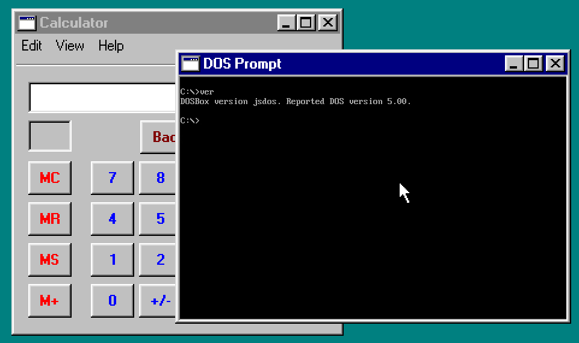
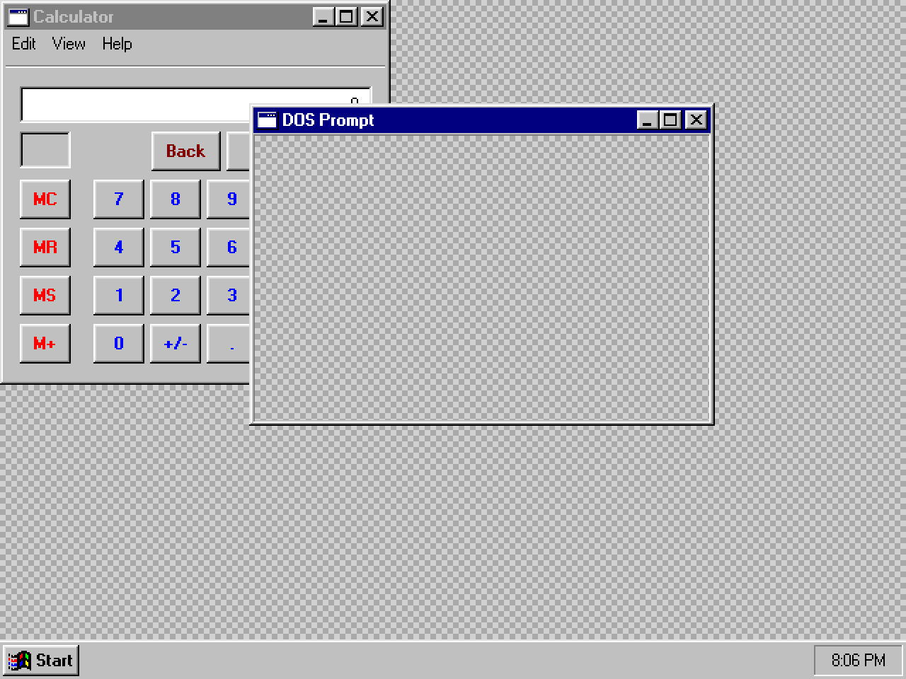
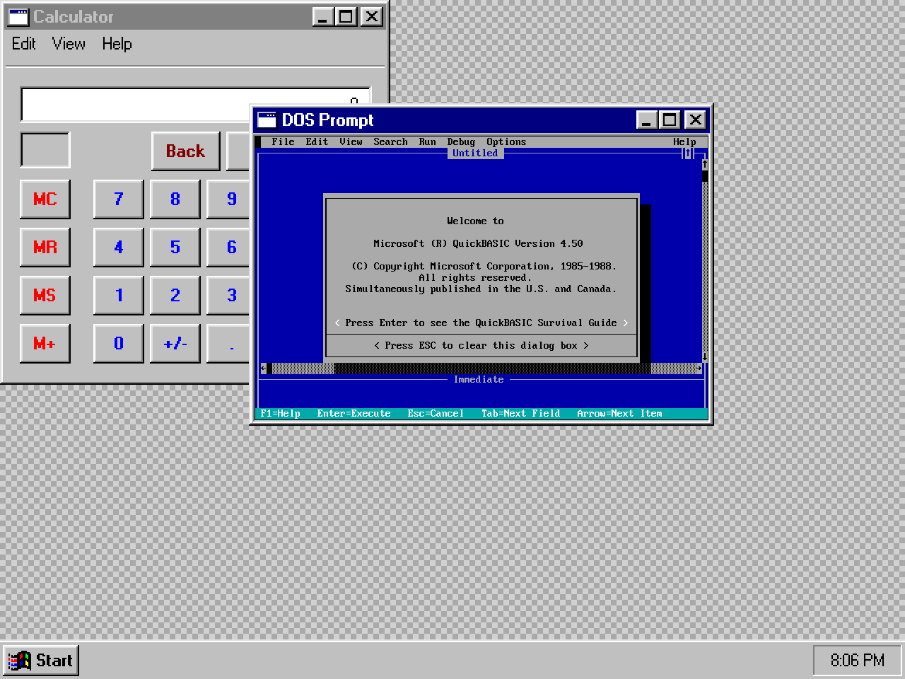
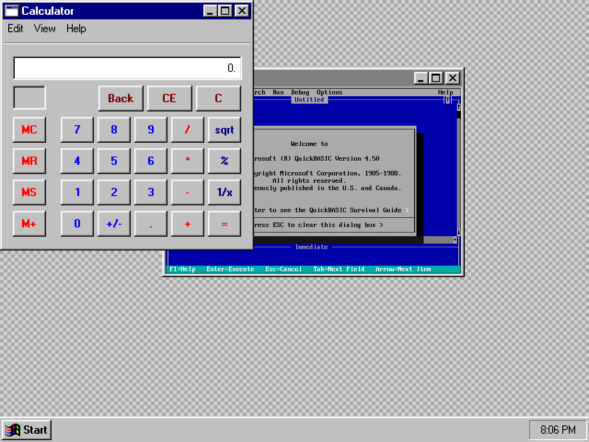
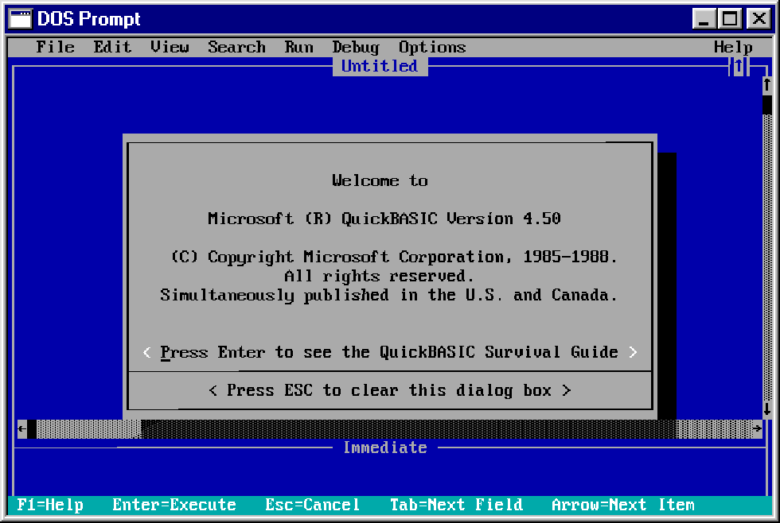

<post-date date="18 March 2023"/>

# Integrating DOSBox into a faux Windows 95 web shell

In [previous blog posts](/blog/#/w95), I've talked about my casual side project to implement a Windows 95-lookalike front-end framework that lives inside a canvas element.

This time, I'll outline the steps to integrating a DOSBox web client ([js-dos](https://js-dos.com/)) into the framework. If you want more background on the framework itself, check out some of those earlier posts.



The animation above shows an instance of js-dos presented as an app created using the framework.

The gist of it is that js-dos renders the output of DOSBox into a canvas element, while the framework associates the canvas element with a window widget (itself rendered on another canvas).

Here's a simplified version of the HTML/JavaScript that defines the page in which the whole thing runs:

```javascript [{headerless}]
<body>
    <canvas id="jsdos-canvas"></canvas>
    <canvas id="w95-canvas"></canvas>
    <script>
        Dos(document.getElementById("jsdos-canvas")).ready((fs, main)=>main());
    </script>
    <script>
        w95.shell.boot(document.getElementById("w95-canvas"));
        w95.shell.run(()=>{
            return w95.widget.window({
                title: "MS-DOS Prompt",
                children: [
                    w95.widget.domElement({
                        element: document.getElementById("jsdos-canvas"),
                    }),
                ],
            });
        });
    </script>
</body>
```

In that code, we first start js-dos with its *Dos* function, then the framework with <nobr>*w95.shell.boot*.</nobr> The output of js-dos gets directed to one canvas, and the output of the framework to another. We then use *w95.shell.run* to define and start the faux Windows 95 app in which js-dos's output is displayed via a *domElement* widget.

The *domElement* widget is defined about like this (simplified):

```javascript [{headerless}]
function domElement({
    width = 100,
    height = 100,
    element = undefined,
} = {})
{
    function relay_event_to_dom(event) {
        element.dispatchEvent(new event.constructor(event.type, event));
    }
    
    return {
        get dom() { return element },
        Event: {
            mousemove: relay_event_to_dom,
            mouseup: relay_event_to_dom,
            mousedown: relay_event_to_dom,
        },
        Form() {
            return Rngon.ngon([
                Rngon.vertex(0, 0),
                Rngon.vertex(width, 0),
                Rngon.vertex(width, height),
                Rngon.vertex(0, height)], {
                    color: Rngon.color(0, 0, 0, 0),
            });
        },
    };
}
```

The widget binds a DOM element into the framework's UI by carving out a transparent rectangle (using *Rngon.ngon*) through which the element will be visible and relaying user input events from the UI to the element.

Here's what the UI canvas would look like without js-dos, with a checkerboard pattern indicating transparent areas:



When the js-dos canvas is added to the HTML, it shows through the UI canvas's transparent region, inside the <i>DOS Prompt</i> window:



Other windows drawn in the UI canvas can occlude the transparent rectangle, which provides a corresponding occlusion of the underlying js-dos canvas:



To move the js-dos canvas in tandem with the UI widget, we update its CSS accordingly:

```javascript [{headerless}]
const canvasRect = w95.shell.display.canvas.getBoundingClientRect();

function recursively_concat_child_meshes(widget, dstArray = [], x = 0, y = 0) {
    x += widget.x;
    y += widget.y;

    const selfMesh = transformed_ngons(widget._mesh, x, y);

    if (widget.dom) {
        widget.dom.style.left = `${(x * w95.shell.display.scale) + canvasRect.x}px`;
        widget.dom.style.top = `${(y * w95.shell.display.scale) + canvasRect.y}px`;
    }

    if (!widget._hideMesh) {
        dstArray.unshift(...selfMesh);
        for (const child of widget.$childWidgets) {
            recursively_concat_child_meshes(child, dstArray, x, y);
        }
    }

    return dstArray;
}
```

One downside here is that the size of the js-dos output doesn't quite match the size of the UI: it's a bit too small at its base resolution of 640 &times; 400, and upscales cleanly only to integer multiples, at which point it's too big. Below is a screenshot of it in a multiple of 1.5, where it's a good fit with the UI but shows fairly noticeable scaling artifacts (you can tap the image to view it in its full size):


