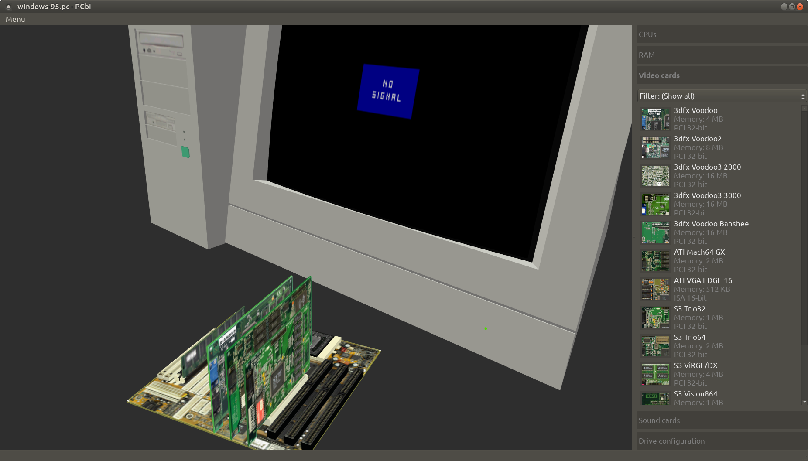
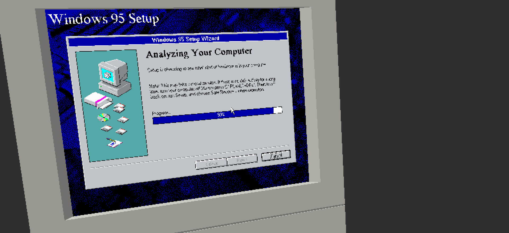
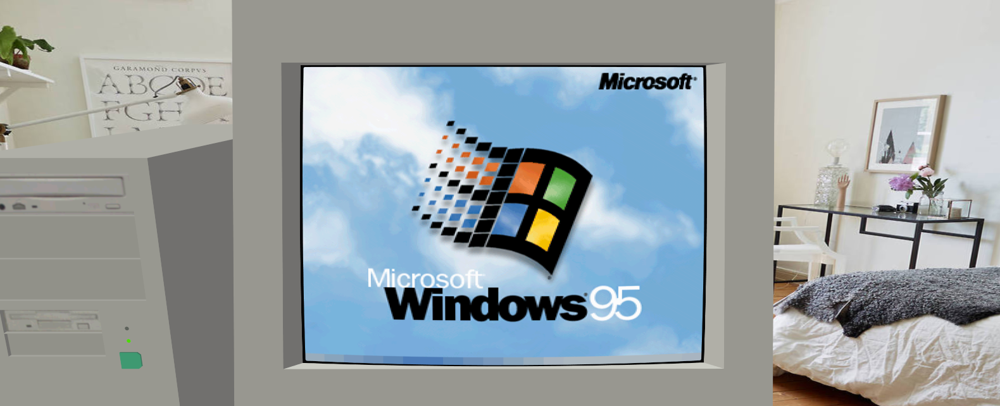
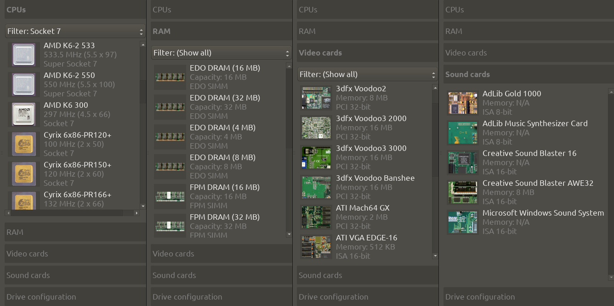
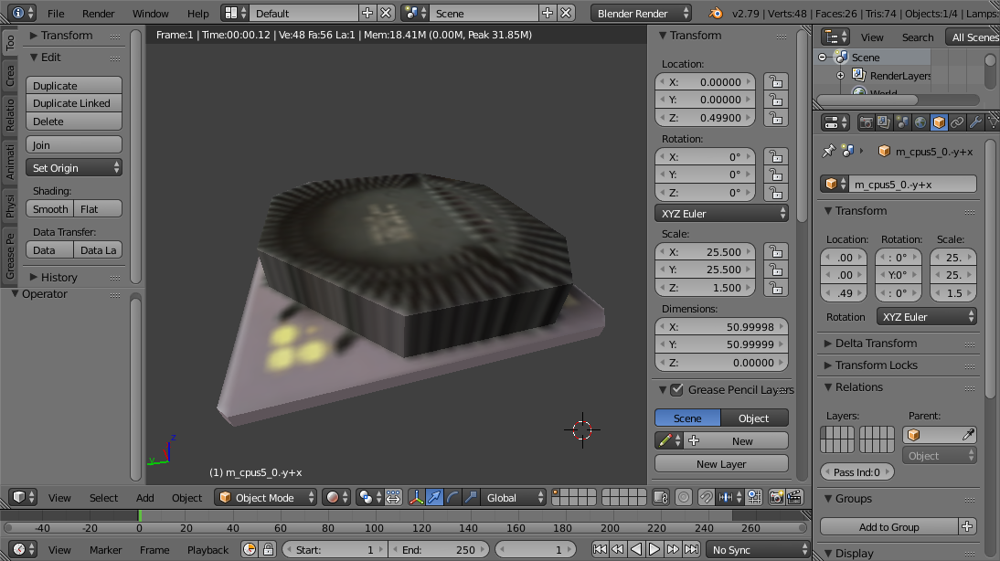
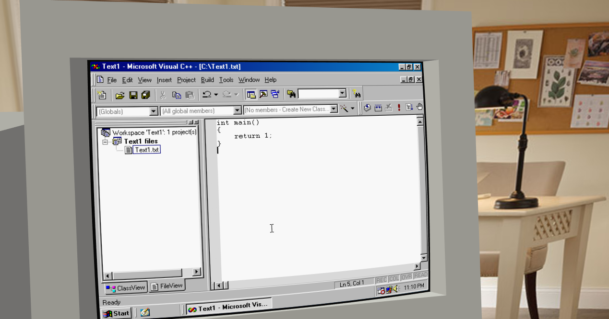

<post-date date="12 February 2024"/>

# Lookback: PCbi, the 3D UI for PCem

Remember PCbi, the 3D UI I wrote for [PCem](https://en.wikipedia.org/wiki/PCem)? Probably not, since it never really caught on and hasn't been available for many years. With that said, let's look back at the project.

> PCbi 0.17.1 for Linux, currently the most recent version


Development kicked off in December 2017, producing a string of public releases starting in 2018:

| Version     | Release date | For Linux | For Windows |
| ----------- | ------------ | --------- | ----------- |
| [alpha.1](https://www.youtube.com/watch?v=Hon6fbH8J3o)     | 20 Jan 2018  | Yes       |             |
| [alpha.2](https://www.youtube.com/watch?v=aTKS79XzVek)     | 27 Jan 2018  | Yes       |             |
| alpha.3     | 3 Feb 2018   | Yes       |             |
| alpha.4     | 7 Feb 2018   | Yes       |             |
| [alpha.5](https://www.youtube.com/watch?v=vR4VKRZharM)     | 15 Feb 2018  | Yes       |             |
| [alpha.6](https://www.youtube.com/watch?v=Al9ZszWIFJA)     | 18 Feb 2018  | Yes       |             |
| [alpha.7](https://www.youtube.com/watch?v=Cmez-Q_UN5I)     | 24 Feb 2018  | Yes       |             |
| alpha.7.1a  | 27 Feb 2018  | Yes       | Yes         |
| alpha.7.1b  | 27 Feb 2018  | Yes       |             |
| [0.13.0](https://www.youtube.com/watch?v=4Xh8L9PbXeM)      | 7 May 2018   | Yes       | Yes         |
| 0.14.0      | 8 May 2018   | Yes       |             |
| 0.15.0      | 9 May 2018   | Yes       |             |
| 0.16.0      | 9 May 2018   | Yes       |             |
| 0.16.1      | 14 May 2018  | Yes       |             |
| 0.16.2      | 18 May 2018  | Yes       |             |
| 0.17.0      | 31 Jan 2021  | Yes       |             |
| 0.17.1      | 2 Feb 2021   | Yes       |             |

The releases were predominantly for Linux, but I made a couple of builds for Windows as well. For various reasons the Windows builds were more tedious to produce, and who's got time for that.

In the post-alpha versioning scheme, the minor version indicated the version of PCem supported.

> Early releases used pure software rendering


The gist of PCbi is to have PCem pass its frame buffer via shared memory to PCbi, which then displays it on a 3D monitor for the user to gawk at as the emulation runs. Alongside the monitor is a motherboard that you can plop components onto to customize the PCem hardware configuration.

> Booting into Windows 95


Out of the box, PCbi comes with a variety of ye olde PC components, ranging from CPUs to sound cards, video cards, and more.

> A selection of components in PCbi


New components can be added via CSV-format component files, which bundle the component's textures, 3D models, metadata, etc.

> Sample component file
``` [{headerless}]
fileType,{PCbi component}
fileFormatVersion,1

uuid,{f16e207b-dc27-48db-bb5a-88b788ebd8e8}
name,{S3 ViRGE/DX}
type,{video card}
params,4096
pcemConfig,{gfxcard = virge375},{video_speed = 5}
pcemConfigExtra,{[S3 ViRGE/DX]},{memory = 4},{bilinear = 1},{dithering = 1}

pixmaps,2
pixmap,{virge375-back},...
pixmap,{virge375-front},...

meshes,2
mesh,{m_pci32_0.-z+x},12
polygon,3
...
mesh,{x_base},20
polygon,3
...
```

Component meshes are made up of two main parts: the connector and the component body. The name of the connector (<em>m_pci32_0.-z+x</em> in the above sample component file) encodes its type and orientation, defining among other things the direction in which the component body would be rotated by PCbi when the component is plugged into a compatible receiving connector.

> Editing the 3D mesh of a component in Blender


That's about the short of it for this 3D UI for PCem.

It's the usual story: an interesting project to work on but limited interest in the public sphere and I can't be bothered to advertise it either. I still use it privately, but it hasn't seen development for several years and may stay that way.

> Productive day at the office

