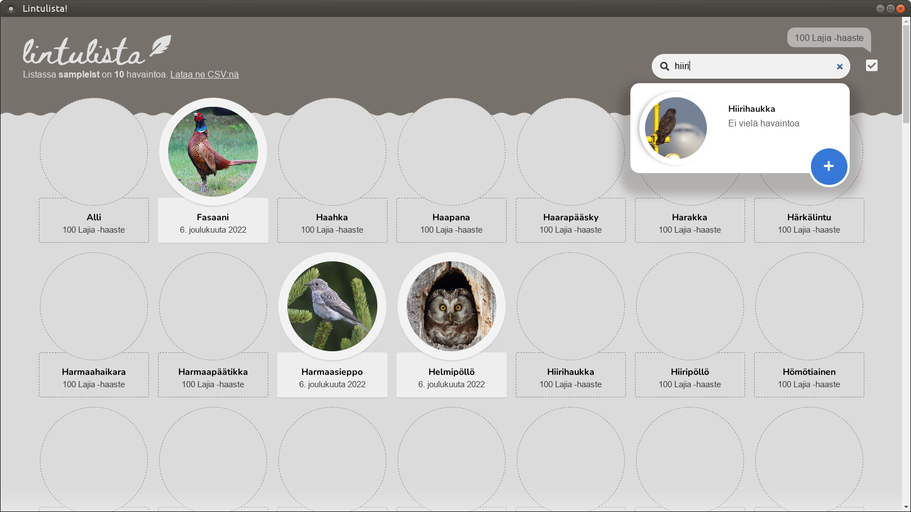

<post-date date="25 December 2022"/>

# Messing around with Electron

I had reason recently to convert one of my software, [Lintulista](/#lintulista), from a full-stack web app into a desktop application.

Normally, I'd use C++ with Qt for building the desktop stuff, but didn't want to rewrite this JavaScript codebase. Instead, I was able to use [Electron](https://www.electronjs.org/) to easily glue the app's server and client together into a desktop-runnable bundle.

In this post, I'll blurt out a few words about the experience, which was my first time with Electron.

## Setting up

Electron is [quite simple to set up and get running](https://www.electronjs.org/docs/latest/tutorial/quick-start). In short, you install the *electron* package, create a **package.json** file for it with some metainformation about your project, and add a bit of JavaScript code to tell Electron how to run the application.

In Lintulista's case, the runner code only needs to do two things:

1. Start the server
2. Start the client

### Starting the server

Lintulista's server is a regular old Node.js job that takes requests and comes up with responses. While the original version of the server used an SQL database, I replaced it here with a plain flat-file one to cut down on dependencies and make the app easier to distribute.

Starting the server for Electron is straightforward:

```javascript [{headerless}]
const {LL_ProcessRequest} = require("../server/process-request.js");
require("http").createServer(LL_ProcessRequest).listen(LL_SERVER_PORT, "127.0.0.1"); 
```

### Starting the client

With the server running, the client can be started as well:

```javascript [{headerless}]
const mainWindow = new Electron.BrowserWindow({show: false});

mainWindow.loadFile("../client/index.html");

mainWindow.on("ready-to-show", ()=>{
    mainWindow.show();
    mainWindow.focus();
});
```

The code will pop out a window displaying Lintulista's React-powered front-end, which interacts with the server as the user navigates the page.



## Distributable footprint

As I was only targeting a single platform (Linux), there didn't seem to be a need for custom build tools. I simply distributed the program's source code along with Electron's modules.

I organized the app's distributable like this:

<dokki-directory headerless>
    <template #structure>
        'client': {
            '/type': 'folder',
        },
        'database': {
            '/type': 'folder',
        },
        'electron': {
            '/type': 'folder',
        },
        'server': {
            '/type': 'folder',
        },
        'lintulista': {}
    </template>
</dokki-directory>

It's a clean and intuitive directory listing for the user &ndash; the program's code and Electron fluff are hidden under subdirectories, and the **lintulista** launch script is discoverable at first glance.

The launch script calls Electron's binary with a user-provided command-line parameter identifying the database resource to operate on:

```bash [{headerless}]
./electron/node_modules/electron/dist/electron ./electron/. $1
```

The app can then be launched with *./lintulista resource_id*.

## My impressions of Electron

My first impression of Electron was that it's easy to set up. You install its package, leaf through their quick-start guide, and a few minutes later you have your previously web-based app running on your desktop. Full disclosure: I tried [NW.js](https://nwjs.io/) before settling on Electron, but found the former messier to set up and distribute.

One downside of Electron was that it apparently tries not to be opinionated. For example, despite this being a predictable need, there was no standard way of persisting application settings. With Qt you might use [QSettings](https://doc.qt.io/qt-6/qsettings.html), but Electron apps are [left to implement their own solutions and reinvent stumbling-block workarounds](https://github.com/electron/electron/issues/526).

A larger problem was that it felt ass-backwards to build desktop software with the JavaScript front-end ecosystem that's specifically not supposed to run with elevated access. [Security with Electron](https://www.electronjs.org/docs/latest/tutorial/security) appeared fairly complicated and easy to get wrong, and potential vulnerabilities felt like a feature of the framework.

Still, this virgin developer experience I had with Electron was quite pleasant overall, and allowed a rapid transformation of a web app into a desktop application. I don't think I'll be diving head-first into building desktop software from the ground up with Electron, but it's a neat tool for limited purposes.
