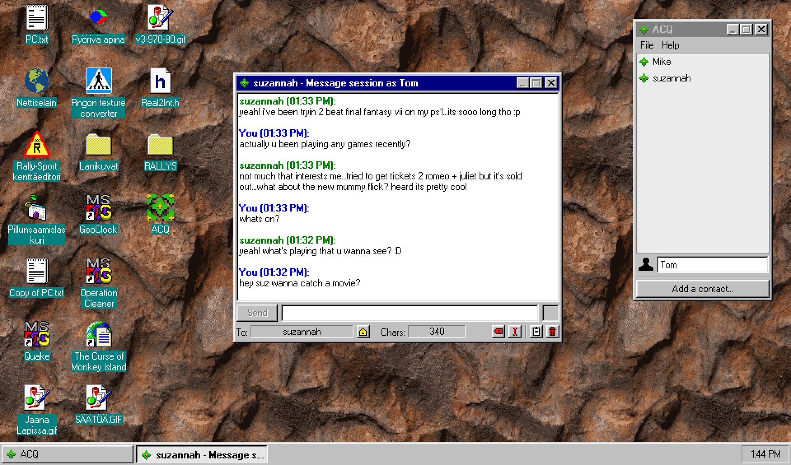
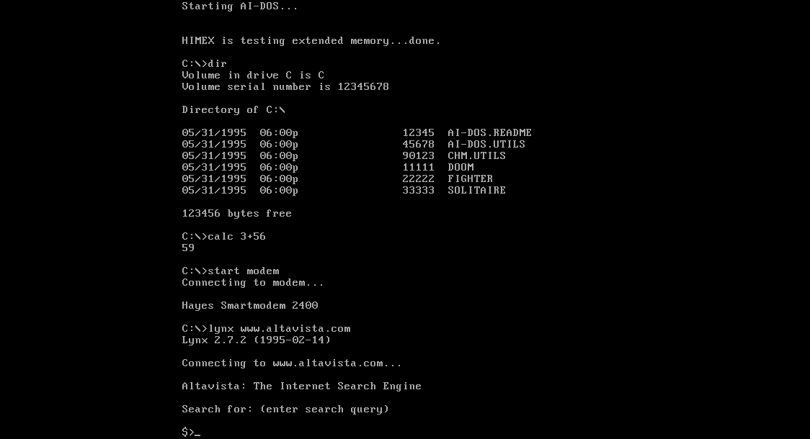

<post-date date="5 June 2024"/>

# My two retro frontends for Ollama

I spent a few evenings coding up a couple of retro web frontends for local Ollama, one loosely in the likeness of ICQ on Windows 95 and the other a DOS prompt. They both use my Windows 95 lookalike JavaScript UI framework.

The ICQ one is kinda like ICQ as you'd guess, with some differences and called ACQ. It uses a system prompt to get the LLM into a 1990s instant messaging frame of mind. Seen here running on [my desktop](/), powered by Llama 3 8B:

The DOS one is called [AI-DOS](/desktop/$apps/aidos/?model=) and is what you'd expect:

Fun to play around with. The ICQ replica works reasonably well, the DOS one is harder for many LLMs to keep in character.
