<post-date date="11 June 2023"/>

# Playing around with painterly Stable Diffusion

It's well known that Stable Diffusion is adept at imitating various artists' styles. You can also take advantage of this when generating realistic images.

For example, below are two images side by side, the left one generated normally and the right one with "Anders Zorn" added to the positive prompt and "painting" to the negative prompt (both generated using the Dreamlike Photoreal 2.0 model). 

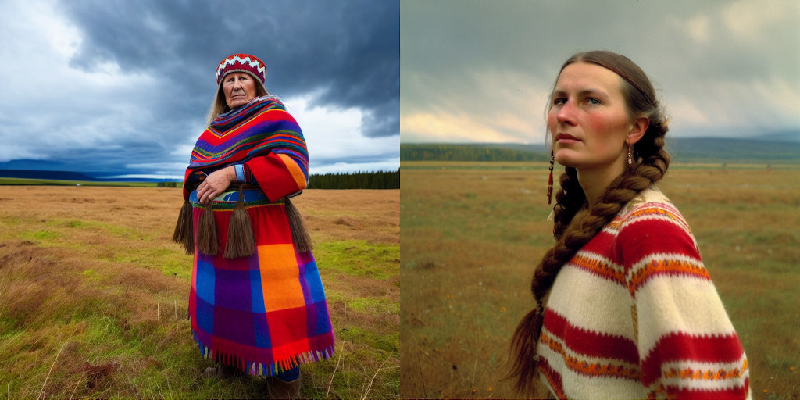

They're somewhat crude images as they're demonstrational, but in any case it's obvious that while they're both realistic enough the second one is more visually coherent and has a stronger sense of artistic vision.

## Anders Zorn

Females in the style of Zorn tend to come out with robust faces (and rosy cheeks).

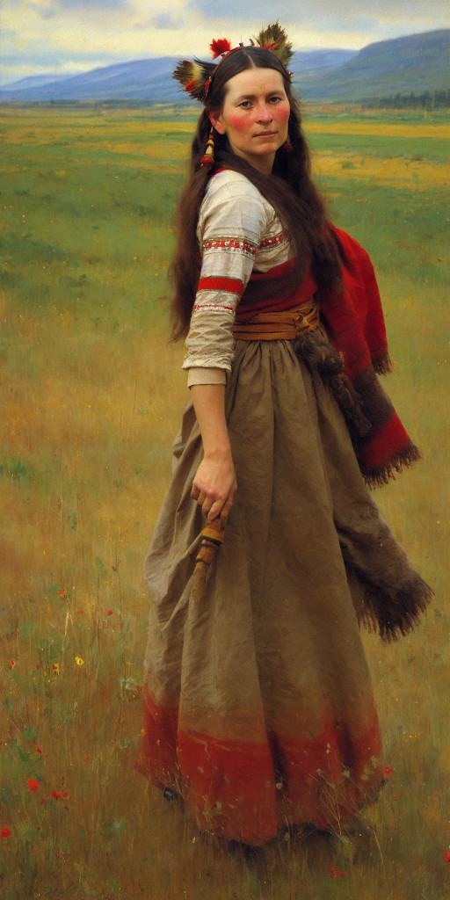

    <b>Positive prompt:</b>
    "Anders Zorn, Finnish Sami woman in a field, (whole body portrait), (wide brush strokes:1.2), earthy palette, very detailed, alla prima, subject in foreground"
    <b>Negative prompt:</b>
    "painting"

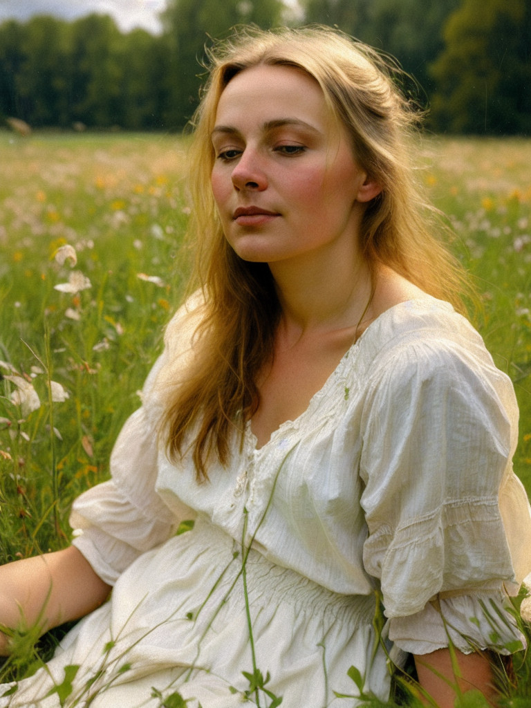

    <b>Positive prompt:</b>
    "Anders Zorn, Finnish woman sleeping in a field, (whole body portrait), (wide brush strokes:1.2), very detailed, alla prima, storm clouds, autumn"
    <b>Negative prompt:</b>
    "(painting:1.3)"

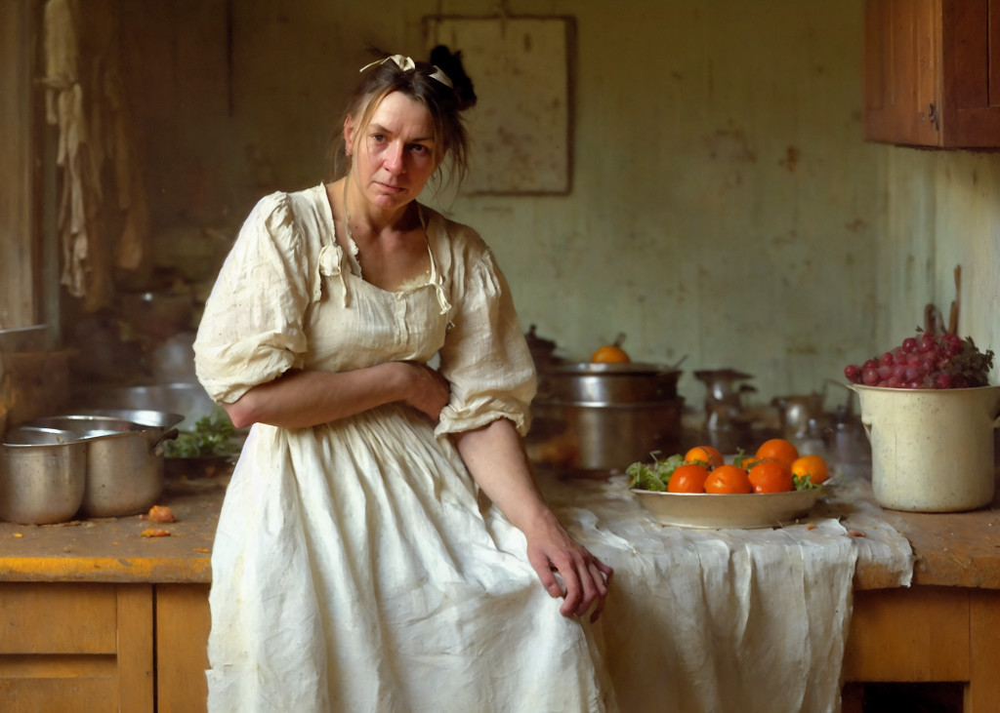

    <b>Positive prompt:</b>
    "Anders Zorn, woman wearing a tiara in a messy rural kitchen,(wide brush strokes:1.1), very detailed, alla prima, banal, unremarkable, earthy, white dress, oppressive atmosphere, foreboding, rotting, decadence"
    <b>Negative prompt:</b>
    "(painting:0.6)"

## John Singer Sargent

Sargent's women have an air of fragility.

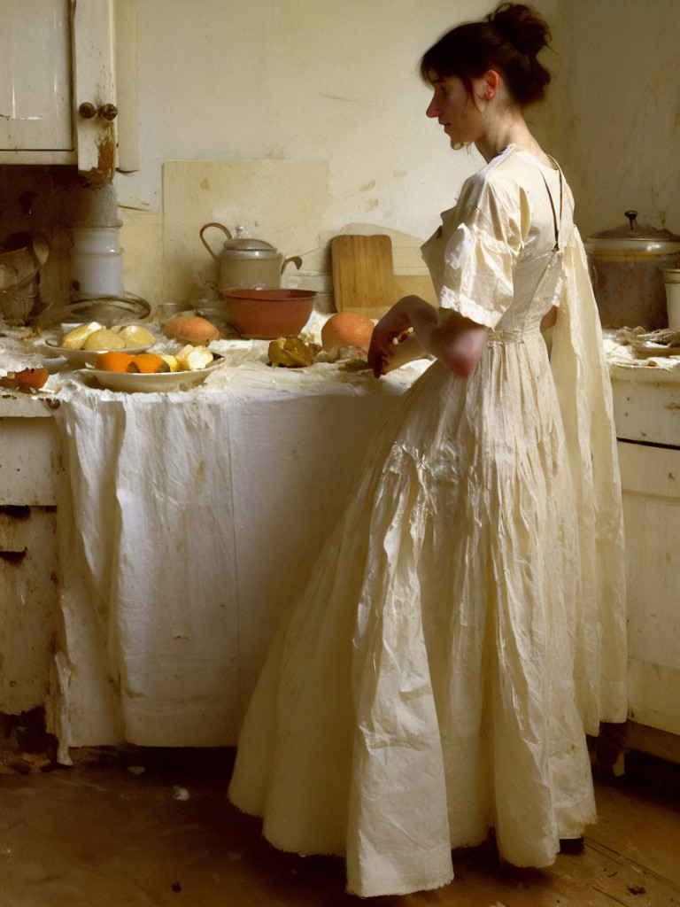

    <b>Positive prompt:</b>
    "John Singer Sargent, homely woman in a messy rural kitchen, (wide brush strokes:1.1), very detailed, alla prima, banal, unremarkable, earthy, white dress, oppressive atmosphere, foreboding, rotting, decadence"
    <b>Negative prompt:</b>
    "(painting:1.1)"

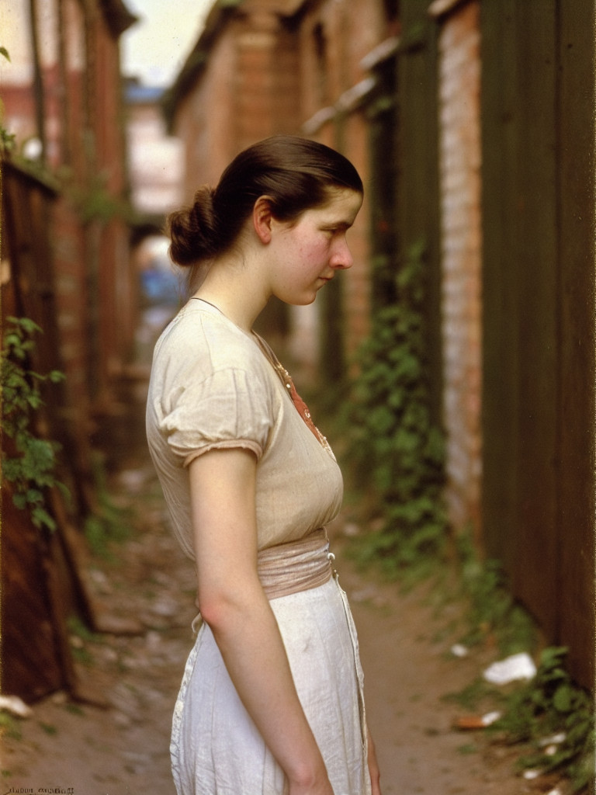

    <b>Positive prompt:</b>
    "John Singer Sargent, woman at a dilapidated finnish streetside cade, banal, unremarkable, very detailed hair, foul stench"
    <b>Negative prompt:</b>
    "strange, surreal, painting, modern"

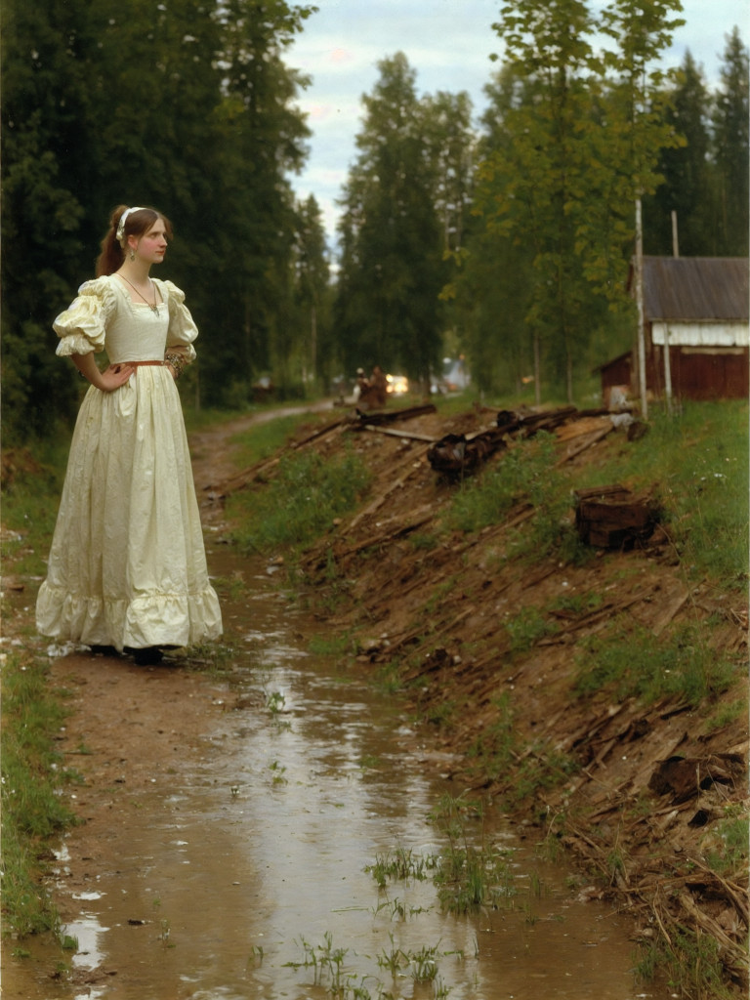

    <b>Positive prompt:</b>
    "John Singer Sargent, woman with a tiara at a rural finnish streeside cade, foreboding, doom, rotten, decadent, foul stench"
    <b>Negative prompt:</b>
    "painting, strange, surreal"

## James Abbott McNeill Whistler

Whistler's style is similar to Sargent's but quieter.

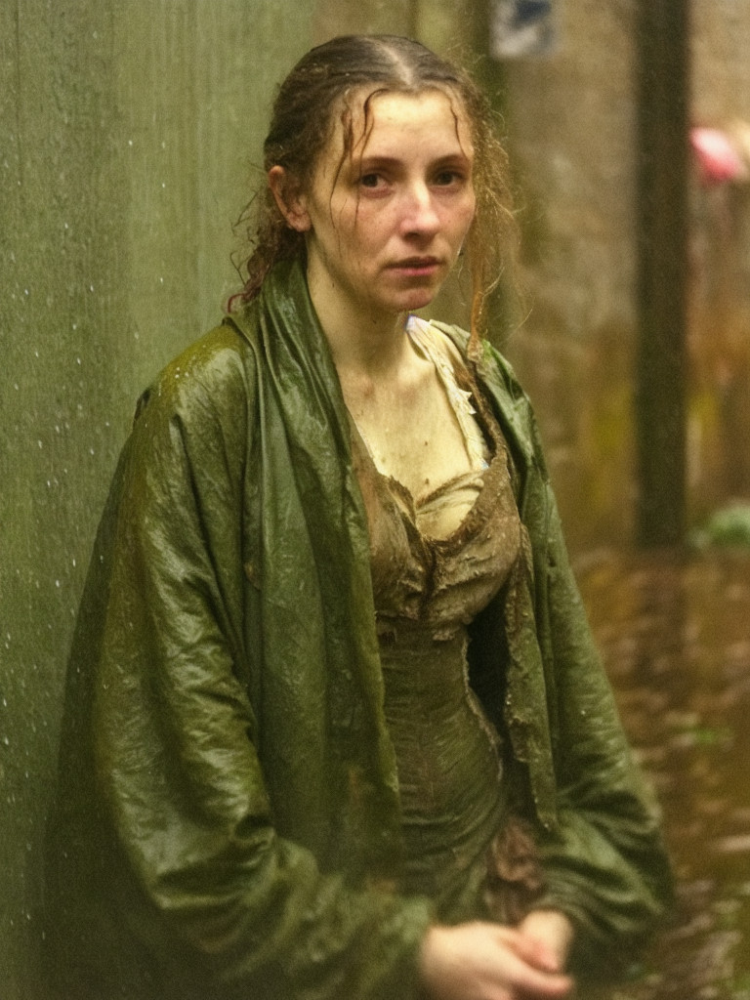

    <b>Positive prompt:</b>
    "James Abbott McNeill Whistler, wet woman at a dilapidated finnish rural streetside cafe, banal, unremarkable, photo, doom, decadence, wet, neon mood, foreboding, foul stench, unusual composition, very detailed plants, detailed face"
    <b>Negative prompt:</b>
    "strange, surreal, (painting:1.1), modern, uneven skintone"

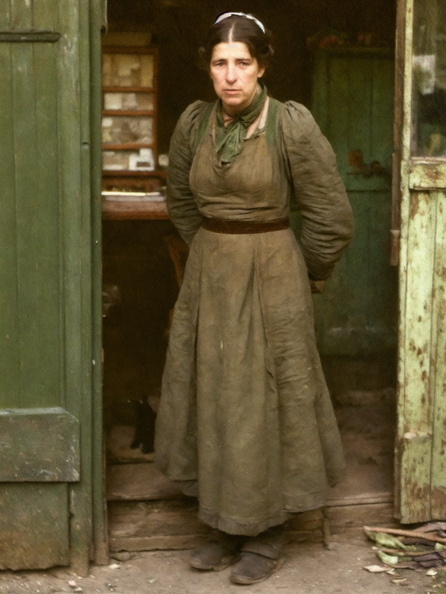

    <b>Positive prompt:</b>
    "James Abbott McNeill Whistler, woman at a dilapidated finnish rural streetside cafe, banal, unremarkable, photo, doom, decadence, foreboding, foul stench, unusual composition, very detailed plants, detailed face"
    <b>Negative prompt:</b>
    "strange, surreal, (painting:1.1), modern, uneven skintone"

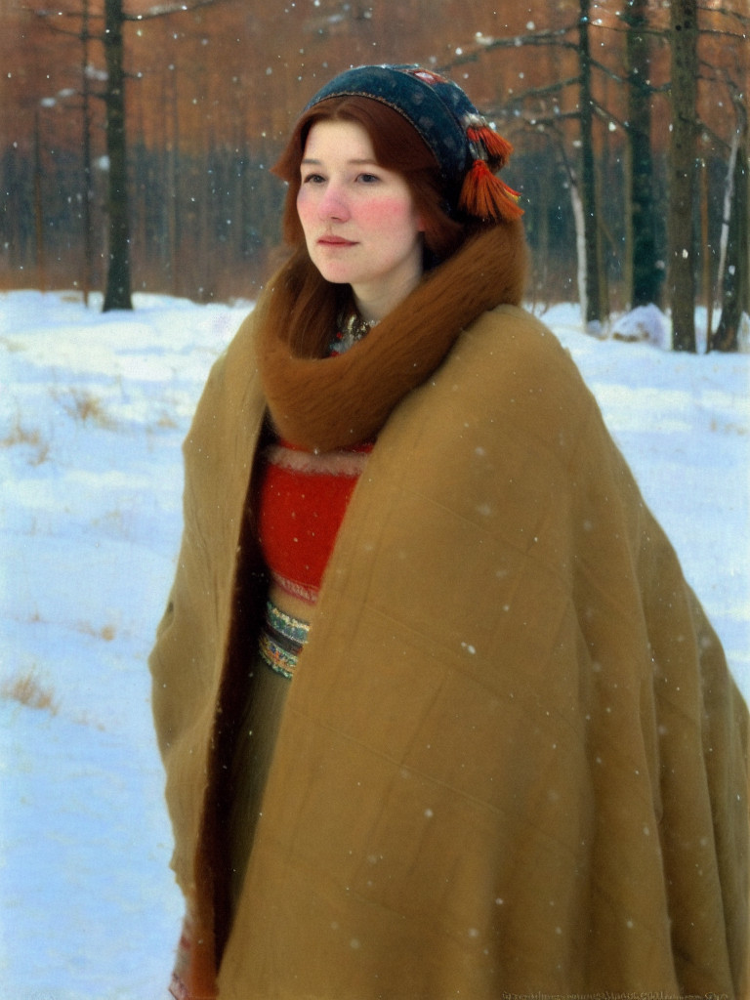

    <b>Positive prompt:</b>
    "James Abbott McNeill Whistler, Sami woman in wintry Finnish outdoors, (wide brush strokes:1.1), alla prima, very detailed, alla prima, banal, unremarkable"
    <b>Negative prompt:</b>
    "(painting:1.3), mutated eye, strange eye, strange iris, harsh lighting, modern"

## Alfred Sisley

Sisley being the impressionist gives off a dreamier vibe.

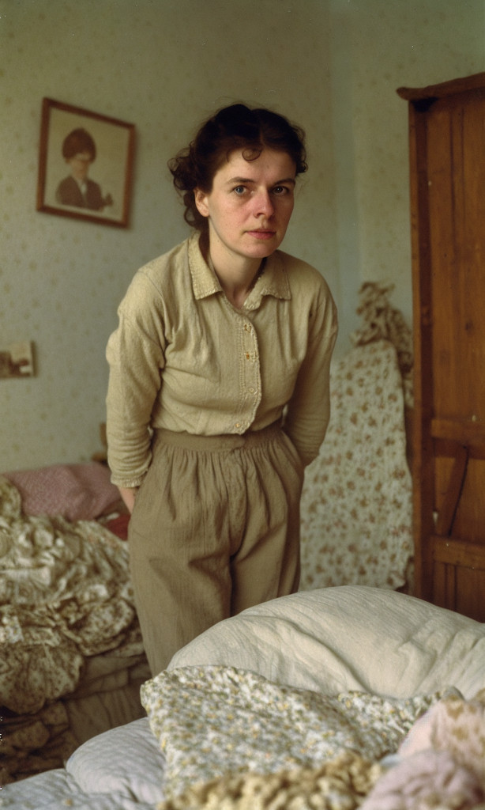

    <b>Positive prompt:</b>
    "Alfred Sisley, homely woman in a messy rural bedroom with lots of small photos on the wall, (wide brush strokes:1.1), very detailed, alla prima, banal, unremarkable, earthy, oppressive atmosphere, foreboding, rotting, decadence"
    <b>Negative prompt:</b>
    "(painting:1.2)"

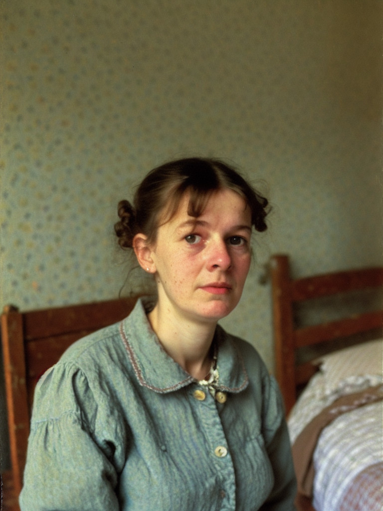

    <b>Positive prompt:</b>
    "Alfred Sisley, homely woman in a messy rural bedroom with lots of small photos on the wall, (wide brush strokes:1.1), very detailed, alla prima, banal, unremarkable, earthy, oppressive atmosphere, foreboding, rotting, decadence"
    <b>Negative prompt:</b>
    "(painting:1.2)"

## Berthe Morisot

Another impressionist,  Morisot-like images come out with dreamlike qualities. People tend to look like they're on vacation, and usually there's rose-like flowers around.

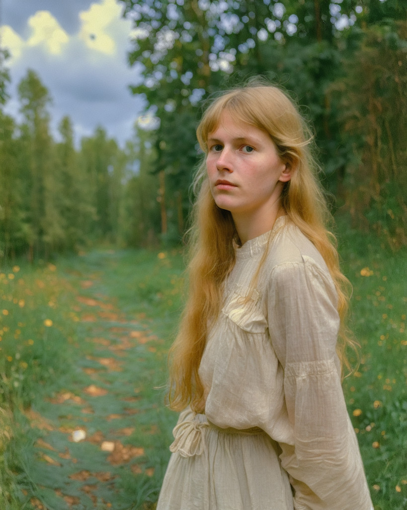

    <b>Positive prompt:</b>
    "Berthe Morisot, woman in Finnish countryside, (wide brush strokes:1.1), alla prima, banal, unremarkable, decadence, heavy clouds, moist, neglected, earthy, very high contrast, bright sunlight, unusual camera angle, very detailed face"
    <b>Negative prompt:</b>
    "(painting:1.2)"

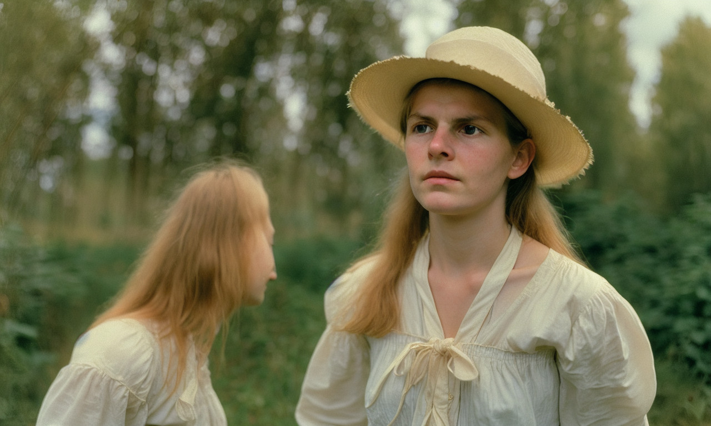

    <b>Positive prompt:</b>
    "Berthe Morisot, woman in Finnish countryside, (wide brush strokes:1.1), alla prima, banal, unremarkable, decadence, heavy clouds, moist, neglected,earthy, very high contrast, bright sunlight, unusual camera angle, very detailed face"
    <b>Negative prompt:</b>
    "(painting:1.2)"

## Interior

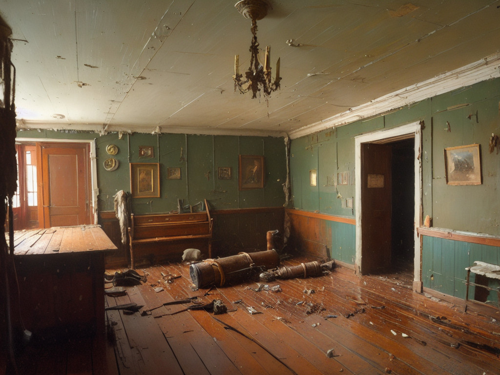

    <b>Positive prompt:</b>
    "Isaac Levitan, messy ship interior, (wide brush strokes:1.1), very detailed, alla prima, banal, unremarkable, oppressive atmosphere, foreboding, rotting, decadence, unusual camera angle"
    <b>Negative prompt:</b>
    "(painting:1.2)"

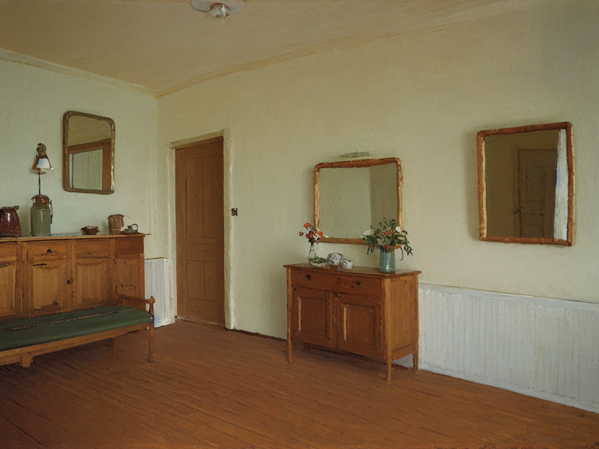

    <b>Positive prompt:</b>
    "Isaac Levitan, Finnish home, indoors, (wide brush strokes:1.2), very detailed, alla prima, banal, unremarkable, earthy"
    <b>Negative prompt:</b>
    "(painting:1.1)"

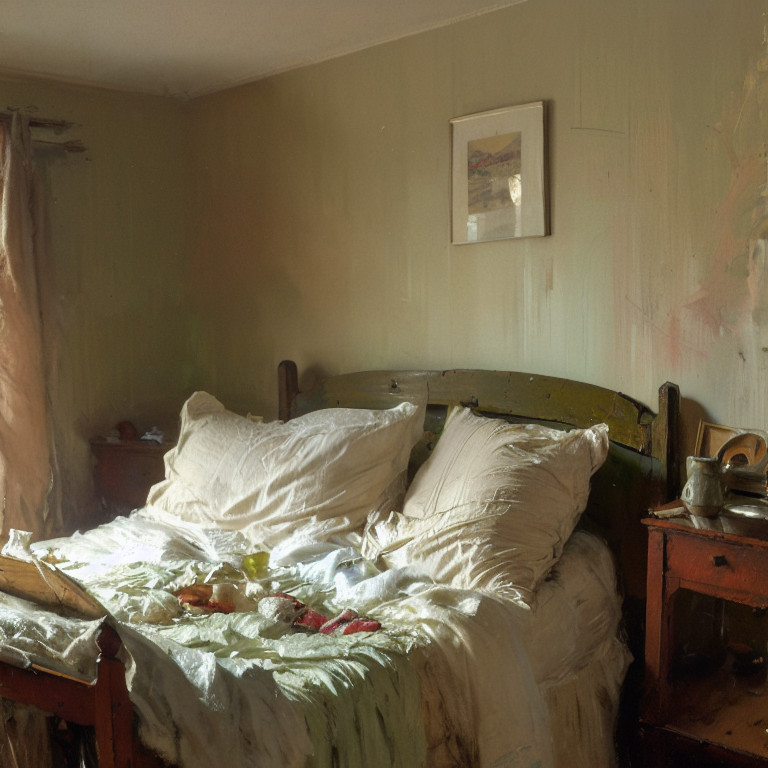

    <b>Positive prompt:</b>
    "Anders Zorn, messy bedroom, (wide brush strokes:1.1), very detailed, alla prima, banal, unremarkable, earthy, oppressive atmosphere, foreboding, rotting, decadence"
    <b>Negative prompt:</b>
    "(painting:1.2)"

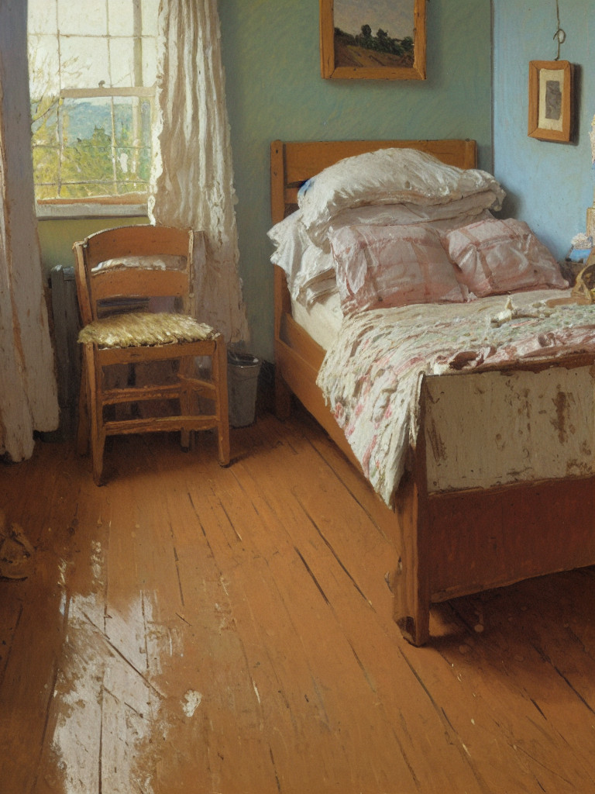

    <b>Positive prompt:</b>
    "Alfred Sisley, messy rural bedroom, (wide brush strokes:1.1), very detailed, alla prima, banal, unremarkable, earthy"
    <b>Negative prompt:</b>
    "(painting:1.3)"

## Plants

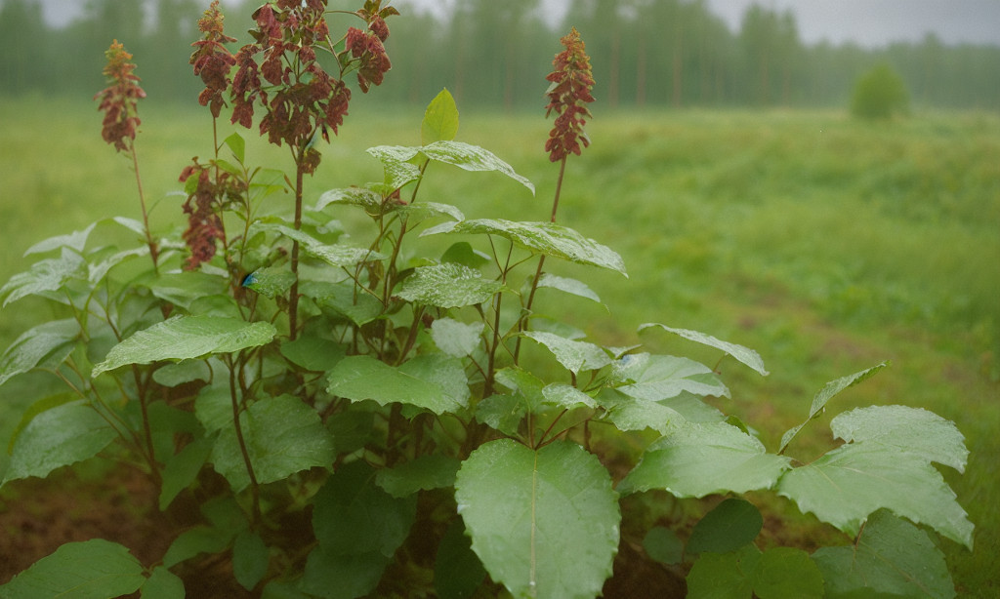

    <b>Positive prompt:</b>
    "Anders Zorn, finnish countryside, (wide brush strokes:1.1), alla prima, banal, unremarkable, decadence, rotten, doom, wet, neglected,earthy, detailed face, unsettling camera angle, very detailed plants"
    <b>Negative prompt:</b>
    "(painting:1.2)"

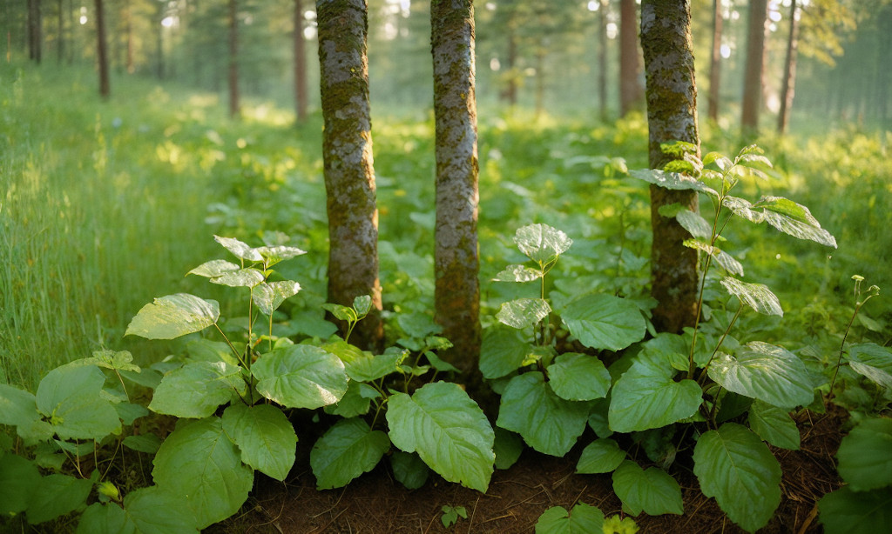

    <b>Positive prompt:</b>
    "Anders Zorn, finnish countryside, (wide brush strokes:1.1), alla prima, banal, unremarkable, wet, neglected,earthy, unsettling camera angle, very detailed plants"
    <b>Negative prompt:</b>
    "(painting:1.2), rain"

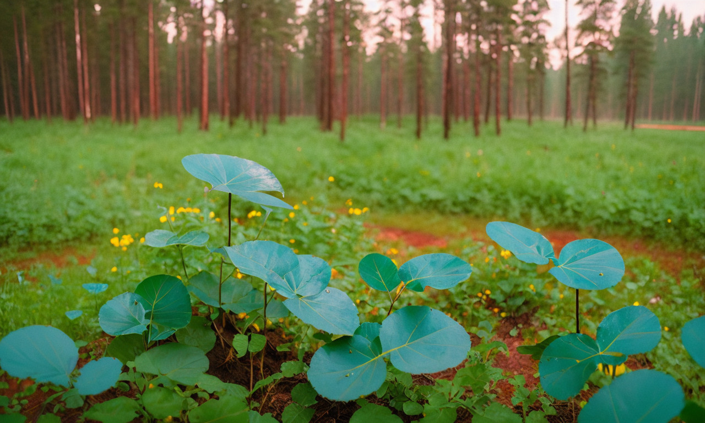

    <b>Positive prompt:</b>
    "Eero Nelimarkka, finnish countryside, (wide brush strokes:1.1), alla prima, banal, unremarkable, decadence, rotten, doom, wet, neglected,earthy, unsettling camera angle, very detailed plants"
    <b>Negative prompt:</b>
    "(painting:1.3)"

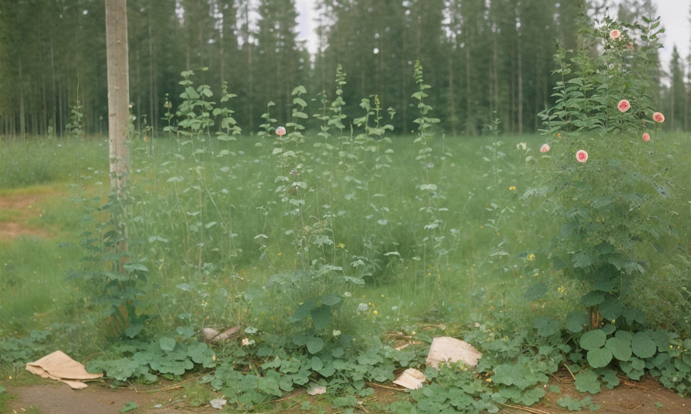

    <b>Positive prompt:</b>
    "Berthe Morisot, plants in finnish countryside, banal, unremarkable, decadence, rotten, doom, wet, neglected,earthy, awkward camera angle, very detailed plants"
    <b>Negative prompt:</b>
    "(painting:1.2)"

## Landscapes

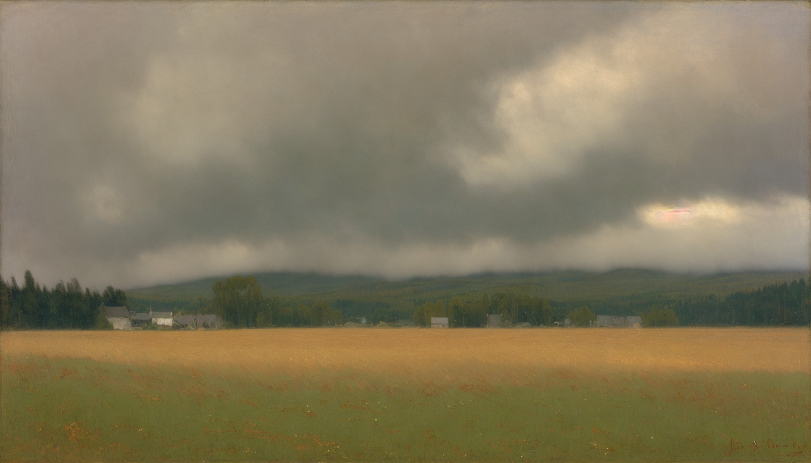

    <b>Positive prompt:</b>
    "James Abbott McNeill Whistler, Finnish countryside, heavy clouds, heavy fog, (wide brush strokes:1.2), very detailed, alla prima, banal, unremarkable, earthy"
    <b>Negative prompt:</b>
    "(painting:1.3)"

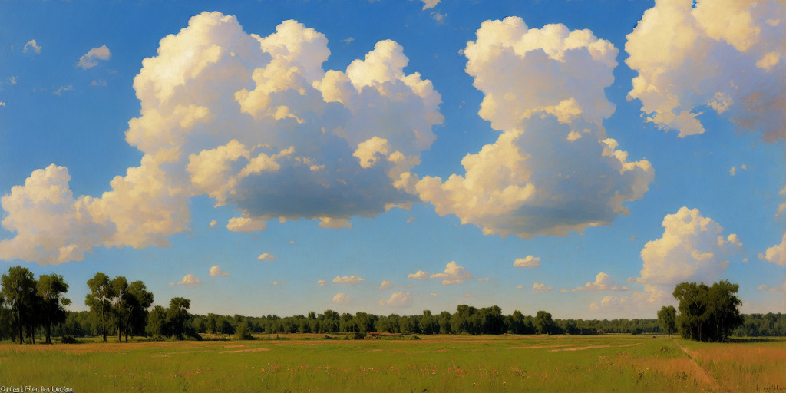

    <b>Positive prompt:</b>
    "Isaac Levitan, summer clouds lazily floating in the sky, (wide brush strokes:1.2), alla prima, sketchy, very detailed"
    <b>Negative prompt:</b>
    "(painting:1.3)"

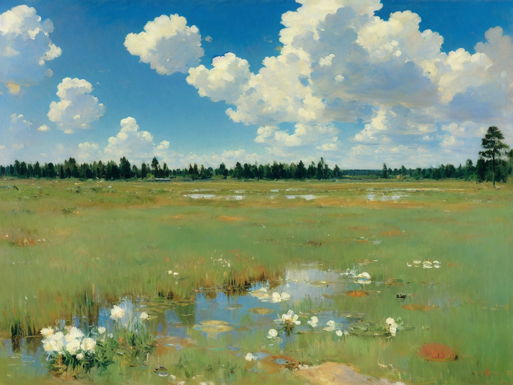

    <b>Positive prompt:</b>
    "Berthe Morisot, Finnish countryside bog with cumulus clouds in the background, (wide brush strokes:1), alla prima, very detailed rocks"
    <b>Negative prompt:</b>
    "painting"

