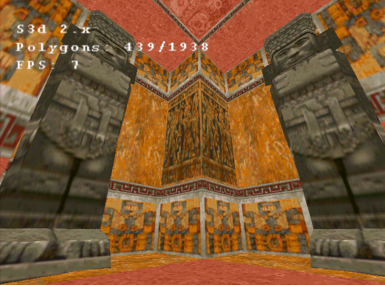
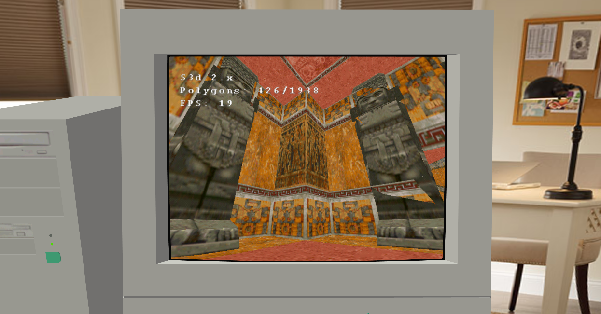
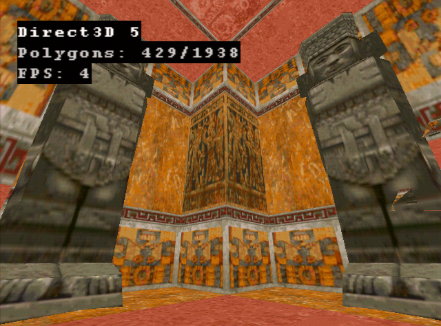

<post-date date="30 December 2024"/>

# Playing around with the S3d rendering API

This past Christmas week I've been playing around with S3's proprietary Win32 hardware rendering API, S3d. It's a lightweight layer for building 3D applications for the (in)famous mid-1990s S3 ViRGE platform.

> A level mesh from Tomb Raider being rendered on the ViRGE/DX in Windows 98 using S3d.


The ViRGE, a family of early 3D graphics cards, were known to some as "graphics decelarators" due to their performance comparing unfavorably with that of software rendering. True enough, on my ViRGE/DX, S3d performance is fairly low, as seen in the 640 &times; 480 screenshot, above. Although the renderer isn't fully optimized, the competing 3Dfx Voodoo achieves about 30 FPS in this scene using its native, equally unoptimized-for Glide API.

> The same scene in PCem (in my 3D UI) using its ViRGE/DX emulation. The emulation has worse Z fighting but better performance.


Conveniently, the PC emulator PCem comes with support for ViRGE/DX emulation. It looks reasonably faithful,  though there's more artifacting than seen on real hardware, and performance may not be indicative of real life. Other than that, I'll much rather debug my code in an emulator than go back and forth on a retro PC.

> The ViRGE/DX rendering the same scene using Direct3D 5. In this case, S3d provided better performance and better visuals. Mipmapping was enabled for Direct3D but not for S3d, which may account for some of the difference in performance.


The S3d API is fairly streamlined and minimalist, the main functions being `S3DTK_TriangleSet()` to render triangles and `S3DTK_SetState()` to configure the render state. A typical render loop might look something like this:

```c [{headerless}]
/* Clear the surface. */
S3D->S3DTK_RectFill(S3D, &s3dSurface[backBufferIdx], &screenRect, 0);
S3D->S3DTK_RectFill(S3D, &s3dZBuffer, &screenRect, ~0u);

/* Render a triangle. */
S3D->S3DTK_TriangleSet(S3D, triangle, 3, S3DTK_TRILIST);

/* Flip the surface. */
ddrawSurface->lpVtbl->Flip(ddrawSurface, NULL, DDFLIP_WAIT);
backBufferIdx = !backBufferIdx;
S3D->S3DTK_SetState(S3D, S3DTK_DRAWSURFACE, &s3dSurface[backBufferIdx]);
```

The API documentation comes in the aged WinHelp format, which I manually converted into Markdown. During the conversion process, I noticed some issues that indicated the documentation hadn't been properly maintained, like obsolete function names and incorrect function signatures. I could almost feel S3 cutting funding to the S3d team as the ViRGE was being obliterated by its competition soon after launch.

One omission in the documentation that had me debugging for some time in the wrong direction was that apparently when the value of the state variable `S3DTK_ZBUFFERSURFACE` is changed, the value of `S3DTK_ZBUFFERENABLE` is reset. So you need to set them in this order:

```c [{headerless}]
S3D->S3DTK_SetState(S3D, S3DTK_ZBUFFERSURFACE, &s3dZBuffer);
S3D->S3DTK_SetState(S3D, S3DTK_ZBUFFERENABLE, S3DTK_ON);
```

If `S3DTK_ZBUFFERENABLE` was set first, the result was various rendering issues like flickering, missing geometry, or nothing but random lines. S3's sample code sets `S3DTK_ZBUFFERENABLE` on every frame, but that doesn't seem to be necessary, not on my system anyway.

Looking around the sample code, you can also find this:

```c [{headerless}]
/* allocating z-buffer does not work */
/* ddsd.ddsCaps.dwCaps = DDSCAPS_ZBUFFER; */
```

Indeed, the surface (S3d's Win32 version uses DirectDraw for render and texture surfaces) that acts as the Z buffer can't be created as an actual Z buffer surface. Who knows why, but apparently it was a known and unresolved issue at S3. This reinforces the impression that S3d never had time to reach maturity, not for Win32 anyway.

Whatever the case, S3's sample code can be compiled for Windows 9x using MinGW 4.4.1, including from Linux:

```bash [{headerless}]
OUTPUT="example.exe"
MINGW=~/mingw441

INPUT="
example.c
winmain.c
utils.c
"

OPTIONS="
-DCUBE
-nostdinc
-isystem $MINGW/lib/gcc/mingw32/4.4.1/include
-isystem $MINGW/include
-I ../../H/
-L ../../LIB/
-L ../../LIB/WIN95/MSVC/
"

wine "$MINGW/bin/gcc.exe" $OPTIONS -o $OUTPUT $INPUT -lDDRAW -lS3DTKW
```

In my limited testing I've found MinGW to produce the most performant executables for Windows 9x, so that's what I'd recommend here.

I didn't mess around with the DOS version of S3d yet, but it may be the more interesting one given that the ViRGE as a 3D solution was quite obsolete by the Windows era of gaming.
