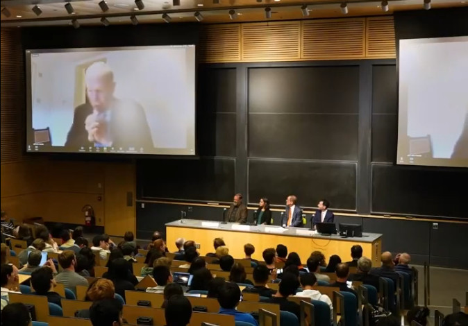

<post-date date="15 October 2024"/>

# Superintelligence vs. taking it easy on UBI

There's plenty of talk about AI putting people out of jobs, and for sure there's a push to develop AI that can serve us on that level. The discourse always ends up at UBI, where AI works to solve our problems and we get free money to pursue our dreams.

The parallel is that this motivates the emergence of an AI superintelligence, as we depend on one existing. And, as has been pointed out many times, it's more likely the superintelligence that subjects us and not the other way around.

> People being instructed. Imagine a superintelligent avatar.

Enabling the world's population to loaf around hogging vital resources like energy probably won't be a primary goal in this. So in the case that superintelligence is being pursued, a generous UBI utopia may be off the table.

Some people maintain that AGI rather than superintelligence is the future goal, but to me it seems GPT-4 from 2023 was already the AGI milestone, to the extent that we can compare these things, and to the extent that AGI is a useful metric in anything. Whatever the case, even GPT-4 has certain superintelligent attributes, so we're already taking those steps.
