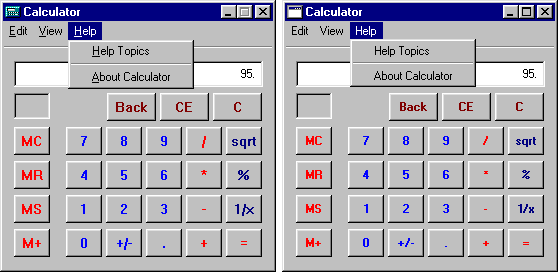
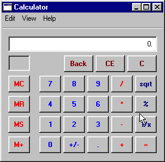
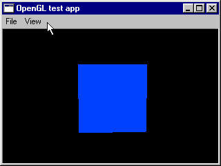

<post-date date="25 August 2022"/>

# The unexpectedly useful useless thing

I've been spending time lately working on an intentionally useless project &ndash; useless in the sense that it has no target audience and I don't even need it myself. The point is that it's an interesting topic to explore, its code a fun challenge to write, and it being fundamentally useless is liberating &ndash; it's just pointless fun.

But it didn't take long for this project to morph into something more useful: it's been giving me an unintended deep dive into some of the underlying mechanics of modern front-end frameworks.

## The useless

The project started simply as an aimless recreation of the GUI of Windows 95 in a \<canvas\> element, but quickly became a front-end framework for building in-canvas UIs in the style of Windows 95. After all, if you have a standalone GUI, you need some sample applications to show it off, and now you're building a framework.

All UI elements &ndash; buttons, menus, scrollers, etc. &ndash; are implemented from scratch as reusable widgets. The widgets are rendered using a [software \<canvas\> rasterizer I wrote earlier](https://github.com/leikareipa/retro-ngon/). State mutations trigger selective re-rendering of only the affected widgets.

It's very much work in progress, but here's a few screen captures.

> The Windows 95 calculator as seen in Windows 95 (left) and in the work-in-progress canvas UI (right)\

> Sample usage of the calculator app with the work-in-progress canvas UI\

> A rotating cube rendered in a mock OpenGL window. The cube is drawn using a software rasterizer rather than OpenGL, but the in-code rendering API emulates the fixed-function OpenGL API.\

## The useful

From a utilitarian view, I can't think of any uses for an in-canvas retro Windows UI. I'm sure some exist, but it's a solution looking for a problem.

But from a developer's view, since I'm building a front-end framework from scratch, I'm getting to experience some of the problems that other, more useful web frameworks have had to solve. Tackling the same problems gives me a more tangible understanding for why things are the way they are in these other frameworks.

For example, one of the earliest (if not unpredictable) problems I came across was the negative effect on performance of updating all widgets each frame &ndash; about 100 times per second, depending on the browser's refresh rate. Even with relatively few widgets on the screen, the garbage collection overhead alone was too high.

An obvious way to improve this is to cache the data and update the cache only when needed, given that most widgets don't change very often. The resulting architecture ended up being (for now) much like [Hooks in React](https://reactjs.org/docs/hooks-intro.html): each widget is defined by a render function that takes in a set of prop variables and returns an instance of the widget reflecting the state of the input, functioning as a cached instance of the widget. When a relevant input variable changes, the render function is called again to get an updated instance.

While props provide outside input into the widget render function, some widgets also need an internal state that persists across re-renders but is unique to that base instance of the widget &ndash; e.g. a button that keeps track of how many times it's been pressed. In React, this can be achieved with the [useState()](https://reactjs.org/docs/hooks-reference.html#usestate) function, and I've borrowed that idea into my framework as well (for now).

Under the hood, each call to the state function accesses the head of a flat array containing the globally combined state of all widget instances, and afterwards advances the array head pointer so that a subsequent call to the state function accesses the next element. If the element exists, the function returns the existing value, and otherwise it assigns the element a default value. Provided that all render functions are always called in a predictable order and that the state function is never called conditionally, a particular call to the state function from inside a particular call to a render function will always hit the same state array element, and you get your unique persistent state.

Especially for those who're new to React, Hooks like *useState()* can feel a bit abstract and fragile: they work somewhat magically and have unintuitive rules about where they can and can't be called. Invoking them conditionally, for example, is a no-no, but it's not inherently obvious. I'm not quite new to React, but having now implemented similar functionality in my own framework, Hooks feel less abstract &ndash; I've got a more practical understanding of what they're doing behind the scenes and how their implementation dictates limits on their use.

## Conclusion

This project was started simply as a way to get me some useless software-developing fun, but it quickly turned into a useful exploration of some of the under-the-hood mechanics of modern web frameworks. (Some consider React in particular a library rather than a framework, and they may be right, but that's beside the point.)

Although it's already failed to be useless, I'll keep working on the project here and there, and will probably blog about implementation details along the way. I have a feeling there's a lot of more useful stuff to learn with it.
